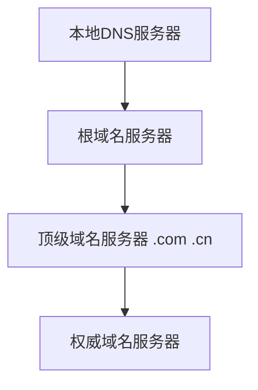

### 一、应用层概述

**核心功能**：实现具有特定网络功能的应用，通过传输层提供的端到端服务进行网络通信

#### 通信模式

##### C/S 模式（Client/Server）

- **客户端**：服务请求方，需要事先知道服务器 IP 或域名
- **服务器**：服务响应方，硬件和操作系统强大，持续监听客户请求

##### P2P 模式（Peer-to-Peer）

- 主机间平等通信
- 每个节点既是服务请求方也是提供方

---

### 二、DHCP（动态主机配置协议）

#### 基本信息

- **传输层协议**：UDP（无连接）
- **端口**：服务器监听 67，客户端监听 68
- **功能**：自动配置 IP 地址、子网掩码、默认网关、DNS 服务器等

#### 工作机制

1. 客户端广播 DHCP Discover
2. 服务器响应 DHCP Offer
3. 客户端请求 DHCP Request
4. 服务器确认 DHCP ACK

（1）（3）中，IP数据报的源地址是0.0.0.0，表示本主机，目的地址是255.255.255.255，表示全网内广播（但是路由器会限制在本网络内广播）
（2）（4）中，IP数据报源地址是DHCP服务器的IP地址，目的地址是255.255.255.255，因为主机还没有得到IP，只能通过广播的方式，让所有主机收到报文，根据传输层内是否有68端口的UDP监听、以及报文中的事务ID，交给主机判断是不是自己请求的DHCP配置

所有的源MAC地址都是硬件的真实地址，目的MAC地址为0xff_ff_ff_ff_ff_ff，表示广播

> [!tip] DHCP 中继 如果网络内没有 DHCP 服务器，可以配置路由器为 DHCP 中继代理，转发 DHCP 请求

---

### 三、DNS（域名系统）

#### 基本信息

- **传输层协议**：UDP（查询），TCP（区域传输）
- **端口**：53

#### 服务器层级结构



|服务器类型|功能|
|---|---|
|**根域名服务器**|返回顶级域名服务器的 IP|
|**顶级域名服务器**|管理二级域名，返回权威服务器 IP|
|**权威域名服务器**|存储具体域名与 IP 的映射|
|**本地DNS服务器**|代理客户端进行查询|

#### 查询方式

- **递归查询**：主机 → 本地 DNS 服务器
- **迭代查询**：本地 DNS 服务器 → 其他 DNS 服务器

---

### 四、FTP（文件传输协议）

#### 基本信息

- **传输层协议**：TCP
- **端口**：控制连接 21，数据连接 20（主动模式）

#### 工作模式

##### 主动模式（PORT）

- **控制连接**（端口21）：持续保持，传输命令
- **数据连接**（端口20）：服务器主动连接客户端指定端口

##### 被动模式（PASV）

- **控制连接**（端口21）：持续保持
- **数据连接**（随机端口）：客户端主动连接服务器指定端口

> [!important] 模式选择 被动模式适用于客户端有防火墙的场景

---

### 五、电子邮件系统

#### 系统组成

1. **用户代理（UA）**：客户端软件，用户与邮件系统的接口
2. **邮件服务器**：存储和转发邮件
3. **邮件协议**：发送协议（SMTP）和接收协议（POP3/IMAP）

#### SMTP（简单邮件传输协议）

**传输层协议**：TCP  
**端口**：25

##### 工作流程

```
发送方UA（用户代理） → 发送方SMTP服务器 → 接收方SMTP服务器 → 接收方邮箱

发送服务器和接收服务器的通信流程：
1. 发送服务器告知自己的身份
2. 发送服务器告诉邮件的发信者
3. 发送服务器告诉邮件的接收者
4. 发送服务器告诉自己准备发送正文
5. 发送服务器发送正文
6. 发送服务结束发送

对应每一步，接收服务器会响应对应的状态码
```

##### 特点

- 只能传输 7 位 ASCII 码，意味着只能传输文本内容
- 使用 **MIME**（多用途互联网邮件扩展）编码非文本内容

##### 邮件结构

- **信封**：由用户代理从首部提取，包含发送者和接收者地址
- **内容**：首部 + 主体

#### 邮件接收协议

| 协议       | 端口     | 特点                       |
| -------- | ------ | ------------------------ |
| **POP3** | 110    | 简单，下载后删除服务器邮件            |
| **IMAP** | 143    | 功能丰富，可在服务器管理邮件           |
| **HTTP** | 80/443 | 基于 Web，无需客户端软件，使用浏览器作为UA |

---

### 六、HTTP（超文本传输协议）

#### 基本信息

- **传输层协议**：TCP
- **端口**：80（HTTP），443（HTTPS）
- **特点**：无状态、面向文本

#### 版本演进

##### HTTP/1.0

- 每次请求都需要新的 TCP 连接
- 资源消耗大

##### HTTP/1.1

- **持久连接**：同一服务器的多个请求复用 TCP 连接
- **管道化**：无需等待响应即可发送下一个请求

##### HTTP/2

- 二进制分帧
- 多路复用
- 头部压缩

##### HTTP/3

- 基于 QUIC（UDP）
- 0-RTT 连接建立

#### 报文格式

##### 请求报文

```http
GET /index.html HTTP/1.1          ← 请求行
Host: www.example.com             ← 首部字段
Connection: keep-alive
User-Agent: Mozilla/5.0
Accept-Language: zh-CN
                                   ← 空行
[请求体]
```

##### 响应报文

```http
HTTP/1.1 200 OK                   ← 状态行
Content-Type: text/html           ← 首部字段
Content-Length: 1024
Set-Cookie: sessionid=abc123
                                   ← 空行
[响应体]
```

#### 常见状态码

|状态码|含义|
|---|---|
|**2xx**|成功|
|200|OK|
|204|No Content|
|**3xx**|重定向|
|301|Moved Permanently|
|302|Found（临时重定向）|
|304|Not Modified|
|**4xx**|客户端错误|
|400|Bad Request|
|401|Unauthorized|
|403|Forbidden|
|404|Not Found|
|**5xx**|服务器错误|
|500|Internal Server Error|
|502|Bad Gateway|
|503|Service Unavailable|

#### Cookie 机制

虽然 HTTP 是无状态的，但通过 **Cookie** 实现状态保持：

1. 服务器在响应中设置 `Set-Cookie` 字段
2. 浏览器存储 Cookie
3. 后续请求自动携带 Cookie

#### 缓存机制

- **浏览器缓存**：本地存储响应内容
- **代理服务器缓存**：减少源服务器负载

#### 性能优化

> [!tip] TCP Fast Open 在 TCP 三次握手的第三次（ACK）中携带 HTTP 请求，节省 **0.5 RTT** 时间

#### 重要首部字段

|字段|说明|
|---|---|
|`Host`|目标域名（必需）|
|`Connection`|连接管理（keep-alive/close）|
|`User-Agent`|客户端信息|
|`Accept-Language`|期望的响应语言|
|`Content-Type`|实体主体的媒体类型|
|`Content-Length`|实体主体的长度|
|`Cache-Control`|缓存控制|

---

### 七、协议对比总结

|协议|传输层|端口|主要用途|
|---|---|---|---|
|DHCP|UDP|67/68|IP 地址分配|
|DNS|UDP/TCP|53|域名解析|
|FTP|TCP|21/20|文件传输|
|SMTP|TCP|25|邮件发送|
|POP3|TCP|110|邮件接收|
|IMAP|TCP|143|邮件管理|
|HTTP|TCP|80|Web 浏览|
|HTTPS|TCP|443|安全 Web 浏览|

[[第五章 传输层|← 上一章：传输层]] 