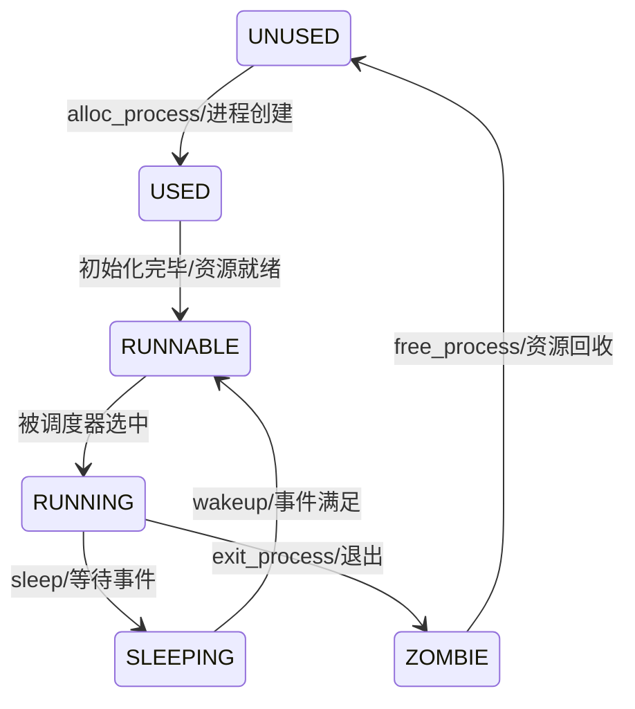

## 系统设计部分

### 架构设计说明

实现了基础进程管理、调度和资源控制。进程管理核心由进程控制块（struct proc）和调度器（scheduler）协同实现，通过上下文切换（context）保障多进程并发执行。

### 关键数据结构

- `struct proc`，包含锁保护、状态机、父子关系、资源指针、文件系统相关字段。
	### 关键数据结构字段作用
	- `struct spinlock lock`：保护进程控制块，确保多核/中断环境下状态原子性变化。
	- `enum procstatus state`：进程当前状态，决定调度和资源管理行为。
	- `void *chan`：进程睡眠时挂载的通道，用于实现条件同步和唤醒。
	- `int killed`：进程被终止标记，调度/唤醒后可主动退出。
	- `int xstate`：进程退出码，供父进程 wait 读取。
	- `int pid`：唯一进程标识符，保证进程查找与管理。
	- `struct proc *parent`：父进程指针，支持进程树和资源回收。
	- `uint64 kstack`：独立内核栈虚拟地址，支持内核态执行和 trap。
	- `uint64 sz`：进程占用内存字节数，便于资源管理和回收。
	- `pagetable_t pagetable`：用户态页表，隔离进程虚拟空间。
	- `struct trapframe *trapframe`：trap现场保存区，支持内核/用户态切换。
	- `struct context context`：上下文切换寄存器集合，调度器切换进程时保存/恢复。
	- `struct file *ofile[NOFILE]`：打开文件表，支持文件系统操作。
	- `struct inode *cwd`：当前工作目录，支持文件系统相关操作。
	- `char name[16]`：进程名称，调试和日志输出方便。

### 与xv6对比分析

- 按照自己的页表实现风格略有微调，但保持了分配-回收的主流程。

### 设计决策理由

- 采用数组管理进程表，保证查找和分配效率，便于多核环境下同步。
- 进程锁与全局 PID 锁分离，提升并发性能。
- 内核栈、trapframe、页表等资源独立分配，便于进程回收和调试。
## 实验过程部分

### 实验步骤记录

1. 完善 struct proc 结构体与关键字段。
2. 设计并实现 alloc_process/free_process 接口，实现进程创建与销毁。
3. 测试进程创建与销毁流程，保证资源分配与回收正确。
4. 实现fork
	- 分配新进程结构体（allocproc），保证资源分配的原子性与回收。
	- 复制父进程用户空间物理页，逐页分配并 memcpy 拷贝内容，建立新页表映射。
	- 复制陷阱帧，保持寄存器一致性。
	- 手动设置子进程返回值为 0，父进程返回新子进程 PID。
	- 标记子进程为 RUNNABLE，等待调度器调度。
5. 实现 exit/wait/reparent 机制
	- exit 仅设置自身为ZOMBIE，唤醒父进程，资源由父进程 wait 时统一回收。
	- wait 遍历所有子进程，发现ZOMBIE时回收资源，获取退出码。
	- 父进程退出时，reparent所有子进程到initproc，防止资源泄漏。
	- 资源包括用户页表、trapframe、内核栈等，全部在freeproc中释放。
6. 实现调度器 scheduler/yield/sched
	- scheduler 采用简单轮转调度策略，遍历进程表寻找 RUNNABLE 进程，切换为 RUNNING。
	- 每个 CPU 独立运行其调度器，支持多核并发。
	- yield 由进程主动调用，进入 sched，再回到调度器继续下一轮。
	- sched 负责上下文切换和状态流转，保证调度流程的原子性。
7. 实现同步原语 sleep/wakeup
	- sleep(chan, lock)：进程挂在指定通道睡眠，释放条件锁，进入调度器等待唤醒。
	- wakeup(chan)：遍历进程表，唤醒所有在chan上睡眠的进程，设为RUNNABLE。
	- 机制保证进程同步、条件等待，避免忙等待和死锁。

### 问题与解决方案

- 并发环境下需要加锁保证状态一致性。
- 拷贝性能不佳
	可以使用COW
	通过标记页面为只读，引入计数，在触发错误的时候分配分页
- 在分配物理页的时候出错
	- 原因在于分配内核页表的页表项映射时字段有错，导致页面物理地址落在了保护段

### 源码理解与总结

1. 进程锁保证并发安全，状态机支持UNUSED、SLEEPING、RUNNABLE、RUNNING、ZOMBIE状态切换。
	- 进程状态转换图及触发条件

2. 进程控制块的状态、资源分配与回收都可能被多个CPU/中断同时访问，需要锁保护保证一致性。
	- 典型原子性场景：
	  - 进程状态变更（如 RUNNABLE→RUNNING）
	  - 资源分配与释放（如 kstack、trapframe、页表）
	  - PID 分配（全局唯一）
	  - 父子关系变更、进程唤醒与杀死标记
	- 没有锁保护可能导致进程表混乱、资源泄漏、死锁等严重错误。
3. 为什么需要ZOMBIE状态
	子进程完成任务之后不能马上释放资源，父进程需要获取子进程的结束信息，用来释放资源等操作
4.  进程表的大小影响
	表的大小决定了操作系统能支持的并发运行的最大进程数
5. 如何防止PID重复
	加锁
6. 为什么要在fork时用不同的返回值
	标志返回的时父进程还是子进程
7. exit 和 wait 的协作方式
	exit 设置进程为 ZOMBIE 并且唤醒父进程， wait 发现后回收资源
8. sleep/wakeup 机制原理
	- **sleep(chan, lock)**  
	    进程在等待某条件时，主动调用 sleep，将自身状态设为 SLEEPING，并挂在指定通道（chan）上。释放等待条件的锁，进入调度器。
	- **wakeup(chan)**  
	    唤醒所有在指定通道上睡眠的进程，将其状态设为 RUNNABLE，等待调度器调度。
9. 根进程启动
	- 内核启动后首先运行的是裸内核代码，并无进程。
	- 初始化阶段会调用 userinit，分配第一个进程 initproc，初始化用户空间、页表、trapframe等资源。
	- initproc 被设为 RUNNABLE，调度器开始运行后成为所有用户进程的祖先。
	- 根进程的内存初始化在 userinit/allocproc 中完成

## 测试验证部分

### 功能测试结果

### 性能数据

### 异常测试

### 运行截图

---

对于进程

1. 进程结构体
2. 进程的用户空间布局
3. 从用户态进入到内核态，对上下文的保护
4. 进程调度的上下文保护
5. 进程fork
6. 进程的wait和exit
	>5和6放到系统调用去讲解
7. 从内核启动 - 根进程初始化 - 到内核态
	所有的进程初始化都会把上下文的 ra 设置为 forkret
	- forkret 负责完成进程第一次的文件系统初始化、exec 用户程序加载、准备 trapframe，然后通过 trampoline 跳转到用户空间入口（trapframe->epc）。
	- mycpu的上下文在调度器初始化之后始终在调度器的上下文中循环

重点 - 一些变量和代码存放在哪一个页表之中，还是两个都有

> 内核在启动之后，把时钟中断和硬件中断委托给监督模式，然后通过sep和ret的汇编指令进入main函数，执行内核的初始化，进行空闲物理分页，对内核部分分页，初始化内核页表，一些段对于映射还比较讲究。之后初始化进程表，创建一个用户态根进程，在调度后会返回用户态
> trap帧在进程的页表中有
> 进程的内核在在内核页表
> trampoline在两者都有

完美完成！！！