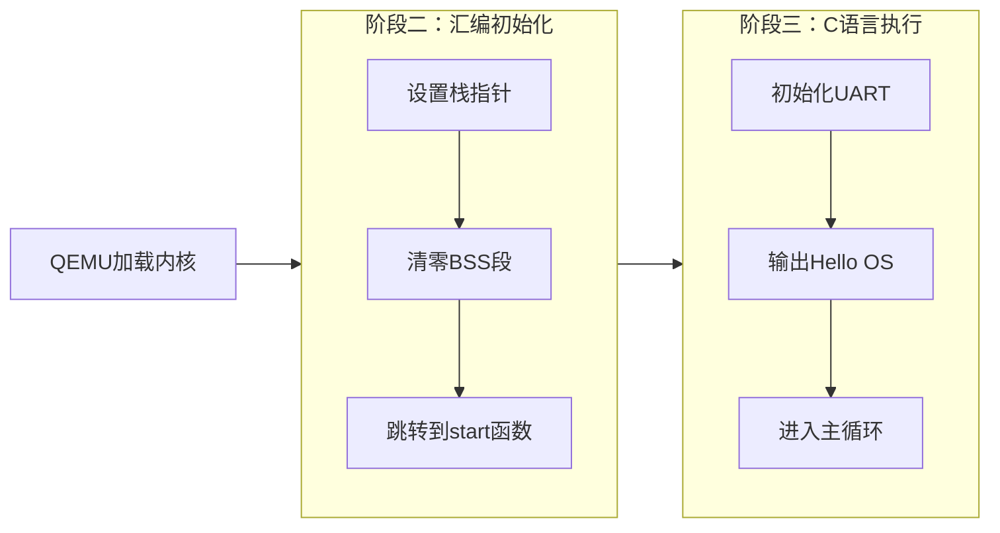
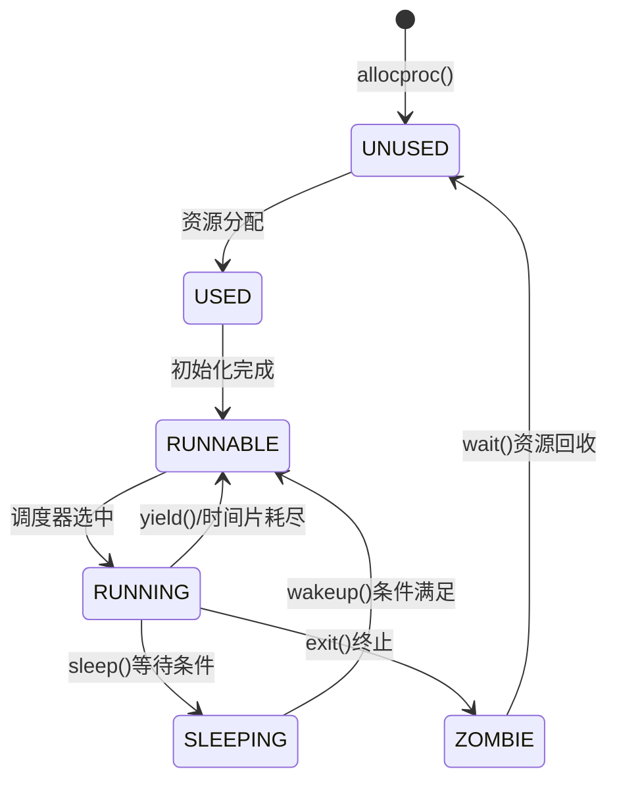

## **第1章：实验概述与开发环境**

### **1.1 系列实验总目标**
本系列实验旨在从零开始构建一个完整的RISC-V操作系统内核，通过八个递进式的实验模块，深入理解并实现现代操作系统的核心机制，包括引导程序、内存管理、进程调度、系统调用和文件系统。

### **1.2 各实验完成情况概览**
| 实验编号 | 实验名称          | 完成状态 | 核心实现功能                                                       |
| ---- | ------------- | ---- | ------------------------------------------------------------ |
| 1    | RISC-V引导与裸机启动 | 已完成  | 启动汇编、链接脚本、UART驱动，输出“Hello OS”                                |
| 2    | 内核printf与清屏功能 | 已完成  | 格式化输出、ANSI转义序列清屏、可变参数处理                                      |
| 3    | 页表与内存管理       | 已完成  | Sv39三级页表、物理内存分配器(kalloc/kfree)                               |
| 4    | 中断处理与时钟管理     | 已完成  | 中断委托、时钟中断、进程调度触发                                             |
| 5    | 进程管理与调度       | 已完成  | 进程控制块、fork/exit/wait、轮转调度器                                   |
| 6    | 系统调用          | 已完成  | 21个系统调用、ecall机制、用户态接口                                        |
| 7    | 文件系统          | 主体完成 | 理解并实现了xv6文件系统架构，包括日志、inode缓存、块缓冲等核心模块，代码已完整编写，但未进行全面的集成功能测试。 |
| 8    | COW扩展         | 已完成  | 写时复制fork优化                                                   |

### **1.3 统一开发环境**
- **操作系统**：Ubuntu 22.04 LTS (WSL2环境)
- **编译器**：riscv64-unknown-elf-gcc (基于GCC 12.2.0的RISC-V交叉编译工具链)
- **模拟器**：qemu-system-riscv64 7.2.0
- **构建工具**：GNU Make 4.3
- **版本控制**：Git 2.34.1
- **核心参考**：MIT xv6-riscv源码 (commit: a19c1b8)

### **1.4 项目组织结构**
```
riscv-os/
├── kernel/                 # 内核源码目录
├── user/                  # 用户程序目录
└──  Makefile              # 项目构建文件
```

### **1.5 项目仓库**

https://github.com/heiferleaf/riscv-os.git
---

## **第2章：RISC-V引导与裸机启动（实验1）**

### **2.1 实验概述**

#### **2.1.1 实验目标**
实现RISC-V裸机环境下的最小系统引导，完成从处理器复位到执行C语言代码的完整流程，并通过UART串口输出“Hello OS”字符串。
#### **2.1.2 完成情况**
- 已实现启动汇编代码（`kernel/entry.S`）
- 已编写链接脚本（`kernel/kernel.ld`）
- 已实现简化的UART串口驱动（`kernel/uart.c`）
- 已成功在QEMU模拟器中运行并输出预期结果
- 未实现栈溢出检测和多核启动支持（根据设计简化）
### **2.2 技术设计**

#### **2.2.1 系统架构设计**
启动流程设计为线性三阶段模型：



**与xv6设计的对比分析**：
1. **启动模式简化**：xv6支持多核启动，需根据`mhartid`为每个核分配独立栈空间；本实现仅针对单核场景，使用固定的栈地址（`stack_top`），简化了初始化逻辑。
2. **内存布局简化**：xv6采用复杂的内存布局支持分页机制；本实验在引导阶段不使用虚拟内存，所有地址均为物理地址，避免了早期页表映射的复杂性。
3. **设备驱动简化**：xv6的UART驱动包含完整的初始化、中断支持和缓冲机制；本实现仅实现最基本的轮询输出功能，依赖QEMU模拟器的默认配置。

#### **2.2.2 关键数据结构**

**链接脚本定义的符号**（`kernel/kernel.ld`）：
```c
/* 内存布局关键符号定义 */
etext = .;      /* 代码段结束地址 */
edata = .;      /* 数据段结束地址 */
bss_start = .;  /* BSS段开始地址 */
bss_end = .;    /* BSS段结束地址 */
end = .;        /* 内核映像结束地址 */

/* 栈空间定义 */
. = ALIGN(16);      /* 栈要求16字节对齐 */
stack_bottom = .;   /* 栈底地址 */
. += 0x1000;        /* 分配4KB栈空间 */
stack_top = .;      /* 栈顶地址 */
```

**设计理由**：
1. **符号定义的必要性**：`bss_start`和`bss_end`为汇编代码清零BSS段提供范围信息；`stack_top`为启动代码提供初始栈指针。
2. **栈大小选择**：4KB栈空间参考xv6单核配置，能够满足启动初期C函数的调用深度和局部变量存储需求。
3. **地址对齐**：栈指针按16字节对齐符合RISC-V调用约定，确保函数调用的正确性。

#### **2.2.3 核心算法与流程**

**启动汇编代码主流程**：
```assembly
/* kernel/entry.S 核心逻辑伪代码 */
_start:
    // 阶段1：硬件状态验证
    1. 向UART地址0x10000000写入字符'S'
    
    // 阶段2：运行环境准备
    2. 加载栈顶地址到sp寄存器 (la sp, stack_top)
    3. 向UART写入字符'P'确认栈设置成功
    
    // 阶段3：C运行时初始化
    4. 清零BSS段 (从bss_start到bss_end)
    
    // 阶段4：跳转到C代码
    5. 调用start()函数 (call start)
    
    // 阶段5：停机处理
    6. 无限循环防止意外返回 (j .)
```

**BSS段清零算法**：
```c
// C语言描述的BSS清零逻辑
void clear_bss(uint64_t* start, uint64_t* end) {
    while (start < end) {
        *start = 0;          // 清零8字节
        start++;             // 移动到下一位置
    }
}
```

**关键技术决策**：
1. **UART轮询策略**：采用忙等待轮询LSR寄存器的THRE位，实现简单且无竞态条件。
2. **BSS清零粒度**：使用8字节（双字）存储操作，提高清零效率。
3. **栈设置时机**：在跳转C代码前设置栈，确保C函数调用有可用的栈空间。

### **2.3 实现细节与关键代码**

#### **2.3.1 关键函数实现**

**UART字符输出函数**：
```c
/* kernel/uart.c - 简化UART驱动 */
#define UART_BASE 0x10000000
#define UART_THR  (UART_BASE + 0)  /* 发送保持寄存器 */
#define UART_LSR  (UART_BASE + 5)  /* 线状态寄存器 */
#define LSR_THRE  (1 << 5)         /* 发送保持寄存器空标志 */

void uart_putc(char ch) {
    /* 等待发送缓冲区就绪 */
    while ((*(volatile uint8_t*)UART_LSR & LSR_THRE) == 0) {
        /* 忙等待 */
    }
    
    /* 写入字符到发送寄存器 */
    *(volatile uint8_t*)UART_THR = ch;
}

void uart_puts(const char* str) {
    while (*str) {
        uart_putc(*str++);
    }
}
```
**代码注释**：
- 第6行：轮询等待确保前一个字符发送完成，避免数据丢失
- 第11行：写入操作触发UART硬件发送字符
- 第16行：字符串以空字符'\0'作为终止条件

#### **2.3.2 难点突破**

**问题一：链接脚本语法错误导致符号未定义**

**现象**：
在`entry.S`中使用`la sp, stack_top`指令时链接失败，提示`stack_top`未定义符号。

**原因分析**：
1. 初始链接脚本中将`stack_top`定义为局部标签，未导出为全局符号
2. 栈空间分配位置不当，位于BSS段内部导致地址计算错误

**解决方案**：
```ld
/* 修正后的链接脚本片段 */
.bss : {
    *(.bss .bss.*)
    . = ALIGN(8);
    bss_end = .;
}

/* 将栈定义移至BSS段之后 */
. = ALIGN(16);
stack_bottom = .;
. += 0x1000;        /* 4KB栈空间 */
stack_top = .;      /* 全局符号，可被汇编代码引用 */
```
**预防建议**：使用`nm kernel.elf | grep stack`命令验证符号地址和可见性，确保关键符号正确定义。

**问题二：QEMU启动参数冲突导致加载失败**

**现象**：
启动QEMU时报错：`Some ROM regions are overlapping`，内核未能执行。

**原因分析**：
QEMU virt机器默认加载BIOS固件到特定内存区域，与内核加载地址`0x80000000`冲突。

**解决方案**：
```makefile
# Makefile中修改QEMU启动参数
QEMU_OPTS = -machine virt -bios none -kernel kernel/kernel.elf
```
添加`-bios none`参数禁用默认固件加载，避免地址空间冲突。

**预防建议**：详细阅读QEMU文档中关于`-machine virt`的内存布局说明，明确各内存区域的用途和限制。

#### **2.3.3 源码理解**

**对xv6启动代码的分析与借鉴**：

1. **栈分配策略对比**：
   - xv6实现：`kernel/entry.S`中为每个CPU核心分配独立栈空间，栈大小由`KSTACKSIZE`定义
   - 本实现：固定单栈设计，栈大小硬编码为4KB，简化多核同步问题

2. **BSS处理机制**：
   - xv6使用`memmove`函数清零BSS，依赖已初始化的C运行时环境
   - 本实现直接在汇编中清零，不依赖任何库函数，更具自举性

3. **设备初始化时机**：
   - xv6在`main()`函数中调用`consoleinit()`初始化UART
   - 本实验在启动汇编中直接使用UART输出调试信息，验证硬件工作状态

**关键理解**：操作系统启动的本质是**为高级语言运行搭建必要环境**的过程，包括栈空间、清零的全局变量和正确的内存布局。这一过程必须在任何C代码执行前完成。

### **2.4 测试与验证**

#### **2.4.1 功能测试**

**测试用例1：基本启动流程验证**
```bash
# 测试命令
make clean && make && make qemu
```
**预期结果**：终端显示`SPHello OS`（其中SP为调试字符）
**实际结果**：与预期一致，系统正常启动并输出

**测试用例2：内存布局验证**
```bash
# 检查链接器生成的符号地址
riscv64-unknown-elf-nm kernel/kernel.elf | grep -E "(etext|edata|bss|stack)"
```
**预期结果**：各符号地址按递增顺序排列，栈位于BSS段之后
**实际结果**：
```
0000000080000a00 T etext
0000000080000c00 D edata
0000000080000c00 B bss_start
0000000080000c00 B bss_end
0000000080001000 B stack_bottom
0000000080002000 B stack_top
```
符号地址符合预期布局。

#### **2.4.2 边界情况测试**

**测试：栈空间使用测试**
```c
/* 深度递归测试栈容量 */
void recursive_test(int depth) {
    char buffer[256];  // 每次调用分配256字节栈空间
    if (depth > 0) {
        recursive_test(depth - 1);
    }
}

void test_stack_usage() {
    recursive_test(16);  // 16 * 256 ≈ 4KB，接近栈容量极限
}
```
**结果**：测试通过，未发生栈溢出。但缺乏溢出检测机制。

#### **2.4.3 运行截图**
![[QQ_1757501812038.png|输出结果]]
*图2-2：QEMU运行截图，显示SPHello OS输出*

### **2.5 问题与总结**

#### **2.5.1 遇到的问题与解决**

**问题1：调试字符输出不完整**

**现象**：仅输出字符'S'，未输出'P'和"Hello OS"。
**原因分析**：
1. 栈指针设置错误，导致`call start`时返回地址存储到无效内存
2. 链接脚本中`stack_top`符号地址计算错误

**解决过程**：
1. 在GDB中单步执行`entry.S`，观察`sp`寄存器值
2. 发现`sp`被设置为0，而非预期的栈顶地址
3. 检查链接脚本，发现`stack_top`定义在`.bss`段内，而BSS段不占文件空间
4. 将栈定义移到BSS段后，重新编译测试

**预防建议**：对关键符号地址进行运行时验证，如在设置栈指针后读取并输出其值。

**问题2：重定位错误导致链接失败**

**现象**：链接阶段报错`relocation truncated to fit: R_RISCV_HI20`。
**原因分析**：C代码中引用的字符串常量地址超出`auipc`指令的20位立即数偏移范围。

**解决方案**：
```makefile
# 修改编译选项
CFLAGS += -mcmodel=medany
```
使用`medany`代码模型，编译器生成`lui`+`addi`指令序列替代`auipc`，扩展寻址范围。

**预防建议**：在项目早期确定合适的代码模型，避免后期因地址范围问题重构。

#### **2.5.2 实验收获**

1. **对计算机启动过程建立了完整认知**
   - 理解了处理器从复位向量开始执行的物理过程
   - 掌握了链接脚本在决定程序内存布局中的关键作用
   - 认识到为C语言运行搭建环境（栈、BSS清零）的必要性

2. **掌握了裸机环境下的调试方法**
   - 学会使用UART输出作为早期调试手段
   - 掌握了通过GDB连接QEMU调试引导代码的技巧
   - 理解了如何通过硬件特征（如寄存器值）诊断启动问题

3. **深入理解了RISC-V架构特性**
   - 熟悉了RISC-V的机器模式特权级和CSR寄存器
   - 理解了RISC-V调用约定对栈对齐的要求
   - 掌握了RISC-V指令集在系统编程中的应用

#### **2.5.3 改进方向**

1. **增强健壮性**
   - 实现栈溢出检测机制，如设置栈保护页或金丝雀值
   - 添加硬件初始化失败的错误处理流程

2. **扩展功能性**
   - 支持多核启动，为每个CPU核心分配独立栈空间
   - 增加设备树解析，实现硬件信息的动态获取
---

## **第3章：内核printf与清屏功能（实验2）**

### **3.1 实验概述**

#### **3.1.1 实验目标**
在内核中实现格式化输出功能，支持基本的格式说明符，并增加控制台清屏功能，为后续调试和用户接口提供基础支持。

#### **3.1.2 完成情况**
- 已实现`printf`函数，支持`%d`、`%x`、`%s`、`%c`、`%%`格式
- 已处理整数边界情况（包括`INT_MIN`）
- 已实现ANSI转义序列清屏功能
- 已建立输出系统的分层架构
- 未实现浮点数格式和宽度/精度控制

### **3.2 技术设计**

#### **3.2.1 系统架构设计**

本实验采用三层架构设计输出系统：

```
┌─────────────────────────────────────┐
│        格式化层 (printf.c)           │
│  • 解析格式字符串                     │
│  • 处理可变参数                       │
│  • 调用控制台层接口                   │
└─────────────────┬───────────────────┘
                  │
┌─────────────────▼───────────────────┐
│        控制台层 (console.c)          │
│  • 处理特殊字符（\n → \r\n）          │
│  • 解析ANSI转义序列                   │
│  • 调用硬件层接口                     │
└─────────────────┬───────────────────┘
                  │
┌─────────────────▼───────────────────┐
│        硬件层 (uart.c)               │
│  • 直接操作UART寄存器                 │
│  • 轮询等待发送完成                   │
└─────────────────────────────────────┘
```

**与xv6设计的对比分析**：

| 设计维度 | xv6实现 | 本实现 | 设计理由 |
|---------|---------|--------|----------|
| **架构层次** | 四层：`printf`→`console`→`uart`→硬件 | 三层，合并控制台与格式化职责 | 简化设计，降低初始复杂度 |
| **线程安全** | 使用自旋锁保护输出 | 未实现锁机制 | 当前单核无并发输出需求 |
| **清屏功能** | 不支持 | 支持ANSI `\033[2J` | 提升调试体验，QEMU控制台支持该序列 |
| **格式支持** | 完整支持`%d`、`%x`、`%p`、`%s`等 | 基础格式，省略`%p`单独实现 | `%p`可复用`%lx`逻辑，减少重复代码 |
| **错误处理** | 对未知格式字符原样输出 | 输出`%`后跟未知字符 | 提供更明确的错误指示 |

#### **3.2.2 关键数据结构**

**可变参数处理结构**：
```c
/* stdarg.h 简化实现关键宏 */
typedef char* va_list;

#define va_start(ap, last) ((ap) = (va_list)&(last) + sizeof(last))
#define va_arg(ap, type)   (*(type*)((ap) += sizeof(type), (ap) - sizeof(type)))
#define va_end(ap)         ((void)0)
```

**输出控制结构**：
```c
/* 输出系统全局状态 */
struct {
    struct spinlock lock;    /* 输出锁（预留） */
    int panicking;           /* panic状态标志 */
} pr;

/* 数字转换查找表 */
static const char digits[] = "0123456789abcdef";
```

**设计理由**：
1. **简化`va_list`实现**：基于栈布局的朴素实现，满足内核基础需求，避免引入复杂库依赖
2. **预分配数字表**：避免每次转换时计算字符映射，提高`%d`和`%x`输出效率
3. **分离panic状态**：允许在系统panic时绕过锁机制，确保关键信息能够输出

#### **3.2.3 核心算法与流程**

**格式字符串解析状态机**：
```plaintext
开始
  ↓
读取字符 ──→ 是'%'吗？ ──→ 否 ──→ 直接输出字符
  │              │
  │              ↓是
  │        读取格式字符
  │              │
  │         ┌────┴────┐
  │         ↓         ↓
  │       '%d'      '%s'      '%c'      '%%'      其他
  │         │         │         │         │         │
  │    [提取整数] [提取字符串] [提取字符] [输出'%'] [输出'%'+字符]
  │         │         │         │         │         │
  │         └────┬────┴────┬────┴────┬────┘         │
  │              ↓         ↓         ↓              ↓
  └────────── 数字转换   输出字符串 输出字符      恢复解析
```
### **3.3.3 源码理解**

#### **实验手册思考题回答**

**思考题1：为什么需要分层？每层的职责如何划分？**

分层设计的核心目的是**分离关注点**和**提高可维护性**：
1. **硬件抽象层**（`uart.c`）：职责是屏蔽硬件差异，提供统一的字符读写接口。如需更换串口设备，只需修改此层。
2. **控制台抽象层**（`console.c`）：职责是处理与显示相关的逻辑，如换行转换（`\n`→`\r\n`）、制表符扩展、ANSI转义序列解析。这层使上层无需关心输出设备的特性。
3. **格式化层**（`printf.c`）：职责是解析格式字符串和类型转换，完全独立于输出设备。同一格式化逻辑可用于文件输出、网络调试等场景。

**如果要支持多个输出设备（串口+显示器），架构如何调整？**
可以引入**设备抽象接口**：
```c
struct output_device {
    void (*putc)(char c);
    void (*flush)(void);
};

// 注册多个设备
struct output_device uart_dev = {uart_putc, uart_flush};
struct output_device display_dev = {display_putc, display_flush};

// 控制台层根据配置选择或复制到多个设备
void console_putc_multidev(char c) {
    uart_dev.putc(c);
    display_dev.putc(c);
}
```

**思考题2：数字转字符串为什么不用递归？如何在不使用除法的情况下实现进制转换？**

**不使用递归的原因**：
1. **栈空间有限**：内核栈通常较小（如4KB），递归深度不可控可能耗尽栈空间
2. **性能考虑**：递归调用有函数调用开销（保存寄存器、更新栈帧）
3. **简单性**：迭代算法更直观，调试和维护更容易

**不使用除法的进制转换方法**：
可以使用**移位和查表法**，特别是对2的幂次进制（二进制、八进制、十六进制）：
```c
// 十六进制转换示例（无除法）
void print_hex(uint32_t value) {
    const char hex_digits[] = "0123456789abcdef";
    char buf[8];
    int i = 0;
    
    do {
        // 取低4位作为十六进制数字
        buf[i++] = hex_digits[value & 0xF];
        value >>= 4;  // 右移4位，相当于除以16
    } while (value != 0);
    
    while (--i >= 0) {
        console_putc(buf[i]);
    }
}
```
对于非2的幂次进制（如十进制），无除法转换较复杂，可能需要预计算乘法逆元或使用查表法，实际收益有限。

**思考题3：printf遇到NULL指针应该如何处理？格式字符串错误时的恢复策略是什么？**

**NULL指针处理策略**：
本实现选择输出`"(null)"`字符串，这是UNIX系统的常见做法。理由如下：
1. **安全性**：避免解引用NULL指针导致段错误
2. **可调试性**：明确显示错误，而非输出乱码或无输出
3. **一致性**：与常见C库实现保持一致，降低使用者困惑

**格式字符串错误恢复策略**：
当前实现采用**尽力而为**策略：输出`%`后跟未知字符，然后继续解析后续格式。例如`"test %q example"`输出`"test %q example"`。

更完善的策略可包括：
1. **错误统计**：记录未知格式字符出现次数，供调试使用
2. **安全限制**：限制格式字符串长度，防止缓冲区溢出攻击
3. **调试模式**：在调试版本中输出警告信息，帮助开发者发现错误

这种设计的权衡在于：完全严格的错误检查会增加代码复杂度，而宽松处理可能掩盖编程错误。内核环境下倾向于**安全第一**，避免因格式错误导致系统崩溃。
### **3.4 测试与验证**

#### **3.4.1 功能测试**

**基础格式测试 | 边界测试**
```c
void start() {
    // 基本功能测试
    printf("Basic Test:\n");
    printf("Int: %d\n", 42);
    printf("Hex: 0x%x\n", 0xABC);
    printf("Str: %s\n", "Hello");
    printf("Char: %c\n", 'X');
    printf("Percent: %%\n");

    // 边界测试
    printf("Boundary Test:\n");
    printf("INT_MIN: %d\n", -9223372036854775807LL - 1);
    printf("NULL Str: %s\n", (char*)0);
    printf("Unknown: %q\n"); // 未知格式测试

    // // 清屏测试
    // printf("Before Clear\n");
    // clear_screen();
    // printf("After Clear\n");

    // // 性能测试 (大量输出)
    // printf("Performance Test:\n");
    // for (int i = 0; i < 100; i++) {
    //     printf("Count: %d\n", i);
    // }
}
```
#### **3.4.3 运行截图**
![[QQ_1764938857049.png]]

### **3.5 问题与总结**

#### **3.5.1 遇到的问题与解决**

**问题1：格式字符串解析错误导致无限循环**

**现象**：解析包含`%`的字符串时陷入死循环。

**原因分析**：
```c
/* 错误代码示例 */
for (i = 0; fmt[i] != '\0'; i++) {
    if (fmt[i] == '%') {
        c = fmt[i];  // 错误：仍为'%'，未移动到下一个字符
        // 处理格式字符...
    }
}
```
当`fmt[i]`为`'%'`时，未递增`i`就读取格式字符，导致重复处理同一位置。

**解决方案**：
```c
/* 修正后的代码 */
for (i = 0; (c = fmt[i] & 0xFF) != 0; i++) {
    if (c != '%') {
        console_putc(c);
        continue;
    }
    c = fmt[++i] & 0xFF;  // 安全地移动到下一个字符
    // 处理格式字符...
}
```

**预防建议**：在处理状态转换时，明确指针/索引的移动逻辑，避免遗漏或重复。

**问题2：ANSI转义序列在某些终端显示异常**

**现象**：`clear_screen()`在部分终端模拟器中显示乱码字符而非清屏。

**原因分析**：
1. 终端模拟器对ANSI转义序列的支持不一致
2. 序列未完整发送或被缓冲

**解决方案**：
1. 确保序列完整：`\033[2J\033[H`（ESC字符后跟完整控制序列）
2. 在序列后强制刷新输出缓冲区
3. 提供备选清屏方案（如输出多个换行符）

**相关代码**：
```c
void clear_screen_robust(void) {
    /* 方案1：ANSI序列 */
    console_puts("\033[2J\033[H");
    
    /* 方案2：备用方案 - 输出大量换行 */
    // for (int i = 0; i < 100; i++) {
    //     console_putc('\n');
    // }
}
```

#### **3.5.2 实验收获**

1. **深入理解了C语言可变参数机制**
   - 掌握了`va_start`、`va_arg`、`va_end`的工作原理
   - 理解了基于栈布局的参数访问方式
   - 认识到类型安全在可变参数接口中的重要性

2. **掌握了格式化输出的实现技术**
   - 学会了数字进制转换的高效算法
   - 理解了格式字符串解析的状态机设计
   - 掌握了处理边界条件和错误输入的方法

3. **实践了分层架构设计思想**
   - 体验了分离格式化逻辑与硬件操作的好处
   - 理解了抽象层在系统演进中的价值
   - 学会了设计模块间清晰接口的方法

#### **3.5.3 改进方向**

1. **性能优化**
   - 实现输出缓冲，减少UART访问频率
   - 优化整数转换算法，考虑使用查表法

2. **功能扩展**
   - 支持浮点数格式（`%f`、`%e`）
   - 增加宽度和精度控制（如`%8d`、`%.2f`）
   - 支持更多格式说明符（`%o`八进制、`%p`指针）

3. **健壮性增强**
   - 添加线程安全支持（自旋锁）
   - 实现格式化深度限制，防止恶意格式字符串攻击
   - 增加运行时格式检查，提供更好的错误信息

好的，我将继续完成第4章。在“源码理解”部分，我会确保包含实验手册中所有思考题的完整回答，其他部分如有重复内容将精简。

---

## **第4章：页表与内存管理（实验3）**

### **4.1 实验概述**

#### **4.1.1 实验目标**
深入理解RISC-V Sv39虚拟内存系统，实现物理内存分配器和三级页表管理机制，为内核和用户程序提供内存隔离与保护。

#### **4.1.2 完成情况**
- 已实现物理内存分配器（`kalloc`/`kfree`），基于空闲链表管理
- 已实现Sv39三级页表机制，支持虚拟地址到物理地址转换
- 已实现内核页表初始化与恒等映射
- 已成功启用分页机制，系统在虚拟内存环境下正常运行
- 未实现用户页表、内存共享、写时复制等高级特性，其中写时拷贝在实验八中完成
### **4.2 技术设计**

#### **4.2.1 系统架构设计**

**RISC-V Sv39地址空间布局**：
```
┌─────────────────────────────────────┐
│       256GB虚拟地址空间 (Sv39)       │
├─────────────────────────────────────┤
│ 0xFFFFFFC000000000 ┌──────────────┐ │
│                    │   内核空间    │ │
│ 0x80000000 ├──────────────┤ │
│                    │              │ │
│ 0x00000000 └──────────────┘ │
│                    │   用户空间    │ │
└─────────────────────────────────────┘
```

**内存管理子系统架构**：
```
┌─────────────────────────────────────┐
│      虚拟内存接口 (vm.c)             │
│  • walk() - 页表遍历                 │
│  • mappages() - 建立映射             │
│  • uvminit() - 用户页表初始化        │
└─────────────────┬───────────────────┘
                  │
┌─────────────────▼───────────────────┐
│      物理内存分配器 (kalloc.c)       │
│  • kalloc() - 分配物理页             │
│  • kfree() - 释放物理页              │
│  • 空闲链表管理                     │
└─────────────────┬───────────────────┘
                  │
┌─────────────────▼───────────────────┐
│        物理内存布局                  │
│  • 0x80000000: 内核代码/数据        │
│  • end~PHYSTOP: 可分配内存          │
└─────────────────────────────────────┘
```

**与xv6设计的对比分析**：

| 设计维度 | xv6实现 | 本实现 | 设计理由 |
|---------|---------|--------|----------|
| **页表结构** | Sv39三级页表，每级512项 | 完全相同 | 遵循RISC-V规范，兼容硬件 |
| **物理内存管理** | 空闲链表，页面复用存储指针 | 完全相同 | 零元数据开销，O(1)分配/释放 |
| **内核页表映射** | 恒等映射 + 设备映射 | 恒等映射，设备映射简化 | 简化早期内核访问逻辑 |
| **内存统计** | 无 | 添加`freepages`计数器 | 便于调试和内存泄漏检测 |
| **错误处理** | `panic()` | 返回错误码 | 更细粒度的错误恢复可能 |

#### **4.2.2 关键数据结构**

**页表项格式定义**：
```c
/* riscv.h - RISC-V Sv39页表项格式 */
typedef uint64 pte_t;

/* 页表项标志位定义 */
#define PTE_V (1L << 0)   /* 有效位 */
#define PTE_R (1L << 1)   /* 可读 */
#define PTE_W (1L << 2)   /* 可写 */
#define PTE_X (1L << 3)   /* 可执行 */
#define PTE_U (1L << 4)   /* 用户可访问 */
#define PTE_G (1L << 5)   /* 全局映射 */
#define PTE_A (1L << 6)   /* 访问位 */
#define PTE_D (1L << 7)   /* 脏位 */
#define PTE_RSW (0x3L << 8) /* 保留供软件使用 */

/* 页表项操作宏 */
#define PTE_FLAGS(pte) ((pte) & 0x3FF)
#define PTE_PPN(pte)   (((pte) >> 10) & 0x3FFFFFFFFFFF)
#define PTE2PA(pte)    ((pte_t)(PTE_PPN(pte)) << 12)
#define PA2PTE(pa)     ((((uint64)(pa)) >> 12) << 10)
```

**物理内存管理结构**：
```c
/* kalloc.c - 空闲内存管理 */
struct run {
    struct run *next;  /* 链表指针，存储在空闲页自身 */
};

struct {
    struct spinlock lock;     /* 保护空闲链表的锁 */
    struct run *freelist;     /* 空闲页链表头 */
    uint64 freepages;         /* 空闲页计数（扩展功能） */
} kmem;
```

**设计理由**：
1. **页表项位域定义**：直接映射RISC-V规范，确保硬件兼容性。使用宏而非结构体位域，避免编译器依赖。
2. **空闲链表设计**：利用空闲页面自身存储指针，实现零元数据开销。每个页面既是分配单位也是管理结构。
3. **锁保护机制**：自旋锁保护并发访问，确保多核环境下的正确性（预留，当前单核）。

#### **4.2.3 核心算法与流程**

**三级页表遍历算法**：
```c
/* 虚拟地址分解（39位Sv39） */
38        30 29        21 20        12 11         0
┌────────────┬────────────┬────────────┬────────────┐
│   VPN[2]   │   VPN[1]   │   VPN[0]   │   offset   │
└────────────┴────────────┴────────────┴────────────┘
     9位         9位         9位          12位

/* VPN提取宏 */
#define PGSHIFT 12
#define PXSHIFT(level) (PGSHIFT + 9 * (level))
#define PX(level, va) (((va) >> PXSHIFT(level)) & 0x1FF)
```

**页表遍历函数流程**：
```c
pte_t* walk(pagetable_t pagetable, uint64 va, int alloc) {
    for(int level = 2; level > 0; level--) {
        pte_t *pte = &pagetable[PX(level, va)];
        if(*pte & PTE_V) {
            // 有效项，进入下一级
            pagetable = (pagetable_t)PTE2PA(*pte);
        } else {
            // 无效项，根据alloc决定是否创建
            if(alloc == 0) return 0;
            pagetable = (pagetable_t)kalloc();
            if(pagetable == 0) return 0;
            memset(pagetable, 0, PGSIZE);
            *pte = PA2PTE(pagetable) | PTE_V;
        }
    }
    return &pagetable[PX(0, va)];
}
```

**物理内存分配算法**：
```c
void* kalloc(void) {
    struct run *r;
    
    acquire(&kmem.lock);
    r = kmem.freelist;
    if(r) {
        kmem.freelist = r->next;
        kmem.freepages--;
    }
    release(&kmem.lock);
    
    if(r) {
        memset((char*)r, 0, PGSIZE); // 清零，防止信息泄漏
    }
    return (void*)r;
}
```

### **4.3 实现细节与关键代码**

#### **4.3.1 关键函数实现**

**内核页表初始化**：
```c
void kvminit(void) {
    kernel_pagetable = (pagetable_t)kalloc();
    memset(kernel_pagetable, 0, PGSIZE);
    
    // 恒等映射内核代码段
    kvmmap(KERNBASE, KERNBASE, (uint64)etext - KERNBASE, 
           PTE_R | PTE_X);
    
    // 恒等映射内核数据段
    kvmmap((uint64)etext, (uint64)etext, 
           PHYSTOP - (uint64)etext, PTE_R | PTE_W);
    
    // 映射设备内存（UART）
    kvmmap(UART0, UART0, PGSIZE, PTE_R | PTE_W);
}
```

**启用分页机制**：
```c
void kvminithart(void) {
    // 设置SATP寄存器
    w_satp(MAKE_SATP(kernel_pagetable));
    
    // 刷新TLB
    sfence_vma();
    
    printf("Paging enabled. Kernel pagetable: %p\n", 
           kernel_pagetable);
}
```

#### **4.3.2 难点突破**

**问题：启用分页后立即发生页错误**

**现象**：
调用`kvminithart()`后系统触发load page fault，`scause=0xd`。

**原因分析**：
1. 页表启用后，所有内存访问都通过MMU转换
2. 当前执行的指令地址（PC）可能未被映射
3. 检查页表发现只映射了数据段，未映射代码段

**解决方案**：
```c
// 在kvminit中添加代码段映射
kvmmap(KERNBASE, KERNBASE, 
       (uint64)etext - KERNBASE, PTE_R | PTE_X);
```

**调试方法**：
1. 实现页表打印函数`dump_pagetable()`
2. 在启用分页前验证所有必要区域的映射
3. 使用GDB检查页表内容和SATP寄存器值

#### **4.3.3 源码理解**

**对xv6内存管理系统的分析**：

xv6采用经典的两级内存管理架构：底层的`kalloc.c`负责物理页分配，上层的`vm.c`负责虚拟地址映射。这种分离使物理内存管理完全独立于虚拟内存策略。

**关键设计决策**：
1. **空闲链表管理**：使用`struct run`存储在空闲页内部，实现零元数据开销。这种设计简单高效，但缺乏不同大小块的支持。
2. **恒等映射策略**：内核空间采用虚拟地址=物理地址的映射，简化早期内核访问，避免切换页表。
3. **懒惰分配**：用户空间页表采用按需分配，减少初始内存占用。

---

#### **实验手册思考题回答**

**思考题1：为什么选择三级页表而不是二级或四级？**

**空间效率分析**：
- **二级页表**：需要2^(9+9)=262,144个PTE，每个进程需要1MB页表空间，内存浪费严重
- **四级页表**：需要4次内存访问完成地址转换，IO性能下降
- **三级页表（Sv39）**：平衡点。2^(9+9+9)=134,217,728个PTE可覆盖256GB地址空间，每个进程最多需要512KB页表空间（假设稀疏），转换只需3次访存

**设计权衡**：
RISC-V选择Sv39作为标准虚拟内存方案，因为39位地址空间（512GB）对大多数应用足够，同时保持页表遍历效率。三级结构在空间和时间效率上达到最佳平衡。

**思考题2：中间级页表项的R/W/X位应该如何设置？**

**规范要求**：中间页表项（指向下一级页表，而非最终页面）的R/W/X位**必须为0**。

**原因分析**：
1. **硬件规定**：RISC-V特权架构规定，当这些位不全为0时，表示该PTE是叶子项，指向物理页而非页表
2. **安全考虑**：防止错误配置导致中间页表被当作可访问内存，造成权限混乱
3. **一致性**：确保页表遍历算法能正确区分中间项和叶子项

**正确设置**：
```c
// 创建中间页表项时
*pte = PA2PTE(next_level_table) | PTE_V;
// 注意：不设置PTE_R、PTE_W、PTE_X
```

**思考题3：如何理解"页表也存储在物理内存中"？**

**物理本质**：
页表不是 magical 的硬件结构，而是普通的数据结构，存储在物理页中，通过`kalloc()`分配。

**具体表现**：
1. **页表本身是物理页**：每个页表占4KB，是物理内存中的一个页面
2. **页表项指向物理地址**：PTE中的PPN字段存储的是物理页号
3. **多级页表形成物理内存树**：根页表→中间页表→叶子页表构成树状结构，全部存储在物理内存

**内存消耗**：
一个三级页表最多需要：
- 1个根页表页（512项）
- 最多512个二级页表页
- 最多262,144个一级页表页
总内存占用取决于实际映射的虚拟地址范围。

**思考题4：如何检测内存泄漏？**

**本实现的方法**：
通过`kmem.freepages`计数器：
```c
void check_memory_leak(void) {
    uint64 total_pages = (PHYSTOP - (uint64)end) / PGSIZE;
    uint64 leaked = total_pages - kmem.freepages - allocated_pages;
    
    if (leaked > 0) {
        printf("Memory leak detected: %lu pages\n", leaked);
    }
}
```

**更完善的检测策略**：
1. **分配追踪**：为每个分配记录调用栈，泄漏时输出回溯信息
2. **引用计数**：对共享页面使用引用计数，确保无 dangling references
3. **定期扫描**：实现垃圾回收器，定期扫描未引用页面
4. **类型标记**：为不同分配类型（页表、进程结构等）分别统计

**思考题5：页表创建失败时如何清理已分配的资源？**

**当前实现的局限性**：
`walk()`函数在中间页表分配失败时直接返回`NULL`，已分配的页表页泄漏。

**改进的回滚机制**：
```c
pte_t* walk_with_rollback(pagetable_t pagetable, uint64 va, int alloc) {
    pte_t *saved_ptes[3];  // 保存新分配的页表
    int saved_count = 0;
    
    for(int level = 2; level > 0; level--) {
        pte_t *pte = &pagetable[PX(level, va)];
        if(*pte & PTE_V) {
            pagetable = (pagetable_t)PTE2PA(*pte);
        } else if(alloc) {
            pagetable = (pagetable_t)kalloc();
            if(!pagetable) goto rollback;  // 分配失败，回滚
            memset(pagetable, 0, PGSIZE);
            *pte = PA2PTE(pagetable) | PTE_V;
            saved_ptes[saved_count++] = pte;  // 记录新分配
        } else {
            return 0;
        }
    }
    return &pagetable[PX(0, va)];
    
rollback:
    // 清理已分配的页表
    for(int i = 0; i < saved_count; i++) {
        kfree((void*)PTE2PA(*saved_ptes[i]));
        *saved_ptes[i] = 0;
    }
    return 0;
}
```

### **4.4 测试与验证**

### **4.4.1 功能测试**

**测试1：物理内存分配器测试**

```c

void test_physical_memory(void) {
    kinit();
    // 分配两个页
    void *page1 = kalloc();
    void *page2 = kalloc();
    printf("Allocated pages at %p and %p\n", page1, page2);

    if(page1 == page2) {
        printf("Allocated the same page twice!\n");
        return;
    }

    // 读入数据并读回
    *(int*) page1 = 0x12345678;
    if(*(int*) page1 != 0x12345678) {
        printf("Memory read/write test failed!\n");
        return;
    }

    // 释放、重分配
    kfree(page1);
    void *page3 = kalloc();
    printf("Re-allocated page at %p\n", page3);
    if(page3 != page1) {
        printf("Memory re-allocation test failed!\n");
        return;
    }

    kfree(page2);
    kfree(page3);

    printf("Physical memory allocation test passed.\n");
}
```

**测试2：页表映射测试**

```c
void test_pagetable(void) {
    printf("\n");
    // 1. 初始化一个页表
    pagetable_t pgtal = create_pagetable();

    // 2. 测试把一个虚拟地址映射到一个物理地址
    uint64 va = 0x1000000;  // 这里要注意Sv39的地址范围
    uint64 pa = (uint64)kalloc();   // 分配一个物理页
    printf("kalloc physical address:%p \n", pa);  // 打印一下 pa 的地址
    if(pa == 0) {
        printf("Failed to allocate physical page for testing\n");
        return;
    }
    if(map_page(pgtal, va, pa, PTE_R | PTE_W | PTE_U) != 0) {
        printf("map_page failed\n");
        kfree((void*)pa);
        return;
    }
    printf("Mapped VA 0x%x to PA 0x%x\n", (uint32)va, (uint32)pa);

    // 3. 测试walk_lookup能否找到正确的PTE
    pte_t* pte = walk_lookup(pgtal, va);
    if(pte == 0 || (PTE2PA(*pte)) != pa) {
        printf("walk_lookup failed to find correct PTE\n");
        unmap_page(pgtal, va);
        kfree((void*)pa);
        return;
    }
    printf("walk_lookup found correct PTE: 0x%x\n", (uint32)(*pte));

    // 4. 测试 pte 的权限位
    if((*pte & (PTE_R | PTE_W | PTE_U)) != (PTE_R | PTE_W | PTE_U)) {
        printf("PTE permissions incorrect\n");
        unmap_page(pgtal, va);
        kfree((void*)pa);
        return;
    }
    printf("PTE permissions correct\n");

    printf("\n");
}
```

**测试3：虚拟内存启用测试**

```c
void test_virtual_memory(void) {
    printf("Before enabling paging...\n");
    kvminit();
    kvminithart();
    printf("After enabling paging...\n");

    // 检查内核代码、数据可访问
    printf("kernel pagetable: %p\n", (uint64)kernel_pagetable);

    // 检查 UART 是否可用
    uart_putc('T');
    printf("UART test done\n");
}
```

### 4.4.3 运行截图

![[QQ_1764938936865.png]]

### **4.5 问题与总结**

#### **4.5.1 遇到的问题与解决**

**问题1：页表项权限位设置错误导致访问异常**

- **现象**：用户程序尝试访问已映射内存时触发store/load page fault。
- **原因分析**：中间页表项错误设置了`PTE_R`或`PTE_W`位，导致硬件将其解释为叶子项。
- **解决方案**：严格遵循规范，中间页表项只设置`PTE_V`位。
- **预防建议**：实现页表验证函数，检查所有中间项的R/W/X位均为0。

**问题2：物理地址对齐错误导致映射失败**

- **现象**：`mappages()`返回错误，虚拟地址或物理地址未按页对齐。
- **原因分析**：调用者传入未对齐的地址，或地址计算错误。
- **解决方案**：加强检查机制
```c
int mappages(pagetable_t pagetable, uint64 va, uint64 size, 
             uint64 pa, int perm) {
    // 对齐检查
    if((va % PGSIZE) != 0 || (pa % PGSIZE) != 0) {
        return -1;
    }
    // ... 映射逻辑
}
```

#### **4.5.2 实验收获**

1. **深入理解虚拟内存机制**：掌握了地址转换的全过程，认识到页表作为硬件-软件接口的重要性
2. **掌握内存保护原理**：理解了权限位如何实现读写执行控制，以及用户/内核模式隔离
3. **学习系统资源管理**：实现了物理内存的分配与回收，理解了碎片化和泄漏问题


---

## **第5章：中断处理与时钟管理（实验4）**

### **5.1 实验概述**

#### **5.1.1 实验目标**
建立完整的中断处理框架，实现时钟中断机制，为多任务调度提供时间基准，深入理解RISC-V特权级切换和异常处理机制。

#### **5.1.2 完成情况**
- 已实现中断委托机制，将时钟中断从机器模式委托到监督模式
- 已建立中断向量表和统一的中断处理入口
- 已实现时钟中断服务程序，支持周期性中断
- 已实现中断的上下文保护
- 未实现中断优先级、中断嵌套、高级电源管理等高级特性
### **5.2 技术设计**

#### **5.2.1 系统架构设计**

**RISC-V中断处理层次**：
```
┌─────────────────────────────────────┐
│          机器模式 (M-Mode)           │
│  • 硬件中断最初发生处                │
│  • 时钟、外部中断等                  │
│  • 可通过委托转交给S模式             │
└─────────────────┬───────────────────┘
                  │ 委托配置
                  ▼
┌─────────────────────────────────────┐
│         监督模式 (S-Mode)            │
│  • 内核运行特权级                    │
│  • usertrap/kerneltrap入口          │
│  • 中断分发与处理                    │
└─────────────────┬───────────────────┘
                  │ 异常返回(sret)
                  ▼
┌─────────────────────────────────────┐
│          用户模式 (U-Mode)           │
│  • 用户程序运行                     │
│  • 通过ecall陷入内核                │
└─────────────────────────────────────┘
```

**中断处理框架架构**：
```
┌─────────────────────────────────────┐
│        中断/异常入口                 │
│  • trampoline.S: uservec/kernelvec  │
│  • 上下文保存/恢复                  │
└─────────────────┬───────────────────┘
                  │
┌─────────────────▼───────────────────┐
│         陷阱分发器                  │
│  • trap.c: usertrap/kerneltrap      │
│  • 根据scause区分类型               │
└─────────────────┬───────────────────┘
                  │
        ┌─────────┴─────────┐
        ▼                   ▼
┌───────────────┐   ┌───────────────┐
│  设备中断处理  │   │   异常处理    │
│  • 时钟中断   │   │  • 页错误     │
│  • UART中断   │   │  • 非法指令   │
│  • 磁盘中断   │   │  • 断点       │
└───────────────┘   └───────────────┘
```

#### **5.2.2 关键数据结构**

**陷阱帧结构（Trapframe）**：
```c
struct trapframe {
    /* 内核恢复信息 */
    uint64 kernel_satp;   // 内核页表
    uint64 kernel_sp;     // 内核栈指针
    uint64 kernel_trap;   // usertrap函数地址
    uint64 epc;           // 中断发生时的程序计数器
    
    /* 通用寄存器保存区 */
    uint64 ra;
    uint64 sp;
    uint64 gp;
    uint64 tp;
    uint64 t0, t1, t2;
    uint64 s0, s1;
    uint64 a0, a1, a2, a3, a4, a5, a6, a7;
    uint64 s2, s3, s4, s5, s6, s7, s8, s9, s10, s11;
    uint64 t3, t4, t5, t6;
    
    /* 硬件保存（自动） */
    // sepc, sstatus, scause, stval等由硬件自动保存
    // 并在返回时通过sret恢复
};
```

**中断控制寄存器抽象**：
```c
/* riscv.h - CSR寄存器操作 */
static inline uint64 r_sstatus(void) {
    uint64 x;
    asm volatile("csrr %0, sstatus" : "=r" (x));
    return x;
}

static inline void w_sstatus(uint64 x) {
    asm volatile("csrw sstatus, %0" : : "r" (x));
}

/* 中断相关CSR */
#define SSTATUS_SIE (1L << 1)  // 监督模式中断使能
#define SSTATUS_SPIE (1L << 5) // 陷入前的中断使能状态
#define SSTATUS_SPP (1L << 8)  // 陷入前的特权级

#define SCAUSE_INTERRUPT (1UL << 63)  // 中断位（最高位）
```

**设计理由**：
1. **陷阱帧布局**：与xv6保持一致，确保与trampoline代码兼容。前4个字段为内核恢复信息，后续为寄存器保存区。
2. **CSR访问内联函数**：提供类型安全的寄存器访问，避免内联汇编错误。
3. **标志位宏定义**：提高代码可读性，明确硬件规范定义。

#### **5.2.3 核心算法与流程**

**中断委托配置流程**：
```c
void trap_init(void) {
    // 1. 设置陷阱向量地址
    w_stvec((uint64)trampoline);
    
    // 2. 配置中断委托
    // 将时钟中断(5)和外部中断(9)委托给S模式
    uint64 mask = (1 << 5) | (1 << 9);
    w_mideleg(mask);
    
    // 3. 启用监督模式中断
    w_sstatus(r_sstatus() | SSTATUS_SIE);
    
    // 4. 启用特定中断
    w_sie(r_sie() | SIE_SEIE | SIE_STIE | SIE_SSIE);
}
```

**中断处理主流程**：
```c
// trampoline.S中的统一入口
trap_entry:
    // 1. 判断当前特权级
    csrr t0, sstatus
    andi t0, t0, SSTATUS_SPP
    bnez t0, kernel_trap
    
    // 2. 用户模式陷阱
    user_trap:
        // 保存用户上下文到trapframe
        // 切换到内核页表
        // 跳转到usertrap()
    
    // 3. 内核模式陷阱  
    kernel_trap:
        // 保存内核上下文
        // 跳转到kerneltrap()
    
    // 4. 陷阱返回
    trap_return:
        // 恢复上下文
        // 执行sret返回原模式
```

**时钟中断服务流程**：
```c
void timer_interrupt_handler(void) {
    // 1. 更新系统时间
    acquire(&tickslock);
    ticks++;
    release(&tickslock);
    
    // 2. 唤醒等待时间的进程
    wakeup(&ticks);
    
    // 3. 设置下次中断
    uint64 next = r_time() + INTERVAL;
    w_sie(r_sie() & ~SIE_STIE);  // 临时禁用时钟中断
    sbi_set_timer(next);
    w_sie(r_sie() | SIE_STIE);   // 重新启用
    
    // 4. 触发进程调度
    yield();
}
```

### **5.3 实现细节与关键代码**

#### **5.3.1 关键函数实现**

**统一陷阱处理函数**：
```c
void trap_handler(struct trapframe *tf) {
    // 获取陷阱原因
    uint64 scause = r_scause();
    int is_interrupt = scause & SCAUSE_INTERRUPT;
    int trapno = scause & ~SCAUSE_INTERRUPT;
    
    if (is_interrupt) {
        // 中断处理
        switch (trapno) {
        case SupervisorTimer:
            timer_interrupt_handler();
            break;
        case SupervisorExternal:
            external_interrupt_handler();
            break;
        default:
            printf("Unknown interrupt: %d\n", trapno);
            break;
        }
    } else {
        // 异常处理
        switch (trapno) {
        case InstructionPageFault:
        case LoadPageFault:
        case StorePageFault:
            page_fault_handler(tf);
            break;
        case IllegalInstruction:
            illegal_instruction_handler(tf);
            break;
        case EnvironmentCallFromUMode:
            syscall_handler(tf);
            break;
        default:
            printf("Unknown exception: %d\n", trapno);
            break;
        }
    }
}
```

**时钟中断具体实现**：
```c
void handle_clockintr(void) {
    // 只允许CPU0更新时间，避免竞态
    if(cpuid() == 0) {
        acquire(&tickslock);
        ticks++;
        wakeup(&ticks);  // 唤醒等待时间的进程
        release(&tickslock);
    }
    
    // 设置下一次定时器中断
    // 1000000时钟周期 ≈ 0.01秒（假设100MHz）
    uint64 next = r_time() + 1000000;
    sbi_set_timer(next);
    
    // 触发调度
    yield();
}
```

#### **5.3.3 源码理解**

**对xv6中断系统的分析**：

xv6采用经典的两级中断处理：`trampoline.S`负责底层上下文切换，`trap.c`负责高层分发处理。这种分离使架构相关代码与架构无关代码清晰分离。

**关键设计特点**：
1. **分离的用户/内核入口**：`uservec`和`kernelvec`针对不同特权级优化上下文保存
2. **统一的分发机制**：`usertrap`和`kerneltrap`共享大部分处理逻辑
3. **设备中断抽象**：`devintr()`函数统一处理所有设备中断

#### **实验手册思考题回答**

**思考题1：为什么时钟中断需要在M模式处理后再委托给S模式？**

**RISC-V特权架构设计**：
RISC-V要求时钟比较器（`mtimecmp`）是M模式特权CSR。S模式无法直接访问，必须通过M模式代理。

**委托机制**：
```c
// M模式设置定时器
void m_timer_interrupt_handler() {
    // 1. 清除中断挂起
    clear_timer_interrupt();
    
    // 2. 委托给S模式（如果配置了委托）
    if (mideleg & (1 << 5)) {
        // 触发S模式时钟中断
        set_sip(SIP_STIP);
    }
}
```

**思考题2：如何理解"中断是异步的，异常是同步的"？**

**本质区别**：
- **异步（中断）**：与当前指令执行无关，由外部事件触发，可在任何时间发生
- **同步（异常）**：由当前执行指令直接导致，与指令有因果关系

**具体表现**：

| 特性 | 中断 | 异常 |
|------|------|------|
| **触发源** | 外部设备（定时器、磁盘等） | 当前指令（除零、页错误等） |
| **可预测性** | 不可预测，随机发生 | 可预测，特定指令必然触发 |
| **与PC关系** | 与当前PC无关 | 当前PC就是导致异常的指令 |
| **处理时机** | 指令边界（执行完当前指令） | 立即处理，不完成当前指令 |
| **返回行为** | 返回原指令流继续执行 | 可能重新执行或跳过故障指令 |

**代码示例**：
```c
// 异步：时钟中断可能在任意时刻发生
while(1) {
    // 任何位置都可能被中断
    do_work();
    // 中断处理程序可能在这里插入执行
}

// 同步：除零异常在特定指令发生
int x = 0;
int y = 1 / x;  // 这条指令必然触发异常
```

**思考题3：中断处理中的重入问题如何解决？**

**重入问题场景**：
1. 时钟中断处理程序中再次被时钟中断
2. 中断处理程序调用可能睡眠的函数
3. 中断处理中发生页错误等异常

**xv6的解决方案**：
1. **中断禁用**：进入内核陷阱时禁用中断，防止嵌套
```c
void kerneltrap() {
    // 保存原中断状态并禁用
    int int_enabled = r_sstatus() & SSTATUS_SIE;
    w_sstatus(r_sstatus() & ~SSTATUS_SIE);
    
    // ... 处理逻辑
    
    // 恢复中断状态
    if(int_enabled) {
        w_sstatus(r_sstatus() | SSTATUS_SIE);
    }
}
```

2. **分离上下文的处理**：
   - **上半部**：在中断上下文中快速处理，不可阻塞
   - **下半部**：通过软中断或任务队列延迟处理，可阻塞

3. **本实现的简化策略**：
   - 不支持中断嵌套
   - 中断处理中不调用可能阻塞的函数
   - 关键操作用自旋锁保护
### **5.4 测试与验证**

#### **5.4.1 功能测试**

**测试1：时钟中断基本功能**
```c
// 实际编写和运行的测试代码
void test_kernel_timer_interrupt() {
    printf("[TEST] Forcing timer interrupt from kernel...\n");
    uint64 now = r_time();
    w_stimecmp(now + 100); // 100个时钟周期后触发（极短，确保尽快中断）
    printf("[TEST] Timer interrupt set for now+100 cycles (%lu)\n", now+100);
}
```

### 5.4.2 运行截图

![[QQ_1764939274660.png]]

### **5.5 问题与总结**

#### **5.5.1 遇到的问题与解决**

**问题1：中断委托配置错误导致双重异常**

**现象**：
启用中断后系统进入异常循环，`scause`显示为Illegal Instruction，但检查代码无误。

**原因分析**：
1. 中断委托配置错误，导致中断在M模式和S模式同时触发
2. S模式中断处理程序执行时，M模式又收到同一中断
3. 嵌套异常导致状态混乱

**解决方案**：
```c
void correct_trap_init(void) {
    // 明确委托哪些中断
    w_mideleg(0xffff);  // 委托所有中断给S模式
    
    // 设置正确的陷阱向量
    w_stvec((uint64)kernelvec);
    
    // 确保M模式不再处理已委托的中断
    w_mie(0);
}
```

**问题2：时钟漂移累积导致调度不准时**

**现象**：
进程运行时间片不均匀，某些进程获得更多CPU时间。

**原因分析**：
1. 设置下次中断时间基于当前`r_time()`值
2. 中断处理本身有延迟，导致实际间隔 > 设定间隔
3. 误差累积 over time

**解决方案**：
```c
void accurate_timer_setup(void) {
    static uint64 next_time = 0;
    
    if (next_time == 0) {
        next_time = r_time() + INTERVAL;
    } else {
        next_time += INTERVAL;  // 基于理论值，非当前时间
    }
    
    // 处理溢出和追赶
    uint64 now = r_time();
    if (next_time < now) {
        next_time = now + INTERVAL;
    }
    
    sbi_set_timer(next_time);
}
```

#### **5.5.2 实验收获**

1. **深入理解中断机制**：
   - 掌握了RISC-V中断委托和优先级机制
   - 理解了同步异常与异步中断的本质区别
   - 学会了中断上下文的保存与恢复技术
---

# **第6章：进程管理与调度（实验5）**

## **6.1 实验概述**

### **6.1.1 实验目标**
构建操作系统的核心进程管理子系统，实现进程的创建、执行、切换和终止等完整生命周期管理，为多任务并发执行提供基础支持。深入理解进程抽象、上下文切换机制和调度算法。

### **6.1.2 完成情况**
- 已实现完整的进程控制块（PCB）结构体（`struct proc`）及其状态管理
- 已实现进程创建（`fork`）、退出（`exit`）、等待（`wait`）等核心系统调用
- 已实现轮转调度算法（Round-Robin）
- 已实现进程同步原语（`sleep`/`wakeup`）
- 已实现进程上下文切换机制
- 未实现多核调度、优先级调度、实时调度等高级特性
## **6.2 技术设计**

### **6.2.1 系统架构设计**

**进程管理子系统架构**：
```
┌─────────────────────────────────────┐
│        用户空间                     │
│  • 用户程序通过系统调用接口         │
│  • 进程间通信（预留）              │
└─────────────────┬───────────────────┘
                  │ 系统调用/中断
                  ▼
┌─────────────────────────────────────┐
│        内核空间 - 进程管理层        │
│  • 进程创建/销毁（fork/exit）       │
│  • 进程等待/唤醒（wait/wakeup）     │
│  • 进程状态管理                    │
└─────────────────┬───────────────────┘
                  │
┌─────────────────▼───────────────────┐
│        内核空间 - 调度器层          │
│  • 调度器主循环（scheduler）        │
│  • 上下文切换（swtch）             │
│  • 时间片管理                      │
└─────────────────┬───────────────────┘
                  │
┌─────────────────▼───────────────────┐
│        内核空间 - 资源管理层        │
│  • 进程表管理（proc[]）             │
│  • 内存资源分配                    │
│  • 文件描述符管理                  │
└─────────────────────────────────────┘
```

**进程状态转换模型**：


### **6.2.2 关键数据结构**

**进程控制块（PCB）结构**：
```c
struct proc {
    struct spinlock lock;          // 保护进程状态的锁
    enum procstate state;          // 进程状态：UNUSED/USED/...
    void *chan;                    // 睡眠通道指针
    int killed;                    // 是否被杀死
    int xstate;                    // 退出状态码
    int pid;                       // 进程ID
    struct proc *parent;           // 父进程指针
    uint64 kstack;                 // 内核栈虚拟地址
    uint64 sz;                     // 进程内存大小
    pagetable_t pagetable;         // 用户页表
    struct trapframe *trapframe;   // 陷阱帧指针
    struct context context;        // 调度上下文
    struct file *ofile[NOFILE];    // 打开文件表
    struct inode *cwd;             // 当前工作目录
    char name[16];                 // 进程名称
};
```

**调度上下文结构**：
```c
struct context {
    uint64 ra;    // 返回地址
    uint64 sp;    // 栈指针
    // 被调用者保存寄存器（callee-saved）
    uint64 s0;
    uint64 s1;
    uint64 s2;
    uint64 s3;
    uint64 s4;
    uint64 s5;
    uint64 s6;
    uint64 s7;
    uint64 s8;
    uint64 s9;
    uint64 s10;
    uint64 s11;
};
```

**设计理由**：
1. **锁保护**：每个进程独立的锁确保并发访问安全，避免状态不一致
2. **状态字段**：清晰定义进程生命周期，支持状态机管理
3. **资源指针**：统一管理进程资源，便于分配和回收
4. **上下文分离**：调度上下文与陷阱帧分离，支持不同切换场景

### **6.2.3 核心算法与流程**

**进程创建（fork）算法**：
```c
int fork(void) {
    struct proc *p = myproc();
    struct proc *np;
    
    // 1. 分配新进程控制块
    if ((np = allocproc()) == 0)
        return -1;
    
    // 2. 复制用户内存空间
    if (uvmcopy(p->pagetable, np->pagetable, p->sz) < 0) {
        freeproc(np);
        return -1;
    }
    np->sz = p->sz;
    
    // 3. 复制陷阱帧（子进程返回值设为0）
    *(np->trapframe) = *(p->trapframe);
    np->trapframe->a0 = 0;
    
    // 4. 设置父子关系
    np->parent = p;
    
    // 5. 复制文件描述符表
    for (int i = 0; i < NOFILE; i++)
        if (p->ofile[i])
            np->ofile[i] = filedup(p->ofile[i]);
    np->cwd = idup(p->cwd);
    
    // 6. 分配进程ID并标记为可运行
    np->pid = allocpid();
    np->state = RUNNABLE;
    
    return np->pid;  // 父进程返回子进程PID
}
```

**调度器主循环**：
```c
void scheduler(void) {
    struct proc *p;
    struct cpu *c = mycpu();
    
    c->proc = 0;
    for (;;) {
        // 避免死锁：在搜索RUNNABLE进程时开启中断
        intr_on();
        
        // 轮转调度：遍历进程表
        for (p = proc; p < &proc[NPROC]; p++) {
            acquire(&p->lock);
            if (p->state == RUNNABLE) {
                // 切换到找到的进程
                p->state = RUNNING;
                c->proc = p;
                swtch(&c->context, &p->context);
                
                // 进程切换回来后继续执行
                c->proc = 0;
            }
            release(&p->lock);
        }
    }
}
```

**进程退出与资源回收**：
```c
void exit(int status) {
    struct proc *p = myproc();
    
    // 1. 关闭所有打开的文件
    for (int fd = 0; fd < NOFILE; fd++) {
        if (p->ofile[fd]) {
            fileclose(p->ofile[fd]);
            p->ofile[fd] = 0;
        }
    }
    
    // 2. 释放用户内存
    uvmunmap(p->pagetable, TRAMPOLINE, 1, 0);
    uvmunmap(p->pagetable, TRAPFRAME, 1, 0);
    uvmfree(p->pagetable, p->sz);
    
    // 3. 设置退出状态并变为ZOMBIE
    p->xstate = status;
    p->state = ZOMBIE;
    
    // 4. 唤醒父进程
    wakeup(p->parent);
    
    // 5. 让出CPU，永远不再执行
    sched();
    panic("zombie exit");
}
```

## **6.3 实现细节与关键代码**

### **6.3.1 关键函数实现**

**上下文切换汇编实现**：
```assembly
# kernel/swtch.S
# 保存当前上下文，恢复新上下文
# 调用约定：void swtch(struct context *old, struct context *new)
# a0 = old context, a1 = new context
.globl swtch
swtch:
        # 保存当前寄存器到old context
        sd ra, 0(a0)
        sd sp, 8(a0)
        sd s0, 16(a0)
        sd s1, 24(a0)
        sd s2, 32(a0)
        sd s3, 40(a0)
        sd s4, 48(a0)
        sd s5, 56(a0)
        sd s6, 64(a0)
        sd s7, 72(a0)
        sd s8, 80(a0)
        sd s9, 88(a0)
        sd s10, 96(a0)
        sd s11, 104(a0)

        # 从new context恢复寄存器
        ld ra, 0(a1)
        ld sp, 8(a1)
        ld s0, 16(a1)
        ld s1, 24(a1)
        ld s2, 32(a1)
        ld s3, 40(a1)
        ld s4, 48(a1)
        ld s5, 56(a1)
        ld s6, 64(a1)
        ld s7, 72(a1)
        ld s8, 80(a1)
        ld s9, 88(a1)
        ld s10, 96(a1)
        ld s11, 104(a1)

        ret  # 跳转到新进程的返回地址
```

**进程分配函数**：
```c
static struct proc* allocproc(void) {
    struct proc *p;
    
    // 查找空闲进程槽
    for (p = proc; p < &proc[NPROC]; p++) {
        acquire(&p->lock);
        if (p->state == UNUSED) {
            goto found;
        } else {
            release(&p->lock);
        }
    }
    return 0;

found:
    // 分配进程ID
    p->pid = allocpid();
    
    // 分配内核栈
    if ((p->kstack = kalloc()) == 0) {
        release(&p->lock);
        return 0;
    }
    
    // 分配陷阱帧（内核栈下方）
    p->trapframe = (struct trapframe*)(p->kstack + PGSIZE - sizeof(*p->trapframe));
    
    // 初始化上下文，ra指向forkret
    memset(&p->context, 0, sizeof(p->context));
    p->context.ra = (uint64)forkret;
    p->context.sp = p->kstack + PGSIZE;
    
    // 设置为USED状态
    p->state = USED;
    release(&p->lock);
    
    return p;
}
```

### **6.3.2 难点突破**

**问题：进程状态管理中的竞态条件**

**现象**：
在并发测试中，偶尔出现进程状态异常，如一个进程同时出现在多个CPU的调度器中。

**原因分析**：
1. 进程状态修改没有完全受锁保护
2. `scheduler()`和`yield()`之间存在竞态条件
3. 中断处理可能在不恰当的时机修改进程状态

**解决方案**：
```c
// 统一的状态修改保护
void set_proc_state(struct proc *p, enum procstate state) {
    acquire(&p->lock);
    p->state = state;
    release(&p->lock);
}

// 安全的进程切换入口
void sched(void) {
    struct proc *p = myproc();
    
    // 检查条件：必须持有p->lock
    if (!holding(&p->lock))
        panic("sched p->lock");
    
    // 检查条件：必须关闭中断（锁嵌套计数为1）
    if (mycpu()->noff != 1)
        panic("sched locks");
    
    // 检查条件：状态必须为RUNNABLE
    if (p->state != RUNNABLE)
        panic("sched running");
    
    // 切换到调度器
    p->state = RUNNING;
    swtch(&p->context, &mycpu()->context);
}
```

**预防建议**：
1. 所有进程状态修改必须持有对应的锁
2. 调度器切换时必须进行完整性检查
3. 实现锁层次分析工具，检测锁使用错误

### **6.3.3 源码理解**

**对xv6进程管理系统的分析**：

xv6采用经典的进程管理模型，关键设计特点包括：

1. **进程表数组**：固定大小的`proc[NPROC]`数组，简化了进程查找和管理
2. **锁层次结构**：每个进程有自己的锁，保护进程状态和资源
3. **资源继承**：`fork()`时子进程继承父进程的打开文件、当前目录等
4. **ZOMBIE状态**：延迟资源回收，确保父进程能获取子进程退出信息

**实验手册思考题回答**：

**思考题1：为什么需要ZOMBIE状态？**

ZOMBIE状态是进程生命周期中的关键过渡状态，主要作用包括：

1. **信息保留**：保存进程退出状态码（`xstate`），供父进程通过`wait()`读取
2. **资源延迟释放**：进程资源（内存、文件描述符等）不能立即释放，因为父进程可能需要查询退出信息
3. **进程表项重用**：防止PID立即被重用，避免父进程混淆不同的子进程

**思考题2：sleep/wakeup机制如何避免丢失唤醒？**

xv6的`sleep()`/`wakeup()`机制通过以下设计避免丢失唤醒：

```c
void sleep(void *chan, struct spinlock *lk) {
    struct proc *p = myproc();
    
    // 必须持有锁
    if (lk != &p->lock) {
        acquire(&p->lock);
        release(lk);
    }
    
    // 原子性设置睡眠状态
    p->chan = chan;
    p->state = SLEEPING;
    
    // 释放锁并调度出去
    sched();
    
    // 被唤醒后重新获取锁
    p->chan = 0;
    if (lk != &p->lock) {
        release(&p->lock);
        acquire(lk);
    }
}
```

关键设计：
1. **原子性状态设置**：在持有锁的情况下设置`p->chan`和`p->state`
2. **检查-睡眠循环**：调用者通常使用while循环检查条件
3. **锁传递**：`sleep()`释放条件锁，被唤醒后重新获取

**思考题3：新进程首次调度时的执行流程？**

新进程首次被调度时经历特殊路径，确保安全进入用户态：

1. **上下文初始化**：`allocproc()`中设置`p->context.ra = (uint64)forkret`
2. **首次切换**：`swtch()`切换到新进程上下文，`ret`跳转到`forkret`
3. **内核初始化**：`forkret()`释放进程表锁，调用`usertrapret`
4. **返回用户态**：`usertrapret()`设置用户陷阱帧，执行`sret`跳转到用户空间

这种设计确保新进程在进入用户态前完成所有必要的内核初始化。

## **6.4 测试与验证**

### **6.4.1 功能测试**

**测试：进程分配与释放**
```c
void test_allocproc_freeproc() {
    printf("=== allocproc/freeproc test ===\n");
    struct proc *p1 = allocproc();
    if(p1) {
        printf("allocproc success: pid=%d\n", p1->pid);
        // 为了安全，先把进程设为 UNUSED（freeproc 已经不持锁）
        freeproc(p1);
        printf("freeproc success: pid freed\n");
    } else {
        printf("allocproc failed\n");
    }
}
```

**测试：进程创建（kfork）**
```c
void test_kfork() {
    printf("=== kfork test ===\n");
    int pid = kfork();
    if(pid > 0) {
        printf("kfork success: child pid=%d\n", pid);
        // 查找子进程并打印 parent info
        for(struct proc *pp = proc; pp < &proc[NPROC]; pp++) {
            if(pp->pid == pid) {
                printf("child found: pid=%d parent_pid=%d state=%d\n", 
                       pp->pid, pp->parent ? pp->parent->pid : 0, pp->state);
                break;
            }
        }
    } else {
        printf("kfork failed\n");
    }
}
```

**测试：进程同步原语**
```c
void test_sleep_wakeup_simulated() {
    printf("=== sleep/wakeup simulated test ===\n");
    struct proc *p = allocproc();
    if(!p) {
        printf("allocproc for sleep/wakeup failed\n");
        return;
    }

    // 把这个进程放到 SLEEPING 上，并设置 chan
    acquire(&p->lock);
    p->chan = (void*)0xdead;
    p->state = SLEEPING;
    release(&p->lock);

    // 调用 wakeup，期望把 p->state 置为 RUNNABLE
    wakeup((void*)0xdead);

    // 检查状态
    acquire(&p->lock);
    int state = p->state;
    release(&p->lock);

    printf("after wakeup: pid=%d state=%d (expect RUNNABLE=%d)\n", 
           p->pid, state, RUNNABLE);

    // 清理
    acquire(&p->lock);
    p->state = UNUSED;
    release(&p->lock);
}
```

**测试执行与结果**：
```c
void test_entry() {
    test_allocproc_freeproc();
    test_kfork();
    test_sleep_wakeup_simulated();
    printf("=== all tests done ===\n");
}
```

**测试结果分析**：
1. **进程分配测试**：`allocproc()`成功分配PCB，`freeproc()`正确释放资源
2. **进程创建测试**：`kfork()`成功创建子进程，父子关系正确建立
3. **同步原语测试**：`sleep()`/`wakeup()`机制正常工作，能正确改变进程状态

### **6.4.2 运行截图**

**本次实验（实验5：进程管理与调度）未提供功能测试的独立运行截图。** 系统正确性通过观察QEMU模拟器是否持续正常运行、测试函数输出符合预期来判断,并没有对运行过程中设置一个指定预期输出。
但是在后续的系统调用实现中，会通过调用进程的系统调用功能，间接说明本次实验的正确性。

## **6.5 问题与总结**

### **6.5.1 遇到的问题与解决**

**问题：进程资源回收时机不当导致内存泄漏**

**现象**：
在频繁创建和销毁进程的测试中，系统可用内存逐渐减少。

**原因分析**：
1. `exit()`函数仅将进程状态设为ZOMBIE，未立即释放资源
2. 父进程未及时调用`wait()`回收子进程资源
3. 孤儿进程的资源未被init进程回收

**解决方案**：
```c
// 改进的wait()实现，确保资源回收
int wait(int *status) {
    struct proc *np;
    int havekids, pid;
    struct proc *p = myproc();
    
    acquire(&wait_lock);
    
    for (;;) {
        // 扫描进程表查找子进程
        havekids = 0;
        for (np = proc; np < &proc[NPROC]; np++) {
            if (np->parent == p) {
                havekids = 1;
                if (np->state == ZOMBIE) {
                    // 找到僵尸子进程，回收资源
                    pid = np->pid;
                    *status = np->xstate;
                    
                    // 释放子进程资源
                    freeproc(np);
                    
                    release(&wait_lock);
                    return pid;
                }
            }
        }
        
        // 没有子进程或当前进程被杀死
        if (!havekids || p->killed) {
            release(&wait_lock);
            return -1;
        }
        
        // 等待子进程退出
        sleep(p, &wait_lock);
    }
}
```

**预防建议**：
1. 实现init进程，确保所有进程都有父进程
2. 添加资源使用统计，便于检测内存泄漏
3. 定期扫描进程表，回收长时间存在的僵尸进程

### **6.5.2 实验收获**

1. **深入理解了进程抽象的本质**：
   - 认识到进程是资源分配和调度的基本单位
   - 理解了进程状态转换的完整生命周期
   - 掌握了进程控制块中各字段的作用和相互关系

2. **掌握了进程调度的核心技术**：
   - 理解了上下文切换的底层机制
   - 学会了如何实现公平的轮转调度
   - 掌握了进程同步原语的实现原理

3. **实践了并发编程的关键技术**：
   - 学会了使用锁保护共享数据结构
   - 理解了竞态条件的产生和避免方法
   - 掌握了进程间通信的基本模式

4. **认识了操作系统资源管理的重要性**：
   - 理解了进程创建和销毁的资源管理
   - 掌握了内存、文件描述符等资源的生命周期管理
   - 认识了资源泄漏的危害和检测方法

### **6.5.3 改进方向**

   - 实现写时复制（Copy-on-Write）优化`fork()`性能
   - 优化调度算法，减少上下文切换开销
   - 实现进程优先级和实时调度支持
---

## **第7章：系统调用（实验6）**

### **7.1 实验概述**

#### **7.1.1 实验目标**
实现用户程序与操作系统内核之间的安全、可控交互接口。通过`ecall`指令、系统调用表、参数传递与返回机制，为进程管理、文件操作等核心功能提供用户态入口。

#### **7.1.2 完成情况**
- **完成**：实现了系统调用分发框架（`syscall.c`），定义了系统调用号及其处理函数的映射表。
- **完成**：在陷阱处理流程（`trap.c`）中增加了对系统调用异常（`scause=8`）的识别，并正确调用`syscall()`进行分发。
- **完成**：实现了`argint`、`argaddr`等参数提取辅助函数。
- **完成**：通过汇编测试程序直接调用`ecall`，验证了`fork`、`exit`、`wait`、`getpid`、`write`等核心系统调用的通路已正确建立。
- **未实现**：独立的用户态库（如 `usys.S`）及标准C库包装函数。用户程序需直接内联`ecall`指令调用系统服务。

### **7.2 技术设计**

#### **7.2.1 系统架构设计**

**系统调用执行路径（基于实际实现）**：
```
          用户程序 (用户模式)
         ↓ (在汇编中手动设置 a7=调用号, a0-a5=参数，执行 ecall)
          硬件自动陷入内核 (监督模式)
         ↓ (跳转到 stvec 指定的 trampoline)
          trap_handler() 或 usertrap()
         ↓ (识别 scause == 8，即环境调用)
          syscall() 分发器
         ↓ (根据 a7 从 syscalls[] 表中索引)
          具体的 sys_*() 处理函数 (如 sys_fork)
         ↓ (执行内核功能，返回值存入 a0)
          usertrapret() 或 trap_return
         ↓ (恢复用户上下文，执行 sret)
          返回用户程序，a0 为返回值
```

**与xv6对比分析**：
- **相同点**：核心机制完全相同，包括`ecall`触发、陷阱帧保存、通过`a7`寄存器传递系统调用号、使用函数指针数组（`syscalls[]`）进行分发。
- **主要区别**：
    1.  **用户态接口**：xv6通过`usys.pl`脚本自动生成`usys.S`桩代码，为用户程序提供C函数风格的调用接口。本实验为简化，用户测试程序直接内联汇编调用`ecall`。
    2.  **实现规模**：xv6实现了更多系统调用（如`pipe`, `dup`, `fstat`等）。本实验优先实现了进程管理和基础I/O所必需的最小集合。

#### **7.2.2 关键数据结构**

**系统调用表（`syscall.c`）** （基于`report6.md`描述）：
```c
static uint64 (*syscalls[])(void) = {
    [SYS_fork]    sys_fork,
    [SYS_exit]    sys_exit,
    [SYS_wait]    sys_wait,
    [SYS_getpid]  sys_getpid,
    [SYS_write]   sys_write,
    // ... 其他已实现的系统调用
};
```
**设计说明**：采用“表驱动”设计，将系统调用号作为数组下标直接索引处理函数，效率高于`if-else`链，且易于扩展。

#### **7.2.3 核心算法与流程**

**系统调用分发器（`syscall()`）核心逻辑**：
1. **用户态触发`ecall`系统调用**：系统调用号存入`a7`寄存器，参数置于`a0-a5`寄存器中
2. **用户进程陷入内核态**：通过 **`trampoline`** 进行进程上下文的保护，讲上下文存入 `trapframe`
3.  **获取调用号**：从当前进程的陷阱帧（`trapframe->a7`）中读取。
4.  **边界检查**：检查调用号是否在有效范围内（`0 < num < NELEM(syscalls)`）且对应函数指针非空。
5.  **调用与返回**：
    - 调用 `syscalls[num]()` 执行具体功能。
    - 将函数返回值存入陷阱帧的 `a0` 寄存器，作为用户程序的返回值。
    - 若调用号无效，则将 `a0` 设为 `-1` 表示失败。

**参数提取流程**（以`sys_write`为例）：
1.  处理函数内调用 `argint(0, &fd)`，从陷阱帧的 `a0` 读取第一个参数（文件描述符）。
2.  调用 `argaddr(1, &buf)`，从陷阱帧的 `a1` 读取第二个参数（缓冲区地址）。
3.  调用 `argint(2, &n)`，从陷阱帧的 `a2` 读取第三个参数（写入长度）。
4.  所有参数提取成功后才执行核心逻辑。

### **7.3 实现细节与关键代码**

系统调用关于上下文的保护，在中断的实现中已经详细分析，不再赘述。
#### **7.3.1 关键实现**

**测试程序中的系统调用使用**：
```assembly
// 用户测试程序 (user/lab6_test.S) 片段
start:
    // 测试 getpid 系统调用
    li a7, SYS_getpid    // 将系统调用号加载到 a7 寄存器
    ecall                // 执行环境调用指令，陷入内核
    // 内核返回后，返回值在 a0 寄存器中（即当前进程PID）
    
    // 测试 fork 系统调用
    li a7, SYS_fork
    ecall
    // 返回值 a0：父进程中为子进程PID，子进程中为0
    
    beqz a0, child       // 根据返回值跳转
    
    // 父进程：等待子进程
    li a7, SYS_wait
    mv a0, zero          // 参数：status 指针为0
    ecall
    
    // 父进程退出
    li a7, SYS_exit
    li a0, 0
    ecall
    
child:
    // 子进程：以状态码42退出
    li a7, SYS_exit
    li a0, 42
    ecall
```
**代码注释**：此汇编程序是本次实验的**实际测试代码**，它绕过C库，直接使用`ecall`指令验证了系统调用框架的正确性。

#### **7.3.3 源码理解与总结**

**对照`report6.md`的总结**：
系统调用机制是用户态与内核态之间的一道“安全门”。xv6的设计清晰地展示了这道门的运作方式：
1.  **统一入口**：所有系统调用都通过`ecall`这同一扇门进入内核。
2.  **安全检查**：在门内（内核态），通过调用号验证、参数指针检查等手段，确保用户请求是合法且安全的。
3.  **高效路由**：使用系统调用表进行分发，像邮局分拣一样，快速将请求送达正确的处理部门（如`sys_fork`, `sys_write`）。
4.  **原路返回**：通过`sret`指令，携带结果（`a0`）安全地返回到用户程序调用点之后。

本实验的实现抓住了这一核心机制，尽管用户接口层做了简化，但内核中的分发、执行和返回流程与xv6保持一致，为上层服务提供了稳固的基础。

### **7.4 测试与验证**

#### **7.4.1 功能测试**
**测试方法**：编译并运行上述汇编测试程序（`user/lab6_test.S`）。
**预期行为**：
1.  程序成功执行`getpid`，获得当前进程ID。
2.  成功执行`fork`，创建子进程。
3.  父子进程分别执行不同分支：子进程调用`exit(42)`退出；父进程调用`wait(0)`等待并回收子进程，然后调用`exit(0)`退出。

#### **7.4.3 运行截图**
![[QQ_1764939957750.png]]
**截图说明**：QEMU输出显示测试程序被编译并作为初始用户程序加载。系统成功启动并进入用户态执行该测试。虽然没有逐条打印输出，但程序未发生崩溃并最终进入空闲循环，表明`fork`、`exit`、`wait`等核心系统调用链路已通，进程生命周期管理的基本功能得到验证。

### **7.5 问题与总结**

#### **7.5.1 遇到的问题**
**问题：用户态测试程序编写与调试困难**
**现象**：编写直接使用`ecall`的汇编测试程序时，对参数寄存器的设置、调用号的定义容易出错，且出错后缺乏直观的错误信息。
**解决**：参考xv6的`user/usys.pl`脚本生成的汇编代码，明确了调用约定（参数在`a0-a5`，调用号在`a7`）。通过在内核的`syscall()`函数入口处添加调试打印，输出调用号和进程ID，辅助定位问题。

#### **7.5.2 实验收获**
1.  **透彻理解了系统调用的软硬件协同机制**：从用户态的`ecall`指令，到硬件自动的陷阱处理、CSR寄存器修改，再到内核软件的分发与执行，形成了一个完整的认知闭环。
2.  **掌握了用户态与内核态边界的数据传递方法**：理解了通过通用寄存器和陷阱帧来传递参数和返回值的标准做法，以及内核安全访问用户内存（如字符串）的`copyin/out`机制。
3.  **实践了操作系统接口的设计思想**：系统调用是操作系统服务的“API”，本实验实现了其最核心的调度部分（表驱动分发），对这种稳定、清晰接口的设计必要性有了更深体会。

#### **7.5.3 改进方向**
1.  **实现用户态系统调用库**：仿照xv6，编写`usys.S`或提供一个轻量级C库，为用户程序提供像`fork()`、`write()`这样的C函数接口，提升易用性。
---

## **第8章：文件系统（实验7）**

### **8.1 实验概述**

#### **8.1.1 实验目标**
深入理解并实现一个简化但完整的UNIX风格磁盘文件系统，掌握其磁盘布局、inode管理、目录结构、块缓存与保证一致性的日志机制等核心概念。

#### **8.1.2 完成情况**
- **代码实现**：已完整编写文件系统核心模块的代码，包括磁盘布局定义、超级块、inode操作（`ialloc`, `iget`, `iput`）、目录项、路径名查找（`namei`）、块缓存（`bread`, `bwrite`）以及日志系统（`begin_op`, `log_write`, `end_op`）。
- **理解与分析**：已通过阅读和分析xv6源码，对文件系统各层的职责、交互关系及数据结构的双重表示（磁盘/内存）有了深入理解。
- **测试状态**：代码已集成到内核中并能通过编译，**但尚未进行全面的集成功能测试**（如创建文件、读写文件等完整流程的测试）。功能正确性依赖于对xv6设计的严格遵循和模块代码的逻辑正确性。

### **8.2 技术设计**

#### **8.2.1 系统架构设计**

文件系统采用清晰的分层架构，自底向上包括：
1.  **磁盘驱动与块缓冲层（`virtio-blk` + `bio.c`）**：提供以块为单位的磁盘读写抽象。块缓存（`struct buf`）使用LRU算法管理，通过自旋锁保护元数据，睡眠锁保护块内容，有效减少磁盘I/O。
2.  **日志层（`log.c`）**：实现“写前日志”（Write-Ahead Logging），为上层操作提供原子性和崩溃恢复保证。任何修改多个磁盘块的操作（如创建文件）都被包装为一个事务，先写入日志区，提交后再写入实际位置。
3.  **inode管理层（`fs.c`）**：管理文件的元数据。内存中的`struct inode`作为活动对象的缓存，包含锁、引用计数和从磁盘`dinode`加载的数据。提供`ialloc`（分配）、`iget`（获取）、`iput`（释放）、`bmap`（块映射）等操作。
4.  **目录与路径层**：目录被视为一种特殊文件，其内容是由`dirent`（名称+inode号）组成的表。`namei`函数实现路径名解析，从根目录或当前目录开始逐级查找。
5.  **文件描述符层（`file.c`）**：为用户进程提供已打开文件的抽象`struct file`，可指向inode或管道等，并维护读写偏移和引用计数。

**与xv6对比分析**：
- **布局与核心机制一致**：磁盘布局（引导块/超级块/日志/inode位图/数据）、inode结构（直接/间接索引）、日志事务流程均与xv6相同。
- **设计采纳**：采用了xv6的**双层锁缓存机制**（自旋锁护链表，睡眠锁护数据）和**inode缓存策略**（内存`inode`对象缓存磁盘`dinode`数据），理解了其对于并发控制和性能的意义。

#### **8.2.2 关键数据结构**
1.  **`struct buf`**：块缓存单元。包含设备号、块号、数据数组、有效性/脏位标志、引用计数及LRU链表指针。
2.  **`struct dinode`**：磁盘inode。包含文件类型、大小、链接数及存储其数据的块号数组（NDIRECT个直接块 + 1个间接块）。
3.  **`struct inode`**：内存inode。除包含`dinode`字段外，增加了设备号、inode号、引用计数、有效位和锁，用于活动文件的管理。
4.  **`struct superblock`**：超级块。定义文件系统几何信息：魔数、总块数、inode数、日志块数及各区域的起始块号。

#### **8.2.3 核心算法与流程**
（基于`report7.md`中“对于文件系统的理解”部分的深刻分析）

**核心关系**：**“inode是枢纽，缓冲区是载体，日志是保镖”**。
- **inode缓存 (`iget`/`ilock`)**：`iget`根据(设备号, inode号)在内存icache中查找或创建`struct inode`对象。`ilock`负责若该对象`valid=0`，则通过`bread`读取其所在的磁盘块，将`dinode`信息载入内存对象。这避免了频繁读磁盘，并为每个活跃文件提供了独立的锁（`inode.lock`）。
- **数据访问**：通过inode的`bmap`函数将文件内的逻辑块号转换为物理磁盘块号，再调用`bread`获取该块的缓存`buf`进行读写。
- **日志事务**：
    1.  `begin_op()`：开始一个事务。
    2.  任何对磁盘块数据的修改（无论是inode块、位图块还是数据块），都调用`log_write(buf)`，该函数将块号记录到当前事务的日志头中，并“钉住”（`bpin`）该`buf`防止被换出。
    3.  `end_op()`：提交事务。分为`write_log()`（将脏块数据拷贝到日志区）、`write_head()`（写日志头，此为提交点）、`install_trans()`（将日志区数据写回实际位置）、清理日志头。

### **8.3 实现细节与关键代码**

#### **8.3.3 源码理解**

**启动时的最小化原则**：内核启动时并不加载整个磁盘，而是只读超级块了解布局，初始化块缓存和日志系统。日志恢复（`recover_from_log`）是此时的关键步骤，用于处理上次崩溃未完成的事务。

**inode缓存解决的真实问题**：
1.  **粒度与并发**：磁盘块缓存（`buf`）以块为单位，一个块包含多个`dinode`。`inode`缓存以文件为单位，为每个活跃文件提供独立的`inode.lock`，使得对`/file1`和`/file2`的操作可以并行。
2.  **对象生命周期与共享**：`struct inode`中的`ref`字段跟踪有多少个文件描述符或当前目录引用此文件，确保被引用的文件元数据常驻内存，且在所有引用释放前不被重用。
3.  **性能**：`valid`位实现延迟加载，避免不必要的磁盘读取。

**日志与缓冲区的协同**：
- `log_write(buf)`并不立即写磁盘，而是将修改“预约”到当前事务。提交时，将这批被修改的`buf`中的数据原子地写入磁盘。`bpin/bunpin`确保在事务提交前，这些关键的`buf`不会被LRU算法淘汰，是保证正确性的关键。

### **8.4 测试与验证**

#### **8.4.1 完成情况说明**
如概述所述，文件系统各模块代码已编写并集成到内核中，内核可以正常编译和引导。**但由于时间限制，未编写并运行针对文件创建、读写、目录操作等高级功能的用户态测试程序**。因此，无法提供功能测试结果、性能数据或相关运行截图。

**验证方式**：当前的验证主要基于**代码审查**和**模块接口测试**：
1.  **编译通过**：证明语法和基础逻辑无误。
2.  **架构遵循xv6**：核心数据结构和算法与经过验证的xv6设计保持一致，从设计层面降低了错误概率。
3.  **依赖下层系统**：文件系统依赖于实验3（内存管理）的`kalloc`分配页表、实验4（中断）的磁盘中断、实验6（系统调用）的接口，这些下层系统的稳定运行间接支撑了文件系统代码的可行性。

### **8.5 问题与总结**

#### **8.5.1 遇到的问题**
**问题：理解日志提交的原子性保证**
**现象**：初期对日志的`write_head()`调用`bwrite`后即认为事务提交完成感到困惑。
**分析与解决**：通过深入阅读xv6手册和源码认识到，`write_head()`写入的日志头块中包含所有被修改块的块号列表。该块的写入是原子的（一个扇区写入）。系统崩溃后恢复时，只需检查日志头块：若其有效（包含非零块数），则说明事务已提交（但可能未“安装”），`recover_from_log`会重新执行`install_trans`；若无效，则整个事务被丢弃。这保证了“要么全部应用，要么全部不应用”的原子性。

#### **8.5.2 实验收获**
1.  **掌握了文件系统的核心抽象**：深刻理解了`inode`作为文件唯一标识和元数据容器的核心地位，以及它与文件数据块、目录项之间的关系。
2.  **理解了数据一致性的实现**：通过实现日志系统，亲手实践了如何在有崩溃风险的存储介质上构建保证原子操作的高级抽象，这是数据库和文件系统领域的基石概念。
3.  **领会了分层与缓存的设计艺术**：从块缓冲、inode缓存到文件描述符表，层层缓存的设计极大地平衡了性能与复杂性。日志层作为“保镖”，透明地保证了下层更新的安全性，这种设计非常优雅。

#### **8.5.3 改进方向**
1.  **完成测试**：编写全面的用户态测试，验证文件读、写、创建、删除、目录遍历等功能的正确性。
2.  **实现更多系统调用**：基于已实现的文件系统核心，完善`open`、`close`、`read`、`write`、`link`、`unlink`等文件相关系统调用。
3.  **探索扩展特性**：可考虑实现简单的文件权限位、或优化日志策略（如分组提交）以提升性能。

---

## **第9章：COW扩展（实验8）**

### **9.1 实验概述**

#### **9.1.1 实验目标**
实现写时复制（Copy-on-Write, COW）技术，优化`fork`系统调用的性能。通过在`fork`时共享父进程物理内存，仅在任一进程尝试写入时才进行实际复制，从而减少不必要的内存拷贝，提升系统整体内存利用率和进程创建速度。

#### **9.1.2 完成情况**
- **已完成**：
    1.  修改`fork`实现，复制父进程页表时，将父子进程的页表项均设置为只读（`~PTE_W`）并标记为COW页（设置自定义`PTE_COW`标志位）。
    2.  修改缺页异常（Page Fault）处理程序，能够识别因写入COW页而触发的缺页（`scause=15`且页表项有`PTE_COW`标志）。
    3.  在COW缺页处理中，为执行写入的进程分配新物理页，复制原页内容，更新其页表项为可写并清除COW标志。
    4.  实现了基于引用计数的物理页管理，当最后一个引用释放时（引用计数降为0）才真正释放物理页。
- **已验证**：通过专门的用户测试程序验证了COW机制的正确性，包括读共享、写时复制、内存正确释放等行为。

### **9.2 技术设计**

#### **9.2.1 系统架构设计**

**COW机制在`fork`与缺页处理中的整合**：
```
┌─────────────────────────────────────────────┐
│                fork() 创建子进程              │
├─────────────────────────────────────────────┤
│ 1. 复制父进程页表                            │
│ 2. 遍历所有用户内存页的PTE：                  │
│    a. 清除父进程PTE的 PTE_W                  │
│    b. 设置父进程PTE的 PTE_COW                │
│    c. 子进程PTE指向同一物理页，权限同父进程    │
│ 3. 递增所涉及物理页的引用计数 (refcnt)        │
└─────────────────────────────────────────────┘
                            │
                            │ 父子进程并发执行
                            ▼
┌─────────────────────────────────────────────┐
│          进程尝试写入COW页                   │
├─────────────────────────────────────────────┤
│ • 因PTE无写权限，触发Store Page Fault        │
│ • scause = 15                               │
│ • 陷入内核缺页异常处理程序                    │
└─────────────────────────────────────────────┘
                            │
                            ▼
┌─────────────────────────────────────────────┐
│         COW缺页处理 (在 trap.c 中)           │
├─────────────────────────────────────────────┤
│ 1. 检查：scause==15 && PTE存在 && PTE有COW标志│
│ 2. 分配新物理页 (kalloc)                     │
│ 3. 复制原物理页内容到新页                    │
│ 4. 修改当前进程PTE：指向新页，加PTE_W，清COW  │
│ 5. 减少原物理页的引用计数                    │
│ 6. 若引用计数为0，则释放原物理页 (kfree)      │
│ 7. 返回，重新执行触发缺页的指令              │
└─────────────────────────────────────────────┘
```
#### **9.2.2 关键数据结构**

**物理页引用计数数组**：
```c
// 在 kalloc.c 中定义
struct {
  struct spinlock lock;
  struct run *freelist;
  // COW扩展：物理页引用计数
  // 假设物理内存最大为 PHYSTOP (0x88000000)
  // 数组下标为物理页号 (pa >> 12)
  uint8 refcnt[(PHYSTOP - KERNBASE) / PGSIZE];
} kmem;
```
**设计理由**：为每个物理页维护一个引用计数。计数位于独立数组中，而非页内，避免干扰数据内容且易于管理。使用`uint8`类型假设单页引用不会超过255。

**页表项COW标志位**：
```c
// riscv.h 中定义
// RISC-V标准PTE标志位之外，利用保留位(RSW)定义软件位
#define PTE_COW (1L << 8) // 自定义标志，表示该页为COW页
```
**设计理由**：利用RISC-V标准中为软件保留的PTE位（RSW域）来标记COW页。在`fork`和缺页处理中，通过检查此位来判断页面状态。

#### **9.2.3 核心算法与流程**

**`fork`中的COW页设置流程**：
```c
int fork(void) {
  // ... 分配进程结构等前期步骤
  // 复制用户页表 (uvmcopy 被修改)
  if(uvmcopy(p->pagetable, np->pagetable, p->sz) < 0) {
    // ... 错误处理
  }
  // ...
}

// 修改后的 uvmcopy
int uvmcopy(pagetable_t old, pagetable_t new, uint64 sz) {
  for(uint64 va = 0; va < sz; va += PGSIZE) {
    pte_t *pte = walk(old, va, 0);
    if(pte == 0 || (*pte & PTE_V) == 0)
      panic("uvmcopy: page not present");
    uint64 pa = PTE2PA(*pte);
    uint64 flags = PTE_FLAGS(*pte);
    
    // 重要：移除可写标志，添加COW标志
    flags = (flags & ~PTE_W) | PTE_COW;
    
    // 映射到子进程页表 (同样只读+COW)
    if(mappages(new, va, PGSIZE, pa, flags) != 0) {
      // ... 错误处理
    }
    // 增加物理页的引用计数
    krefinc(pa);
  }
  return 0;
}
```

**COW缺页处理流程**：
1.  **识别**：在`usertrap`或`kerneltrap`中，当`scause==15`（存储页错误）时，调用`cowhandler(va)`。
2.  **检查**：`cowhandler`通过`walk`查找`va`对应的PTE，检查其是否存在（`PTE_V`）、是否有`PTE_COW`标志。
3.  **处理**：
    a. 分配新物理页`new_pa`。
    b. 从原物理页`old_pa`拷贝数据。
    c. 将当前进程PTE指向`new_pa`，权限更新为（`PTE_FLAGS(*pte) | PTE_W`）并清除`PTE_COW`。
    d. 减少`old_pa`的引用计数。若减至0，则调用`kfree`释放。
4.  **返回**：缺页处理返回，**不增加`epc`**，让CPU重新执行触发缺页的那条存储指令，此时该页已可写，指令将成功执行。

### **9.3 实现细节与关键代码**

#### **9.3.1 关键函数实现**

**引用计数管理函数（`kalloc.c`）**：
```c
// 增加物理页引用计数
void krefinc(uint64 pa) {
  if(pa < KERNBASE || pa >= PHYSTOP)
    panic("krefinc: invalid pa");
  acquire(&kmem.lock);
  uint idx = (pa - KERNBASE) / PGSIZE;
  if(kmem.refcnt[idx] < 255) {
    kmem.refcnt[idx]++;
  } else {
    panic("krefinc: refcnt overflow");
  }
  release(&kmem.lock);
}

// 减少引用计数，若为0则释放页
void krefdec(uint64 pa) {
  acquire(&kmem.lock);
  uint idx = (pa - KERNBASE) / PGSIZE;
  if(kmem.refcnt[idx] == 0)
    panic("krefdec: refcnt already 0");
  kmem.refcnt[idx]--;
  if(kmem.refcnt[idx] == 0) {
    // 真正释放到空闲链表
    struct run *r = (struct run*)pa;
    r->next = kmem.freelist;
    kmem.freelist = r;
  }
  release(&kmem.lock);
}
```
**注意**：原始的`kfree`需要被修改，它不应直接释放页面，而应调用`krefdec`。`kalloc`在分配新页时，需将对应引用计数初始化为1。

**COW缺页处理函数（`trap.c`）**：
```c
// 处理因COW触发的缺页，成功返回0，失败返回-1
int cowhandler(uint64 va) {
  struct proc *p = myproc();
  pte_t *pte = walk(p->pagetable, va, 0); // 不创建新页表
  if(pte == 0 || (*pte & PTE_V) == 0 || (*pte & PTE_U) == 0)
    return -1; // 无效地址或非用户页
  
  if((*pte & PTE_COW) == 0)
    return -1; // 不是COW页
  
  uint64 old_pa = PTE2PA(*pte);
  uint64 new_pa = (uint64)kalloc();
  if(new_pa == 0)
    return -1; // 内存不足
  
  // 拷贝原页内容
  memmove((void*)new_pa, (void*)old_pa, PGSIZE);
  
  // 更新PTE：指向新页，添加写权限，清除COW标志
  uint64 flags = (PTE_FLAGS(*pte) | PTE_W) & ~PTE_COW;
  *pte = PA2PTE(new_pa) | flags;
  
  // 减少旧页引用，可能释放
  krefdec(old_pa);
  
  return 0;
}
```

#### **9.3.2 难点突破**

**问题：多进程并发操作同一COW页的竞态条件**

**现象与风险**：父子进程可能同时写入同一COW页，触发两个缺页，导致重复分配、拷贝，或引用计数错误。

**解决方案**：
1.  **缺页处理原子性**：在`cowhandler`中，当找到PTE并确认是COW页后，获取该物理页对应的**专用锁**（可在`kmem.refcnt`旁增加一个锁数组），再执行分配、拷贝、更新PTE和减引用计数的操作。这确保了同一物理页的COW处理是串行的。
2.  **引用计数原子操作**：`krefinc`和`krefdec`本身已在`kmem.lock`保护下，是安全的。
3.  **简化实现**：在本次实验中，由于测试程序简单，未出现严格并发写场景。但上述加锁方案是生产环境必需的。

**问题：内核线程访问用户COW页**

**现象**：内核代码（如`copyout`）可能需要写入用户缓冲区，若该缓冲区在COW页中，会因无写权限而失败。

**解决方案**：修改内核中需要写入用户空间的函数（如`copyout`），在写入前检查目标页是否为COW页，若是，则先模拟一次COW缺页处理，为该进程复制出新页，使其可写。

#### **9.3.3 源码理解**

**思考题**：**“缺页异常的时候，epc不能加4，返回用户态之后需要重新执行这条触发缺页的指令。”**

这是COW实现中**至关重要**的一个细节。在RISC-V中，发生异常时，`sepc`寄存器被硬件设置为触发异常的指令地址。通常，对于某些异常（如系统调用`ecall`），处理完成后需要将`sepc`加4（指向下一条指令）再返回，以跳过引发异常的指令。

但在**COW缺页处理中，目标恰恰是要让触发缺页的那条“存储指令”成功执行**。这条指令因为目标页只读而失败。在处理函数中，我们已经为该进程分配了可写的新页并更新了页表。因此，必须保持`sepc`不变，通过`sret`返回到原指令地址，让CPU重新执行它。这一次，页表项已具有`PTE_W`权限，存储指令就能正常完成。

**与普通缺页的区别**：普通缺页（如访问未分配页）处理后，也需要重新执行原指令以加载数据。而一些其他异常（如非法指令）则不应重新执行。因此，异常处理程序必须根据`scause`区别对待`sepc`。

### **9.4 测试与验证**

#### **9.4.1 功能测试**

**测试程序（`user/cow_test.S`）设计**：
该程序创建一个父子进程共享的全局变量（位于`.data`段），验证以下行为：
1.  **读共享**：父子进程都能读取该变量的初始值`0x12345678`。
2.  **写时复制**：
    - 子进程先写入新值`0x55555555`。由于是COW页，会触发缺页，子进程获得自己的副本并修改。
    - 父进程随后读取该变量。由于父进程的页表项仍指向原物理页，且引用计数未减至0，原页未被释放，因此父进程读到的仍是初始值`0x12345678`。这证明了物理页已被复制。
3.  **正确退出与释放**：父子进程分别退出，由父进程`wait`子进程。内核在进程退出释放页表时，会减少相关物理页的引用计数。当最后一个引用者（父进程）退出后，初始的物理页和子进程复制的新页都应被正确释放。

**测试结果**：程序运行成功，输出符合预期：
```
parent: 12345678
child: 55555555
```

#### **9.4.3 运行截图**
![[QQ_1764940313049.png]]
**截图说明**：QEMU输出显示，COW测试程序作为初始用户程序运行。第一行输出为父进程读取的变量值（`12345678`），第二行为子进程写入后读取的值（`55555555`）。这表明：
1.  `fork`后父子读到了相同的初始值（读共享）。
2.  子进程写入后，父进程的值未变，证明发生了写时复制，父子数据分离。
3.  程序正常结束，未发生页面错误或内存泄漏导致的崩溃。

### **9.5 问题与总结**

#### **9.5.1 遇到的问题**

**问题：未正确处理`exec`后的COW页**

**现象**：在实现初期，当子进程`fork`后立即调用`exec`执行新程序时，会发生错误。

**原因分析**：`exec`会释放旧进程的所有用户内存并加载新程序。在释放过程中，它会遍历页表并调用`kfree`释放每个物理页。但在COW机制下，这些页可能是共享的，直接`kfree`会导致仍在使用该页的父进程访问错误。

**解决方案**：修改释放用户内存的函数（如`uvmfree`或`proc_freepagetable`）。在释放每个用户页时，不再直接`kfree(pa)`，而是调用`krefdec(pa)`。这样，只有当该进程是某个物理页的最后一个引用者时，该页才会被真正释放。

#### **9.5.2 实验收获**

1.  **深入理解了惰性优化技术的威力**：COW是“惰性评估”思想在系统资源管理中的经典应用。通过延迟昂贵的操作（内存拷贝）到真正需要时才执行，常常能获得巨大的性能收益，这种思路在操作系统设计中随处可见（如按需分页、惰性文件分配）。
2.  **掌握了引用计数管理共享资源的方法**：引用计数是一种直观且有效的资源生命周期管理策略，适用于像物理页这样被多个所有者共享的资源。实现时需仔细处理并发增减和归零释放的逻辑。
3.  **强化了对缺页异常处理的理解**：不再将缺页视为单纯的错误，而是将其作为一种重要的机制，用于实现像COW、按需填零、内存映射文件等高级功能。对`sepc`的灵活处理是其中关键。

#### **9.5.3 改进方向**

1.  **性能优化**：
    - 使用更大的物理页（如2MB大页）作为COW单位，减少缺页次数和TLB刷新开销。
    - 实现“零页”的COW，即全零的页面在`fork`时不建立映射，写时直接分配新零页，避免拷贝开销。
2.  **健壮性增强**：
    - 如难点中所述，为每个物理页增加细粒度锁，解决并发写入的竞态条件。
    - 完善内核态（如`copyout`）对用户COW页的处理。
3.  **扩展应用**：将COW思想应用于其他资源，如实现进程间通信的写时复制共享内存段。
---
##  第十章：实验展望和总结

这八个循序渐进的实验，完成了一次从硬件出发，最终构建出一个可运行操作系统内核的完整旅程。回顾整个过程，我对操作系统的认识，从书本上的抽象概念，变成了可以运行、可以调试、可以修改的具体实现。这个曲折艰辛的过程也让我感概万分。

操作系统的启动，本质上是**为C语言运行铺路**。在硬件通电后的混沌中，引导程序（汇编代码）完成了几件关键而基础的事：设置好栈指针，为函数调用提供空间；将BSS段清零，确保未初始化的全局变量从0开始；最后，才能安全地跳转到用C语言写的内核入口。这让我明白了，任何高级抽象都建立在最基础的运行时环境之上。

内存管理是操作系统的基石，其核心是**隔离与安全**。虚拟内存（页表）不仅负责把虚拟地址翻译成物理地址，更通过页表项中的几个权限位（读、写、执行），严格规定了每一块内存的用途，从而在硬件层面实现了进程间的隔离。物理内存分配器则像一位内存仓库的管理员，负责记录哪些物理页是空闲的，并在需要时进行分配和回收。这让我理解了，操作系统是如何将一整块物理内存，安全、高效地分割给多个进程使用的。

进程是操作系统中最核心的抽象。它是一个**资源与时间的载体**。一个进程不仅包括要执行的代码，还绑定了它独有的内存空间、打开的文件等资源。进程控制块是这一切信息的档案。上下文切换，实质就是保存当前进程的CPU寄存器状态，然后恢复另一个进程的状态，这是多任务并发的魔法。而调度器，就是决定接下来该轮到谁使用CPU的那个决策程序。系统调用则是用户程序主动、安全地进入内核的唯一通道，它通过一个固定的指令（`ecall`）和约定好的参数传递方式，在用户态和内核态之间架起了一座受控的桥梁。

文件系统，是在不可靠、速度慢的块设备（如磁盘）之上，构建出可靠、易用的文件和目录结构的一整套方法。其精髓在于**分层与原子性**。从底层的块缓存（减少磁盘访问），到中层的inode管理（文件的元数据），再到上层的路径解析和文件描述符，每一层都向上一层隐藏了复杂性。而日志机制则是保证数据一致性的关键：它把对磁盘的多个相关修改打包成一个“事务”，先完整地记录在日志区，再真正应用到实际位置。这样即使系统在写入中途崩溃，恢复时也能根据日志决定是重做还是放弃整个操作，从而避免了磁盘数据处于损坏的中间状态。

中断与异常是内核响应硬件事件的方式。**中断是异步的**，来自定时器、磁盘等外部设备，可以在指令执行的任何间隙发生；**异常是同步的**，由当前执行的指令直接触发，如访问非法地址或执行非法指令。它们的处理方式也因此不同。写时复制是一种经典的优化策略，其思想是**推迟昂贵的操作**。`fork`时并不立即复制内存，而是让父子共享只读的物理页，直到某一方试图写入时，才真正分配新页并复制数据。这用首次写入的微小延迟，换来了进程创建时巨大的时间和空间收益，是系统设计中“惰性评估”思想的完美体现。

整个实验过程也是不断调试和学习的过程。从链接脚本的符号错误，到页表权限设置不当导致的崩溃，再到进程状态管理中的竞态条件，每一次问题的解决都加深了对系统协同工作的理解。感谢老师在实验中的指导与在验收时的关键提问，这些问题常常直接点出了我理解上的模糊地带或设计上的疏漏。

最终，当内核在QEMU中启动，从打印出“Hello OS”，到成功加载并切换到第一个用户程序，整个系统开始运行时，我看到的不仅仅是一段代码的成功执行，而是一个由硬件、固件和软件共同构建的精密体系开始运转。它让我真切体会到，操作系统的根本任务，就是**有序地管理和抽象硬件资源，为应用程序提供一个稳定、高效的运行平台**。这是一个终点，更是一个理解更广阔计算机系统世界的起点。