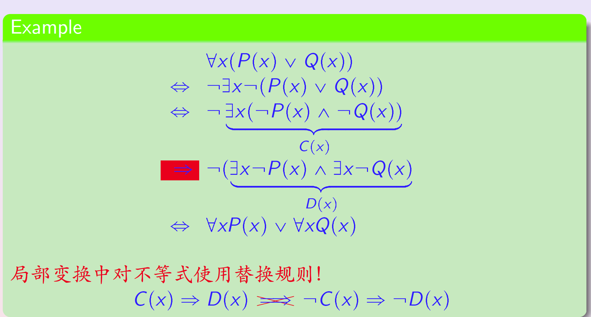
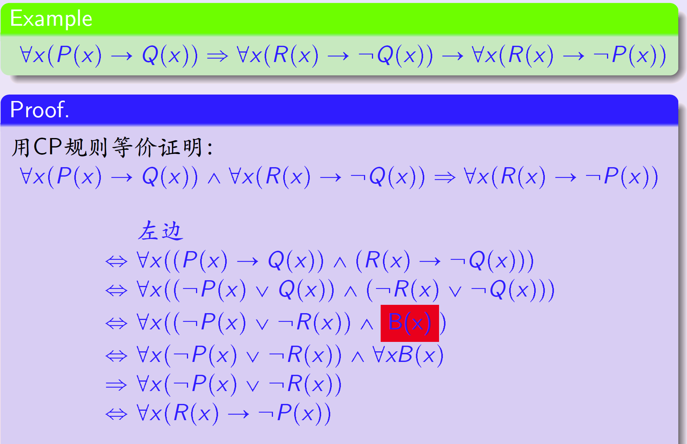
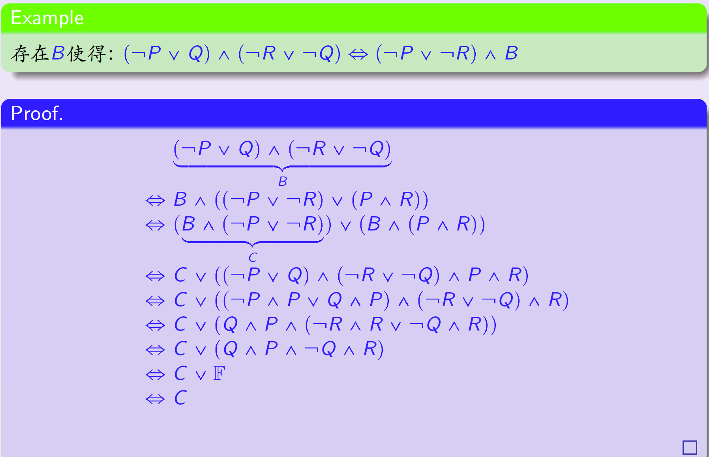
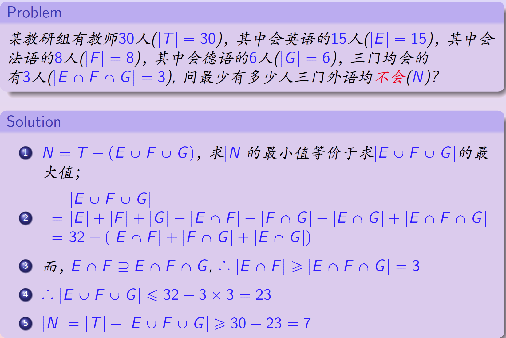
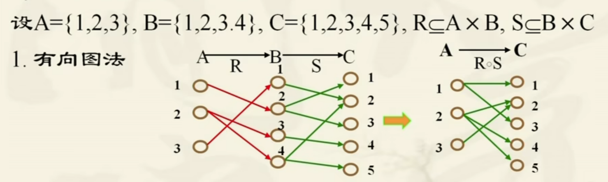
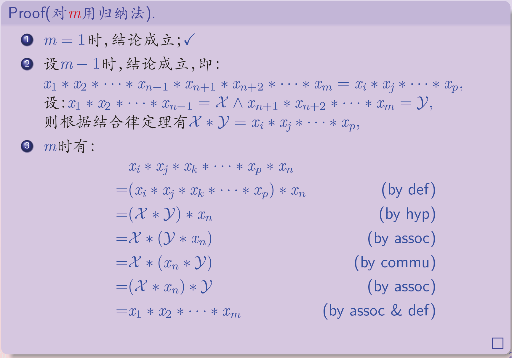
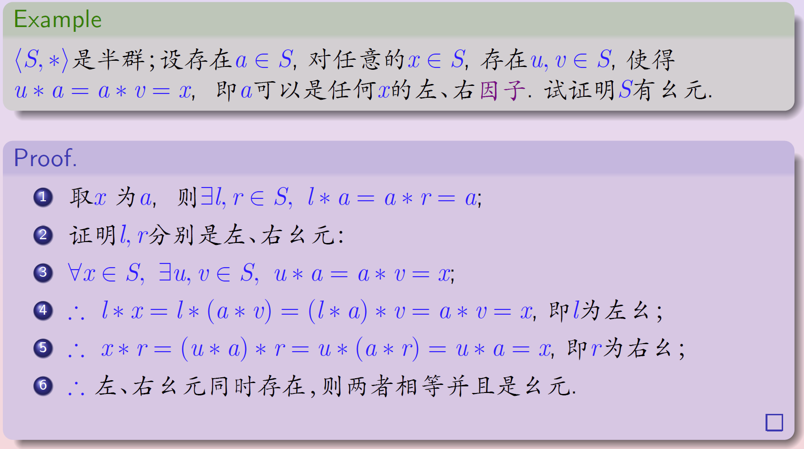
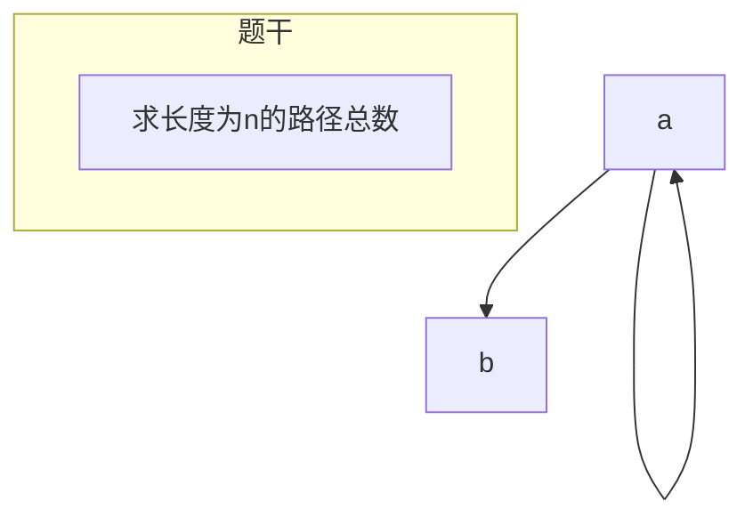

[TOC]

# 离散数学笔记

## 命题逻辑

### 命题符号化

### 合式公式

符号串，空串，字母表等定义

$\Sigma$表示字母表（都是一个个字母），$\Sigma^*$表示由字母表中的字母构成的字符串的集合，$\Sigma^+$表示非空字符串的集合。

### 永真蕴含的证明

* Method 1: 设**前件**为真，推理**后件**为真

* Method 2: 设**后件**为假，推理**前件**为假

* 需要额外注意的是，如果通过直接推理发现很难完成，可以试着去考虑**分类讨论**

### 代入规则与替换规则

#### 代入规则

**特别注意，一个合式公式本身也是他自己的子公式**

**恒等与蕴含**关系都是可以替换的
$$
A\Leftrightarrow B, 则A(F/P)\Leftrightarrow B(F/P)\\
A\Rightarrow B, 则A(F/P)\Rightarrow B(F/P)\\
$$

#### 替换规则

**恒等**可以，但**蕴含**不可以。

$$
A\Leftrightarrow B, G\Leftrightarrow G'\\
A\Rightarrow B, G\nRightarrow G'\\
$$

### 广义De Morgan定理（对命题变元和谓词都是成立的）

设$G$是一个仅含有全称、特称、非、合取、析取运算符的公式，则：

$$
\neg G(P_1,P_2,\cdots,P_n)\Leftrightarrow G^*(\neg P_1, \neg P_2,\cdots, \neg P_n)\\
$$

注意看公式的证明方法：**对公式的递归结构用归纳法证明**。尤其是**归纳法**证明

$$
F\Leftrightarrow G \space 当且仅当 \space F^*\Leftrightarrow G^*\\
F\Rightarrow G \space 当且仅当 \space G^*\Rightarrow F^*\\
$$

其实**对偶**运算和**取反**运算在运算律上是一样的。（因为这两个定律的证明过程中，都是**先去取反**，再用**广义De Morgan**去调整成**对偶式**，进而**用原子的取反代入原子**，最终将**双重否定化简**即可得到答案）

**另外，对于永真蕴含式往往是不便于处理的。我们会将其改写成$A\rightarrow B \Leftrightarrow T$的形式，以便于处理。**

### 范式

注意区分**析取范式**和**主析取范式**的区别，一定要注意**唯一性**的问题。

主析取范式在最后的化简中一定要到$\sum$和$\prod$的程度才可以。

### 与非、或非、异或

$\{\downarrow\}$是全功能的，这其实是因为可以**自反来构造非门**。

$$
\neg P \Leftrightarrow P\downarrow P\\
$$

对于全功能：一定要向$\{\lnot,\land\}$方向靠拢

### 推理与证明

* 直接推理法：假设前件为真，再逐步推理(证明序列)

* 真值表法

* 反证法

* 将条件等价转化，再推理

| 字母 | 说明                 |
| -- | ------------------ |
| P  | Premise（前提）        |
| T  | Tautology（恒等变换）    |
| MT | Modus Tollens(拒取式) |
| CP | Conditional Proof  |
| MP | 假说推理               |

过程书写每行三部分

1. 行号（1，2，3……）

2. 结论

3. 依据（包括原理+前面的结论）

#### CP规则

$$
H_1,H_2,...,H_n \vdash P \rightarrow Q \iff H_1, H_2,...,H_n,P\vdash Q.\\
$$

#### 反证法

$$
H_1,H_2,...,H_n\vdash C\iff H_1,H_2,...,H_n,\neg C\vdash F\\
$$

**当要证明的结论是析取时**

* 利用**反证法**得到两个条件

* 将**析取**转化为**蕴含**得到一个附加条件

### 做题笔记

#### 小心替换规则的错用

 

#### 利用真值表推理“永真蕴含式”

在已知一个式子的真值表，求他有多少个不同的永真蕴含公式（仅考虑有相同的原子命题，且真值表相同的合式公式认定为同一合式公式）

对于这种问题，我们必须知道的是，如果$P\Rightarrow Q$，则 **$P$的真值表是$Q$的真值表的子集**。

例题：

$P\land Q$有多少个不同的永真蕴含公式（仅考虑有相同的原子命题，且真值表相同的合式公式认定为同一合式公式）

$P\land Q$有1个1,3个0，所以答案为$2^3=8$.

## 谓词

### 谓词和量词

**谓词中出现的对象可以是通过常数，变量和函数符号组成的对象，称为“项”(terms)**

谓词有**特性谓词**、**动作谓词**。

#### Definitions

* 常数符号(constant symbol): 3, John, Mary, ...

* 变量符号(variables): x, y, z, ...

* 函数符号(functions): plus, father, f, g, ...

* 谓词符号(predicate): MAN, GREATER, LOVE, P, Q, R, ...

#### Remark

* 每个函数符号都固定的个数：$f$的参数的个数为$n$，称为$n$元函数

* **0元函数退化为常数**

* 每个谓词符号都固定参数的个数：$P$的参数个数为$n$, 称为$n$元谓词

* **0元谓词退化为命题**

#### 符号化谓词公式

**Example**

* 这个班的每个学生都去过北京

* $C(x): x$是这个班的学生

* $B(x): x$去过北京

* $\forall x(C(x)\rightarrow B(x))$

特别注意**不要写成**$\forall x(C(x)\land B(x))$​，厘清这二者的区别。

* 蕴含对$x$的**取值范围**是弱限制的（**需要保证x不论在不在取值范围内为真**），而合取则是有限制的。

另外，$C(x)\rightarrow$称为**全称限定条件**

**Example**

* 这个班有同学去过北京

* $C(x): x$是这个班的学生

* $B(x): x$去过北京

* $\exists x(C(x)\land B(x))$

这个同样也不要写反了（**这里则是有真的就整个为真，所以在限制取值范围时用合取来加强**），另外

$C(X)x\land$称为**特称限定条件**

#### 运算优先级

从高到低依次为：

$$
(),\forall,\exists,\lnot,\land,\lor,\rightarrow,\leftrightarrow\\
$$

所有的火车都比有的汽车跑得快

$$
\forall x(Train(x)\rightarrow\exists y(Car(y)\land Fast(x, y)))\\
\forall x\exists y(Train(x)\rightarrow Car(y)\land Fast(x, y))\\
$$

**喝酒者悖论**

There is someone in the pub such that, if he is drinking, everyone in the pub is drinking.

$$
\exists x(D(x)\rightarrow \forall y(D(y)))\\
$$

**存在唯一**$\exists!$

每个数都有唯一的直接后继数

$$
\forall x(N(x)\rightarrow \exists!y(N(y)\land Succ(x, y)))\\
$$

#### 辖区(Scope)与论域(Domain)

##### Definition

* 形如：$\forall x(F)(\exists x(F))$的子公式, $F$称为全称(特称)量词的**辖域**;

* $F$中出现的$x$称为**约束出现(bound occurrence)**,  $x$也称为**约束变量(bound variable)**

* 子公式F没有被约束的变量称为**自由出现(free occurrence)**, $x$也称为**自由变量(free variable)**.

要想判断一个**量词命题的真假**是需要**论域**的。

**对于含有自由变量的公式，只有在每个自由变量都取定D中的值时公式才有解释.**

* 每个$n$元函数对应于一个$D^n\rightarrow D$的函数

  $$
  D^n\triangleq\{<x_1,x_2,...,x_n>|x_i\in D,i=1,2,...,n\}\\
  $$

  值域也在$D$上的目的：

* 每个$n$元谓词对应于一个$D^n\rightarrow\{0,1\}$

### 公式间的关系式

#### 量词的消解

$$
\forall xF\Leftrightarrow F\\
\exists xF\Leftrightarrow F\\
$$

#### 辖域的扩张与收缩(extension & restriction)

设$x$不在$G$中出现，则：

$$
(\forall xF(x))\land G \Leftrightarrow \forall x(F(x)\land G)\\
(\exists F(x) \land G)\Leftrightarrow \exists x(F(x)\land G)\\
(以上式子对于\lor也可行)\\
\\
\forall xP(x)\rightarrow Q(x)\Leftrightarrow \exists x(P(x)\rightarrow Q(x))\\
Q(y)\rightarrow \forall xP(x)\Leftrightarrow \forall x(Q(y)\rightarrow P(x))\\
$$

#### 量词的分配形式

$$
\forall x(F(x)\land G(x))\Leftrightarrow \forall xF(x) \land\forall xG(x)\\
\exists x(F(x) \lor G(x))\Leftrightarrow \exists xF(x)\lor \exists xG(x)\\
\forall xF(x)\lor \forall xG(x)\Rightarrow \forall x(F(x)\lor G(x))\\
\exists x(F(x)\land G(x))\Rightarrow \exists xF(x)\land \exists xG(x)\\
$$

**严$\forall$对严$\land$，宽$\exists$对宽$\lor$​**

不过要特别注意**换名规则**的使用：

$$
\forall xF(x)\lor \forall xG(x)\Leftrightarrow \forall x\forall y(F(x)\lor G(y))\\
$$

#### 多个量词的处理

$$
\exists y\forall x F(x, y)\Rightarrow \forall x\exists yF(x,y)\\
$$

**右无法推左：**不同的$x$对应的使$F(x, y)$为真的$y$是**不一样**的，这样就无法反推了。

例如，每个人都有人喜欢，而没人被所有人喜欢

$$
\forall x\exists yLove(x, y)\nRightarrow\exists y\forall xLove(x, y)\\
$$

从$(x, y)$组合的角度来理解这种多量词会好很多，也就是去看**解集**都能是什么情况~

**注意下面这个神奇的推理：**

$$
\begin{align*}
&\forall xP(x)\rightarrow \exists xQ(x)\\
\Leftrightarrow& \exists x(P(x)\rightarrow Q(x))\\ 
\Leftrightarrow &\exists x\exists y(P(x)\rightarrow Q(y))\\
\end{align*}
$$

需要能理解到的是：出现在**蕴含式**之前的量词，其实是以**否定**的形式出现的。

### 谓词公式的自然推理

#### 全称指定规则(Universal Specification)

$$
US:\forall xF(x)\Rightarrow F(y)\\
$$

**这里谈到的所有注意点适用于后面所有的规则**

**特别注意：量词前面不能有任何符号**

$$
\frac{\lnot \forall xF(x)}{\neg F(c)}(US)\times\\
$$

**而且量词的辖域必须是整个式子，不是局部的子公式**,不是说推理一定错，而是说**依据是错的**

$$
\frac{\forall xF(x)\lor G(x)}{F(c)\lor G(c)}(US)\times
$$

**引入的新符号不能是之前存在的自由变量**

$$
\frac{\forall x(F(x)\lor G(y))}{F(y)\lor G(y)}(US)\times
$$

#### 特称指定规则(existsential Specification)

$$
ES:\exists xF(x)\Rightarrow F(c)\\
$$

#### 两者混用

全称和存在都有的时候，要**先用特殊规则，再用一般规则**

**错误推理：**

| 序号 | 公式              | 依据    |
| :- | --------------- | ----- |
| 1  | $\forall xP(x)$ | P     |
| 2  | P(c)            | US(1) |
| 3  | $\exists xQ(x)$  | P     |
| 4  | Q(c)            | ES(2) |

**改错：**

| **序号** | **公式**          | **依据** |
| ------ | --------------- | ------ |
| 1      | $\exists xQ(x)$  | P      |
| 2      | Q(c)            | US(1)  |
| 3      | $\forall xP(x)$ | P      |
| 4      | P(c)            | ES(2)  |

#### 特称推广规则（Extential Generalization）

$$
EG:F(c)\rightarrow \exists yF(y)\\
$$

#### 全称推广规则(Universal Generalization)

$$
F(x)\Rightarrow \forall yF(y)\\
$$

### 做题笔记

#### 巧妙打包

**不过为什么一定能改写成这种形式呢？**

这里的过程其实是，先猜出来了，左边的式子就是`B`，然后从第一行到第二行其实是：

$$
B\Leftrightarrow B\land T\\
$$

特别注意第2行的`T`是如何发现的呢？

$$
把\neg P\lor \neg R认成\neg(P\land R)就可以看出来其实是T了
$$

## 集合

### 基本概念

集合中所有元素的个数称为该集合的**基数(Cardinal)**，记为$|S|$

### 集合上的运算

- 环合：$A\oplus B$，异或运算
- 环积：$A\otimes B$，同或运算

#### 指标集(Index)

$I$是一个集合，并且对$\forall i\in I$都有一个集合$S_i$与之对应，称这样的集合为**指令集(Index)**

其实是$I$中的**每个元素都一一对应一个集合$S_i$**,所以$I$其实可以看作是一种**集合的集合**，只不过方式是**映射**。

### 集合的构造

#### 幂集合(Power Set)

对每个集合$S$，都存在一个集合，该集合的元素正好是集合$S$的子集合，称为$S$的幂集合，记为$P(S)(or 2^S)$;

$$
P(S)=\{T|T\subseteq S\}\\
$$

#### 字符串集合归纳定义

设$A$是一个集合，则$A$上的有限序列集合$A^*$归纳（递归）定义(inductive(recursive) definition): 如下：

1. **inductive base:** $\varepsilon\in A^*$

2. **inductive rule:** $s\in A^*\land a\in A\Rightarrow<a, s>\in A^*$

3. （**极小项条款**）$A^*$的所有元素都由并仅由以上步骤在有限步生成

#### 结构归纳法(Structural Induction)

设$S$是一个具有归纳结构的集合，$\forall x(x\in S\rightarrow P(x))$,当且仅当，下述两个条件同时成立：

* **Base:**对$S$递归定义中的基础集合$B$有：$\forall x(x\in B\rightarrow P(x))$

* **Inductive rule:**对每个归纳条款$r(x,y)$（表示由x和y按照规则r生成的新元素），有：$P(x)\land P(y)\rightarrow P(r(x, y)).$

#### 序偶(Ordered pair)

本质上就是**二维向量**，是**有序的**，可以用**集合**的方式理解为$<a, b>\triangleq\{a,\{a,b\}\}$.

##### n重组(n-tuple, inductive definition)

* **inductive base:** 二重组即序偶

* **inductive rule:**任$n(n\geqslant3)$个元素$a_1,a_2,...,a_n$，设前$n-1$个元素的$n-1$重组已经定义，并记为$<a_1,a_2,...,a_{n-1}>$，则n重组定义为$<a_1,a_2,...,a_n>\triangleq<<a_1,a_2,...,a_{n-1}>,a_n>$

##### 叉积 笛卡尔乘积集合(Cartesian Product)

$$
\prod_{i=1}^nA_i= A_1\times A_2\times...\times A_n\triangleq\{<a_1,a_2,...,a_n>|a_i\in A_i,i=1,2,...,n\}
$$

特别强调，**笛卡尔乘积集合不满足结合律**

###### 性质

$$
\varnothing\times A=\varnothing\\
关于交并计算满足分配律\\
ex:A\times(B\cup C)=(A\times B)\cup(A\times C)\\
|\prod_{i=1}^nA_i|=\prod_{i=1}^n|A_i|\\
$$

##### 容斥原理(inclusion-exclusion principle)

$$
\big|\bigcup_{i=1}^nA_i\big|=\sum_{i=1}^n(-1)^{i+1}\sum_{\{j_1,j_2,...,j_i\}\subseteq\{1,2,...,n\}}\big|\bigcap_{k=1}^iA_{j_k}\big|\\
\big|\bigcup_{i=1}^nA_i\big|=\sum_{i=1}^n|A_i|-\sum_{i,j,i\neq j}|A_i\cap A_j|+\sum_{i,j,k:i\neq j,j\neq k,k\neq i}|A_i\cap A_j\cap A_k|-...\pm|A_1\cap A_2...\cap A_n|
$$

### 做题笔记

#### 看好放缩的范围，注意卡

## 关系

### 关系的定义

$$
R\subseteq A_1\times A_2\times...\times A_n, n元关系
$$

对于一元关系会退化为**一般的集合**，关系在本质上讲仍然是**集合**

对于一个集合A($|A|=n$)上面的二元关系的数量有：

$$
|\rho(A\times A)|=2^{n^2}\\
$$

**平凡关系**（普遍存在的关系）：

$$
\varnothing, 空关系\\
R=\prod_{i=1}^nA_i, n元全域关系\\
$$

对于空关系，注意

$$
\varnothing\subseteq\varnothing\times\varnothing\\
\varnothing\subseteq A\times B\\
$$

这是两种不一样的**空关系**

在**非空集合上的空关系**表现为，所有的点都是孤立的，关系矩阵均为0.

因为想要让两个关系相等需要满足2个条件：

1. 前域和陪域相同

2. 两个关系在集合意义上是相等的

例：

$$
|\subseteq \mathbb{N}^2和|\subseteq(\mathbb{N}-\{0\})\times \mathbb{N}是不一样的整除关系\\
$$

$$
aRb(中缀)\\
<a,b>\in R(后缀)
$$

* **定义域(Domain): ** 序偶中第一分量的集合。

  $$
  Dom(R)\triangleq\{x|\exists y(y\in B\land<x,y>\in R)\}\subseteq A\\
  $$

* **值域(Range): **序偶中第二分量的集合

  $$
  Ran(R)\triangleq\{y|\exists x(x\in A\land<x,y>\in R)\}\subseteq B\\
  $$

* 特别注意，在考虑定义域值域时，要考虑**自反性（Reflexive）**，即：**恒等关系**：$\mathbb{1}_A=\{<x,x>|x\in A\}$

### 关系的表示方法

#### 关系矩阵(Matrix of Relation)

$$
A=\{a_1,a_2,...,a_m\},B=\{b_1,b_2,...,b_n\},R\subseteq A\times B\\
M_R=(c_{ij})_{m\times n},c_{ij}=\begin{cases}
1,a_iRb_j\\
0,a_i\not Rb_i\\
\end{cases}
$$

### 关系的基本运算

#### 逆关系

$$
\tilde R=\{<y,x>|xRy\},R\in A\times B\\
\tilde R\in  B\times A\\
逆关系的关系矩阵：M_{\tilde R}=M^T_R\\
$$

逆运算和并交差补运算都满足分配率。用$表示并交差补运算之一：

$$
R,S\in A\times B\\
\tilde {\tilde R}=R,转置的转置\\
\sim \tilde R=\tilde{(\sim R)}\\
(R$S)^{-1}=R^{-1}\$S^{-1}\\
R\subseteq S \iff R^{-1}\subseteq S^{-1}\\
\tilde R不如R^{-1}好看（）
$$

#### 合成

能合成的前提：R的陪域是S的前域。

$$
R\subseteq A\times B,~S\subseteq B\times C\\
R\circ S=\{<a,c>|\exists b\in B(<a,b>\in R\land <b,c>\in S)\}
$$

**矩阵的逻辑乘法：**结果矩阵的第i行，第j列元素的值为，第i行的n个元素分别**逻辑与**第j列的n个元素，然后将n个结果进行**或运算**，最终的结果就是矩阵的第i行，第j列的元素的值。

与**矩阵乘法**的区别在于，将**乘**换成了**逻辑与**，将**加**换成了**逻辑或**。

但如果是直接做**矩阵乘法的话**，那么得到的值是长度为n的路径的**条数**。

$$
\begin{align}
M(R_2\circ R_1)
&=M(R_2)\cdot M(R_1)\\
&=
	\left[
	\begin{matrix}
		1&1&0\\
		1&0&1\\
		0&0&0
	\end{matrix}
	\right]
\cdot
	\left[
	\begin{matrix}
	1&1&0\\
	1&0&1\\
	0&0&0
	\end{matrix}
	\right]
\\
&=
	\left[
	\begin{matrix}
	1&1&1\\
	1&1&0\\
	0&0&0
	\end{matrix}
	\right]
\end{align}
$$

对于相对简单的矩阵，可以采用有向图的方法来解决。

* 关系复合**不满足交换律**，但满足**结合律**

* 关系复合还保持**子集关系**

  $$
  R\subseteq S,U\subseteq W\\
  U\circ R\subseteq W\circ S
  $$

* 与**单位矩阵的转化关系（同一律）**

  $$
  R\subseteq A\times B\\
  \mathbb1_A\circ R=R=R\circ\mathbb1_B\\
  $$

* 关于**并集**满足分配律

  $$
  T\circ(R\cup S)=(T\circ R)\cup (T\circ S)\\
  (R\cup S)\circ T=(R\circ T)\cup(S\circ T)\\
  $$

* 关于**交集**只有**单向**的

  $$
  T\circ(R\cap S)\subseteq(T\circ R)\cap(T\circ S)\\
  (R\cap S)\circ T\subseteq(R\circ T)\cap(S\circ T)\\
  $$

  可以通过下面这个例子来理解，右不能推左(**回到集合定义的角度来解决问题**)

  $$
  <a,c>\in RHS\\
  <a,c>\in(T\circ R)\\
  令<a,b>\in T,<b,c>\in R\\
  \\
  <a,c>\in(T\circ S)\\
  令<a,d>\in T,<d,c>\in S\\
  \\
  $$

### 关系的一般属性

#### 自反性(Reflexive)

##### 定义

$\forall x\in A,<x,x>\in R$，这个更好用，可以推理出来：

* **空集上的空关系**是自反关系（**前件为假，公式为真**）,也是反自反关系。

* **非空集合上的空关系**不是自反关系，是反自反关系。

如果**都不存在**$<a,a>\in R$​，则是**反自反**的。

特别注意的是，一个关系可以是**既不自反，也不反自反**的

##### 关系矩阵表示

反映在关系矩阵中是：

* 对角线**都是1**，则是自反关系

  $$
  \mathbb1_A\subseteq R\\
  $$

* 对角线**都是0**，则是反自反关系

  $$
  \mathbb1_A\cap R=\varnothing\\
  $$

* **否则**既不自反也不反自反。

#### 对称性

##### 定义

* R是对称的：

  $$
  \forall a,b\in A(<a,b>\in R\rightarrow<b,a>\in R)\\
  $$

* R是反对称的：

  $$
  \forall a,b\in A(<a,b>\in R~\land<b,a>\in R\rightarrow a=b)
  $$

一个关系可以是**既不对称也不反对称**。

##### 关系矩阵表示

* **对称性**：$M_R=M_R^T$

* **反对称性**：要求**非对角线**上的两个对称元素不能同时为1.$r_{ij}\cdot r_{ji}\neq1$

因此要注意到的是**自反性不影响反对称性**

##### 集合表示

* **对称性**：$R=R^{-1}$.

* **反对称性：**$R\cap R^{-1}\subseteq \mathbb1_A$​.

#### 传递性

##### 定义

$$
\forall a,b,c\in A(<a,b>\in R\land<b,c>\in R\rightarrow<a,c>\in R)
$$

##### 关系矩阵表示

$$
R\circ R\subseteq R\\
$$

> [!note]
>
> 如果补充上**自反性**，那么就有$R\circ R=R$了，这是因为对于$\forall <x,y>\in R,<x,x>\in R\land<x,y>\in R\Rightarrow <x,y>\in R\circ R$
>
> 总之其实是注意好多出来的**自反性**的运用。（因为没自反性不行，所以证明这个必须靠自反性）

#### 关系运算与关系的性质

如果给定的两个或一个关系**都**具有某种性质的话，那么运算结果是否还具有该性质呢：

| 运算         | 自反性 | 反自反性 | 对称性 | 反对称性 | 传递性 |
| ---------- | --- | ---- | --- | ---- | --- |
| $\tilde R$ | 1   | 1    | 1   | 1    | 1   |
| $R\cap S$  | 1   | 1    | 1   | 1    | 1   |
| $R\cup S$  | 1   | 1    | 1   | 0    | 0   |
| $R-S$      | 0   | 1    | 1   | 1    | 0   |
| $R\circ S$ | 1   | 0    | 0   | 0    | 0   |

#### 关系的闭包

##### 自反闭包reflexive

R的自反闭包记为：

$$
r(R)=R\cup\mathbb1_A\\
$$

###### 定义

1. 自反闭包是原关系的扩展，即原关系是自反闭包的子集，$R\subseteq r(R)$

2. 自反闭包是自反关系, $\mathbb1_A\subseteq r(R)$

3. 对于任意包含原关系的自反关系$S$,自反闭包也是他的子集:$R\subseteq S\rightarrow r(R)\subseteq S$.

###### 性质

1. 自反闭包保持**子集关系**

   $$
   if~~R\subseteq S,then~~r(R)\subseteq r(S)\\
   $$

2. 自反闭包与交并**满足分配律**

   $$
   r(R\cap S)=r(R)\cap r(S)\\
   r(R\cup S)=r(R)\cup r(S)\\
   $$

##### 对称闭包symmetric

定义与自反闭包是相似的

$$
s(R)=R\cup \tilde R\\
$$

对称闭包与**并**可以分配，而**交**不可以。

$$
s(R\cap S)\subseteq s(R)\cap s(S)\\
s(R\cup S)=s(R)\cup s(S)\\
$$

##### 传递闭包transitive

###### 定义

1. 传递闭包是原关系的扩展，$R\subseteq t(R)$

2. 传递闭包是传递关系$t(R)\circ t(R)\subseteq t(R)$

3. 对于任意包含原关系的传递关系$S$,传递闭包是他的子集：$R\subseteq S\rightarrow t(R)\subseteq S$

全域关系一定是传递的，全域关系的并集也一定是传递的。

###### 性质

1. 传递闭包保持**子集关系**

   $$
   if~~R\subseteq S,then~~t(R)\subseteq t(S)\\
   $$

2. 传递闭包对**交并**只有**子集关系**

   $$
   t(R\cup S)\subseteq t(R)\cup t(S)\\
   t(R)\cap t(S)\subseteq t(R\cup S)\\
   $$

###### 关系的幂

$R^n$​​是关系与自己的n次复合。

* 递归定义

$$
R^0=\mathbb1_A\\
R^{n+1}=R^nR\\
$$

从**关系矩阵**的角度来说，取$R^n$的关系矩阵中的某个元素$m_{ij}$,若$m_{ij}=1$​​，那么说明i到j之间有一条长度为n的通路。原关系的关系矩阵就是描述那些元素具有**直接通路**，也就是长度为1的通路。

* 性质

$$
R^mR^n=R^{m+n}\\
(R^m)^n=R^{mn}\\
$$

在一个传递的关系中，**若两个元素间具有一条长度大于等于2的通路，那么这两个元素间就应当有一条直接通路。**因此，我们每计算一次$R^n$，就是在寻找任意两个元素间的n通路，**当我们从1遍历到正无穷的时候，就相当于找到了所有长度的通路**。这样，只要在“有通路”的两个元素间建立一条直接通路，我们就生成了原关系的传递闭包：

$$
t(R)=\bigcup_{n=1}^{+\infty}R^n=R^*\\
$$

$R^*$是中间的关系广义并的简记。然而实际上我们不可能一直计算到无穷大。假设A中有n个元素。如果一条通路长度大于n、那么这条通路必然会经过**重复的顶点(鸽笼原理)**，因此这条通路已经是至少两条长度小于n的通路的相连了。也就是说，我们只需计算到$R^n$即可结束：

$$
t(R)=\bigcup_{k=1}^nR^k\\
$$

##### Warshall算法

Warshall算法实际就是图论中的Floyd算法。这个算法是利用递推式，从$W_0=M_R$开始，计算到$W_n$为止。$W_n$本身就是传递闭包结果，这省略了求广义并的过程。

记$w_{ij}^k$为矩阵$W_k$的第i行j列元素。第k个矩阵由上一个矩阵，也就是第k−1个矩阵完全确定。递推式是：

$$
w_{ij}^k=w_{ij}^{k-1}\lor(w_{ik}^{k-1}\land w_{kj}^{k-1})\\
$$

##### 关于闭包的证明方法

注意反复运用以下性质，对于析取进行**分类讨论**即可，用定义的角度去证明$\forall x\in A,x\in B\Rightarrow A\subseteq B$

1. 先验证构造的闭包是满足闭包第2点性质

2. 闭包的3个性质(**尤其是第2点容易忘记用**)

3. $A\subseteq B\land B\subseteq A\Rightarrow A=B$

**特别地，对于传递闭包的证明，要用数学归纳法，同样要注意合成运算的定义**

### 等价关系与集合的划分

如果一个关系同时是**自反关系**，**对称关系**，**传递关系**，那么称它为**等价关系**。

#### 等价类

若$R$是$A$上的等价关系，$a\in A$,则$a$的等价类是：

$$
[a]_R\triangleq\{x|x\in A\land xRa\}\\
$$

$a$称为等价类$[a]_R$的**代表元**

#### 等价类的性质

下述3个条件是等价的

$$
aRb\\
[a]_R=[b]_R\\
[a]_R\cap [b]_R\neq\varnothing\\
$$

#### 划分

$A$是一个集合，$A$的一个划分是一个集簇：

$$
\Pi = \{A_i|i\in I(指标集),A_i\subseteq A\land A_i\neq\varnothing\}
$$

该集簇满足两个条件：

$$
\bigcup_{i\in I}A_i=A\\
\forall i,j\in I,if~~i\neq j,then~~A_i\cap A_j=\varnothing\lor A_i=A_j\\
$$

#### 等价类与划分的关系

设$R$是集合$A$上的等价关系，则$R$的等价类集簇：

$$
\Pi_R=\{[a]_R|a\in A\}\\
$$

称之为由等价关系R诱导的**划分(induced)**

**等价关系可以等同于集合的划分**

设$\Pi$是集合$A$的一个划分，$A$上的关系$R_\Pi$定义如下：

$$
aR_\Pi b \iff \exists A_i\in\Pi\land a\in A_i\land b\in A_i\\
$$

1. $R_\Pi$是$A$上的等价关系

2. 由$R_\pi$诱导的划分$\Pi_{R_\Pi}$其实就是$\Pi$​

> [!note]
>
> 划分的证明就是三步走：
>
> 1. 每个划分块非空
> 2. 两个划分块若交集非空，则两个划分块相等
> 3. 所有划分块并集等于全集

#### 商集合(Quotient Set)

设$R$是集合$A$上的等价关系，则由$R$诱导的划分称为关于关系$R$的**商集合**：

$$
A/R\triangleq\{[a]_R|a\in A\}\\
$$

$|A/R|$称为关系$R$​的**秩（rank）**

### 偏序关系

#### 定义

设$R$是集合$A$上的关系，称$R$为**偏序关系**，iff,$R$满足下述三个条件：

1. 自反性

2. 传递性

3. 反对称性

二重组$<A,R>$称为**偏序集合(Partially ordered set, Poset)**

偏序关系一般用$\preccurlyeq$表示，如$<A,\preccurlyeq>$.

#### 定义：全序关系（线序关系）(Total order/Linear order)

**可比较的Comparable**

设$<A,\preccurlyeq>$是一个偏序集合，$x,y\in A$,称x和y是**可比较的**，iff,$x\preccurlyeq y\lor y\preccurlyeq x.$

**Definition**

设$<A,\preccurlyeq>$是一个偏序集合,称该偏序为全序（线序），iff,$\forall x,y\in A$，x和y是可比较的。

#### Hass图

**Hass图**是一种**简化的关系图**，用于表示一个偏序关系。

由于偏序关系是**对称的**，每个元素必有一条指回自己的**自回路**，这显然可以省略；

由于偏序关系是**传递的**，两元素间有长度大于等于2的通路则必有直接通路，因此略去所有长度大于等于2的通路。这意味着只有一个元素**覆盖**另一个元素时，两者间才有边；

规定偏序关系中较大者总画在较小者的上方，这样可以略去方向。

#### 拟序关系(Strict order)

##### Definition

设$R$是集合$A$上的关系，称$\prec$为**拟序关系**，iff,$\prec$满足以下三个条件

1. 反自反性

2. 传递性

3. 反对称性

**Remark**

拟序定义中的反对称性实际上可以有反自反性＋传递性推出来

#### 拟序和偏序的关系

* 设$<A,\preccurlyeq>$是poset, 则$\preccurlyeq-\mathbb1_A$是拟序；

* 设$\prec$是$A$上的拟序，则$\prec\cup~\mathbb1_A$​是偏序；

#### 最大元素，最小元素，极大元素和极小元素

记住这里的大和小说的是在**指定的偏序关系**之下的大和小。

例如：

$$
<\mathbb N,\geqslant>上0是最大的元素
$$

**最**要求和谁都能比，**极**要求能比的他都最大。

有限集合一定存在**极大（极小）元素**。

#### 临界元素

##### Definition:上（下）界Upper(Lower) bound

* 设$<A,\preccurlyeq>$为Poset, $B\subseteq A,a\in A$是$B$的上(下)界，iff, $\forall b\in B,b\preccurlyeq a(a\preccurlyeq b)$

* **最小上界（上确界）Least upper bound, Supremum:**上界集合$\{a|a是B的上界\}$的最小元素，记为：$lun(B)$

* **最大下界（下确界）Greatest lower bound, Infimum:**下界集合$\{a|a是B的下界\}$的最大元素，记为：$glb(B)$。

#### 良序关系

$<\Sigma,\preccurlyeq>$是偏序关系，称关系$\preccurlyeq$是**良序关系**，iff, $\preccurlyeq$是线序，并且$A$的每个非空子集合都存在最小元素。

$<\Sigma,\preccurlyeq>$也称为**良序集合(Well-ordered set)**

**Well-ordering theorem**

任意一个集合都可以在其上构造一个良序关系.

### 做题笔记

## 函数

### 函数（function, map, mapping）

设$f$是集合$X$到$Y$上的关系($f\subseteq X\times Y$)，$f$是函数，iff，

* **完全性：**$\forall x\in X,\exists y\in Y$,such that $<x,y>\in f$

* **多对一：**if $<x,y>\in f~\land<x,z>\in f$,then $y=z$

集合$X$和$Y$分别称为函数$f$的定义域(domain)和陪域(codomain).与$x\in X$有关系$f$的$y\in Y$记为:$f(x)$,即$y=f(x)$

**Remark**

* **非完全的（部分函数partial function）:**$\exists x\in X\land \forall y\in Y,<x,y>\notin f$

  表示函数在有些点没有定义，满足**多对一**不满足**完全性**的关系

* **一对多（多值函数multivalued function）:**$\exists x\in X\land y,z\in Y\land y\neq z\land<x,y>\in f\land<x,y>\in f:$

  表示函数在有些点可能对应多值，满足**完全性**不满足**多对一**的关系

* 常常要考虑到**Y中有多出来的元素**和**X的多对一**特性来举出反例。

**Extended Theorems**

1. $y\notin Y'\land y=f(x)\Rightarrow x\notin f^{-1}(Y')$

2. $x\notin f^{-1}(Y')\land y=f(x)\Rightarrow f(x)\notin Y'$

3. 对于一个单独的量,$x, y$，他们是可以随意套$f,f^{-1}$并进行化简的(这里$f^{-1}$为求**逆函数**)

   但是对于一个集合$A,X,Y$等，他们仍然可以对等式两边套$f,f^{-1}$但是不可以随意进行化简的。必须用（这里$f^{-1}$为求**逆像**）

   $$
   A\subseteq f^{-1}(f(A))\\
   f(f^{-1}(B))\subseteq B\\
   $$

4. $y\in f(A)$, then $\exists x\in A, y=f(x)$

5. $x\in f^{-1}(B)$, then $f(x)\in B$

### 函数的集合

记$Y^X\triangleq\{f|f:X\rightarrow Y\}$为所有的从$X$到$Y$的函数的集合；

若$X$和$Y$为有限集合，则$|Y^X|=|Y|^{|X|}$;

$|Y|^{|X|}<2^{|X|\times|Y|}, then Y^X\subsetneq P(X\times Y).$

**函数相等**：称两个函数$f,g:X\rightarrow Y$相等（记为$f=g$）, iff, 对应的函数关系相等。即：函数$f,g$在任一点具有相同的函数值，$\forall x\in X,f(x)=g(x)$

### 像(image)

设$f:X\rightarrow Y$是$X$到$Y$上的函数，$A\subseteq X,B\subseteq Y:$

* $A$在$f$下的**像**：

  $$
  f(A)\triangleq\{y|\exists x\in A\land y=f(x)\}=\{f(x)|x\in A\};\\
  $$

* $B$在$f$下的**逆像(inverse image)**：

  $$
  f^{-1}(B)\triangleq\{x|\exists y\in B\land y=f(x)\}=\{x|f(x)\in B\};\\
  $$

* $f(X)$称为函数$f$的**值域(range).**

**Remark:**

$f^{-1}$有两重含义，求逆像和逆函数（反函数），求逆像的作用对象只能是集 合; 只有当 f 的逆函数存在时，$f^{-1}$才能作用元素.

### 函数的合成

$f:X\rightarrow Y,g:Y\rightarrow Z$.则关系$f$和$g$的合成关系$f\circ g$也是函数，记为$g\circ f$​（注意这里**函数合成的写法与关系合成相反**）

**Theorem**

设$f:X\rightarrow Y,g:Y\rightarrow Z,h:Z\rightarrow W:$

* $\mathbb1_Y\circ f=f\circ\mathbb1_X=f$

* $h\circ(g\circ f)=(h\circ g)\circ f$

### 单射、满射、双射

一旦发现无法直接依靠定理推出来时，一定要试着回到集合级别的定义来解决。要证明$A=B$，多半会先有一个$A\subseteq B$，对于另一个$B\subseteq A$，就需要从$\forall x\in B$开头，尝试用到函数的性质即可。

设$f:X\rightarrow Y:$

* 若$f(X)=Y$，称$f$​为**满射(onto)**.

* 若$\forall x,x'\in X, f(x)=f(x')\rightarrow x=x'$，称$f$为单射(one to one)

* 若$f$既是单射，也是满射，则$f$​为双射(bijection)

> [!note]
>
> 如果$|X|=|Y|$，那么$f$是**单射**$\iff f$是**满射**（这里的依据是**容斥原理**）

**Theorem**

* 设$f:X\rightarrow Y, g:Y\rightarrow Z$，若$f,g$是（单、满、双）射，则$g\circ f$​​​也是（单、满、双）射。

  * 若$g\circ f$是单射，则$f$是单射

  * 若$g\circ f$是满射，则$g$是满射

  * 若$g\circ f$是双射，则$f$是单射且$g$是满射

* 设$f:X\rightarrow Y$，$f$是双射，iff，$\exists!g:Y\rightarrow X\land g\circ f=\mathbb1_X\land f\circ g=\mathbb1_Y$，称$g$为$f$的**逆函数（反函数）**，记为$g=f^{-1}$.$f$​是可逆的。

* 若$f,g$是双射的，则：

  * $(f^{-1})^{-1}=f$

  * $(g\circ f)^{-1}=f^{-1}\circ g^{-1}$​

* 设$f:X\rightarrow Y.f$​是单射，iff，$\forall A\subseteq X,f^{-1}(f(A))=A.$​

* 设$f:X\rightarrow Y.f$是满射，iff，$\forall B\subseteq Y,f(f^{-1}(B))=B.$

* 有限集合上的双射称为**置换**，通常表示为集合$\{1,2,...,n\}$上的双射。

**充要条件**

设$f:X\rightarrow Y:$

* $f$是单射，iff，$\exists g:Y\rightarrow X\land g\circ f=\mathbb1_X$，称$g$是$f$的**左逆函数**

* $f$是满射，iff，$\exists g:Y\rightarrow X\land f\circ g=\mathbb1_Y$，称$g$为$f$的**右逆函数**

## 基数

1. 把要挖掉的在排列中排成前面的项，并找到合适的规律给出一个无限序列

2. 跳跃式的给定映射关系

3. 补充其他元素自身映射的条件

## 群论

### 运算

设$A$是一个抽象集合，$*:A\times A\rightarrow A,<x,y>\mapsto x*y$是$A$上的二元运算，满足下述条件：

* **结合律：**$\forall x,y,z\in A,(x*y)*z=x*(y*z)$

* **特殊元素：**$\exists e\in A\land\forall x(x\in A\rightarrow e*x=x*e=x).$

设$A$为非空集合，$n\in\mathbb N$，函数$f:A^n\rightarrow A,<x_1,x_2,...,x_n>\mapsto f(x_1,x_2,...x_n), $称为n元运算，集合$A$称为运算$f$的**载体(Carrier).**

* n=0时，运算退化为$A$中的常量。

根据**函数**的定义，**运算**必须具有两个属性：

* **处处有定义**；定义域内每个点都有定义

* 运算**封闭(closed)**$\forall x,y\in A,x*y\in A$，即值域一定在载体$A$中。

> [!NOTE]
> 代数定律使用的是**全称量词**，因此每个定律都是一个“特强”的条件
>
> 全称量词使得使用代入规则进行代数恒等式变换，这是代数推理的核心。

**交换律定理**

$<A,*>$满足交换律，当且仅当，*的运算表是对称的。

$<A,*>$满足结合律和交换律，$x_1,x_2,...,x_m\in A$，设:$(i,j,k,...,n)$是$(1,2,...,m)$的一个置换，则

$$
x_1*x_2*...*x_m=x_i*x_j*...*x_n\\
$$

在用**归纳法**证明这个定理的时候，注意要证明的其实是可以随意的把一个量插入到中间去，而不是单纯的续尾。

### 特殊元素

#### 幺元和零元

* $\mathbb1_l(\mathbb1_r)$称为左幺元（左单位元）（右幺元），iff

  $$
  \forall x~\mathbb1_l*x=x~(x*\mathbb1_r=x)\\
  $$

* $\mathbb0_l(\mathbb0_r)$称为左零元（右零元），iff

  $$
  \forall x~\mathbb0_l*x=\mathbb0_l(x*\mathbb0_r=\mathbb0_r)\\
  $$

*

| *     | a | b | c |
| ----- | - | - | - |
| **a** | a | b | c |
| **b** | a | b | c |
| **c** | a | c | b |

这个表是竖*横，所以a是左单位元和右零元。

#### 幺元和零元唯一性定理

* 如果左、右单位元(幺元)同时存在，则两者相等，称之为单位元(幺元)，一般用$\mathbb1$或$e$表示。这样的代数系统记为$<A,*,\mathbb1>$

* $<A,*>$如果左、右零元同时存在，则两者相等，称之为零元，一般用0或θ表示.这样的代数系统记为$<A,*,\mathbb0>$

#### 逆元

$<A,*,e>$是一个代数系统，$e$是幺元，如果$x*y=e$，称x是y的左逆元，或称y是左可逆的；y是x的右逆元，或称x是右可逆。

#### 逆元唯一性定理

$<A,*,e>$是**可结合的**，对任意的元素x, 如果左、右逆元同时存在，则两者相等并唯一，称为x的逆元，记该逆元为$x^{-1}$, 称x是可逆的；

注：习惯上，对$<A,+,0>$，元素x的逆元记为-x.

#### 运算下求逆

$<A,*,e>$是**可结合的**，设元素$a,b$是可逆的，则$a*b$也是可逆的，其逆元为$b^{-1}*a^{-1}.$

#### 消去律

$<A,*,e>$是**可结合的**，设元素a是可逆的，则$a*x=a*y\Rightarrow x=y.$称元素a是**（左）可约的。**

可约和可逆是等价的。

**消去律**

设$<A,*>$是一个代数系统，若$A$中的所有元素都是可约的，则称$<A,*>$满足**消去律**。

### 半群

* $<S,*>$是半群，iff，二元运算*具有结合律；

* $<S,*,e>$是幺半群，iff，二元运算*具有结合律，并且具有幺元。

**Remark**:特别注意半群的两个特点：

* 二元运算，而不是代数系统中的n元运算。

* 结合律。前面大量的定律都建立在**结合性**的前提下。

* $<\Sigma^+,\cdot>$是典型的半群，除了结合律之外无其他性质。$\Sigma^+$是除了空字符串的字符串。

#### 子半群

设$<S,*>$是半群：

* $T\subseteq S$，设$T$在运算\*下封闭($\forall x,y\in T$)，则$<T,*>$继承的运算*的结合律，也构成一个半群结构，称为$S$的子半群，记为$T\leqslant S$

* 如果$S$有幺元$e$，并且$e\in T$，则$T$称为$S$的子幺半群。

**证明子幺半群**最关键的是两个点：

- 幺元属于这个半群
- 仍然保持对运算的封闭

#### 半群同态

设$<S,*,\mathbb1>$和$<T,\cdot,e>$是两个幺半群，$h:S\rightarrow T$称为半群的**同态**，iff，$h$满足以下两个条件：

- $\forall a,b\in S,h(a*b)=h(a)\cdot h(b)$
- $h(\mathbb1)=e$

补充定义：

- 去掉$h(\mathbb1)=e$，这就是**一般半群**的同态
- 如果$h$是单射，称为**单同态**
- 如果$h$是满射，称为**满同态**
- 如果$h$是双射，称为**同构**
- 如果$h$的陪域和定义域相同，称为**自同态**
- 自同态+双射=自同构

**Remark:**

往往在进行同态等式证明的时候，我们会对其中一个进行归纳证明，例如对$h(s\cdot t)=h(s)\cdot h(t)$中的$s$进行归纳证明。

1. 假设当$s=\varepsilon,h(\varepsilon\cdot t)=\cdots=h(\varepsilon)\cdot h(t)$
2. 当$s'=a*s$时，证明出$h(s'*t)=\cdots=h(s')\cdot h(t)$

#### 同态像

设$h$是幺半群$<S,*,\mathbb1>$到$<T,\cdot,e>$的同态，则：

- 若$A\leqslant S$，则$h(A)\leqslant T$，特别地，$h(S)\leqslant T$
- 若$B\leqslant T$，则$h^{-1}(B)\leqslant S$，特别地，$h^{-1}(\{e\})\leqslant S$.

### 做题笔记

#### 证明每个有限半群至少有一个幂等元

设$<S,*>$是半群，$S$是有限集，徐证明$\exists a\in S,a*a=a$
$$
\begin{align*}
&\forall b\in S,\because *封闭，\therefore b^2=b*b\in S,b^3,b^4,...\in S\\
&\because S有限，\therefore \exists i,j\in \N_+,i<j,b^i=b^j\\
&\therefore b^i=b^j=b^{j-i}*b^i,令p=j-i,即b^i=b^j=b^p*b^i\\
&\therefore 当q\geqslant i,b^q=b^p*b^q\cdots(1)\\ 
&\because p\geqslant 1,\therefore \exists k\in \N_+,kp\geqslant i\\
&由(1)知，b^{kp}=b^p*b^{kp}=b^{2p}*b^{kp}=...=b^{kp}*b^{kp}\\
&\therefore 令a=b^{kp}\in S,a*a=a,是幂等元\\
\end{align*}
$$
特别注意，这里很容易和前面学到的$b^{j-i}=e$弄混，要额外注意的是，在**半群**中是不一定有**单位元**的，**幂等元**也更不一定是**单位元**

## 群

### 定义

$<G,*,e>$为一个代数结构，当且仅当其满足下述条件时，可以称之为**群**：

- 运算\*具有结合律
- 存在幺元$e$
- $G$中任意元素$a$均存在逆元$a^{-1}\in G$

设$<G,*,e>$为群，

- 若$G$是**有限集合**，称之为**有限群**，$|G|$称为群的**阶**
- 若运算\*具有**交换律**，称之为**交换群(Abelian Group)**
- 习惯上，用+作为群的运算符时，其逆元用$-a$表示

### 判定方法

$<G,*>$为一个代数结构，当其满足以下条件时，$G$是群：

- 运算\*具有结合律
- 存在左（右）幺元$e$
- $G$中任意元素$a$均存在左（右）逆元$a^{-1}\in G$

在证明这个定理的过程中，有以下注意点：

1. 先证明**逆元**，再证明**幺元**。

    当有了合适的**逆元**之后，再去处理**幺元**会容易很多。

2. 在用到逆元的时候，一定要能想到$a^{-1}$的逆元是$(a^{-1})^{-1}$，并用其结合律完成化简。

    而其实综合考虑这两点会发现，其实把$a^{-1}*a=e$调整成$(a^{-1})^{-1}*a^{-1}=e$​来使用，是不得已的事情。

### 方程的解

若$<G,*>$是群，则$\forall a,b\in G,$

- 存在唯一的$x$，使得$a*x=b$
- 存在唯一的$y$，使得$y*a=b$

在证明**唯一性的时候**，重点用到的是**运算结果的唯一性**。

**反向推理：**

已知方程有两个唯一解，且$G$是一个半群，能否推出$G$是一个群

$$
\begin{aligned}
&\because \forall a\in G,\exists!y,y*a=b\\
&\therefore y*a=a\\
下证：&y对于\forall b\in G,y*b=b,即，y是左单位元e_l\\
又&\because \forall a,b\in G,\exists!x,a*x=b\\
&\therefore a*c=b\\
&\therefore y*b=y*(a*c)=(y*a)*c=a*c=b\\
&\therefore y是左单位元\\
&同理有x是右单位元\\
&\therefore G中存在幺元e\\
&\therefore \forall a\in G,\exists!x,y\in G,a*x=y*a=e\\
&\therefore G是群\\
\end{aligned}
$$

> [!NOTE]
> 这种结合已知巧妙代换的思想，**强迫性地**用到结合律来解决问题。
>
> 而且其实在得到$y*a=a$的时候，就已经注定了要对后面的$a$进行代换
>
> 但是在书写过程的时候，采用$y*b=b$的形式仍然是更好的策略

### 元素的阶
#### 定义
设$<G,*,e>$是群，$a\in G$，若存在正整数$n$，使得$a^n=e$，满足上式的最小正整数$n$称为元素$a$的**阶**，称元素$a$具有**有限阶$n$**, 记为$|a|=n$；否则，若不存在这样的正整数$n$，则称元素$a$为**无限阶**。

- 幺元是唯一阶为1的元素，记为$|e|=1$​

> [!NOTE]
> 有时候会证明到某个元素的阶为1，进而证明出是幺元。

#### 性质1
群$<G,*,e>$中，$|a|=n$, 则$a^k=e\iff n|k$

**推论：**（这个推论很常用，甚至往往是用来证明$k=n$的时候用）
$$
k\geqslant n\\
$$

这里我们只强调充分推理的部分，即：$a^k=e\Rightarrow n|k$
若$a^k=e$, 设$k=mn+t,0\leqslant t <n,m\in \Z,$
$\therefore a^t=a^{-mn}=a^k*(a^n)^{-m}=e*e^{-m}=e$.
$\because n$是使$a^n=e$的最小正整数，而且$0\leqslant t < n,$
$\therefore t=0,k=mn.$

这里我们特别强调的是$\mathbf{k=mn+t,0\leqslant t <n,m\in \Z},$这步，这样实现的效果是可以更好地**利用$t=0$说明$n|k$**

#### 性质2
群中任一元素和其逆元具有相同的阶

在证明的时候，主要是用的各个数字在**指数**上具有**良好的交换组合性质**，因而会方便操作。

**特别注意**，

1. 这个时候的证明是需要分为**有限阶**和和 **无限阶** 两种情况来讨论的.
2. 当证明出来了$(a^{-1})^{n}=e$之后，只能说明$a^{-1}$的阶数是有限的，且小于$n$，但不能说明阶数为$n$.
3. 往往在证明其他部分时会反过来用这个性质。
4. 根据这条性质知道，**有限群中阶大于2的元素的个数一定是偶数**

    > [!NOTE]
    > 阶为1的是e，阶为2的$a=a^{-1}$

5. 根据4可以进一步推理出来，**偶数阶群中阶为2的元素的个数一定是奇数**

    > [!NOTE]
    > 群是偶数阶，大于2的个数是偶数，1的只有e，所以2的一定是奇数。

#### 性质3
在有限群$<G,*,e>$中，设$|G|=n$，则任一元素具有有限阶，且阶至多是$n$.

**特别注意**，这里是要用到**抽屉原理**来证明，尤其是对于**有限**的概念的时候，一定要能联想到。

#### 性质4

**性质1，2是性质4的特殊情况**(除了性质2还需要考虑到无限阶的情况)

群$<G,*,e>$中，$a\in G, |a|=n$，则$|a^k|=\frac{n}{(k,n)},(k\in\Z).$特别地，$|a^{-1}|=|a|$

设$|a^k|=m$，则$a^{km}=e$（这个是要尽力去用$|a|=n$）
$$
\begin{aligned}
&\therefore n|km,即\frac{n}{(k,n)}|\frac{km}{(k, n)}，而\frac{n}{(k,n)}与\frac{k}{(k,n)}互质,\\
&\therefore \frac{n}{(k,n)}|m(这里推得实在太棒了)\\
&\because(a^k)^{\frac{n}{(k,n)}}=(a^n)^{\frac{k}{(k,n)}}=e,|a^k|=m\\
&\therefore m|\frac{n}{(k,n)}(这个其实白给的属性更大)，因为要证明的式子就是这个\\
&\therefore m=\frac{n}{(k,n)}
\end{aligned}
$$

> 把不好求的元素的阶先设出来，利用其性质尝试去写出等式，进而得到答案

1. 设$<G,\cdot>$为群，$a,b\in G$，试证明：$|a\cdot b|=|b\cdot a|$

$$
\begin{align*}
设|a\cdot b|=m,|b\cdot a|=n,&\\
&\therefore (ab)^m=e,(ba)^n=e\\
&\therefore (ba)^n=b\cdot(ab)^m\cdot(ab)^{n-m-1}\cdot a=(ba)^{n-m}=e\\
&又\because |b\cdot a|=n\\
&\therefore n-m=0\\
&\therefore |a\cdot b|=|b\cdot a|\\
\end{align*}
$$

2. 设$<G,\cdot>$为群，$a,b\in G$，且$a\cdot b=b\cdot a$，试证明：若$|a|$与$|b|$互质，则$|a\cdot b|=|a|\cdot|b|$
    $$
    \begin{align*}
    &设|a|=m,|b|=n,(m,n)=1,|ab|=k\\
    &\therefore a^m=e,b^n=e,(ab)^k=e\\
    &\because ab=ba\\
    &\therefore (ab)^k=a^kb^k=e\\
    &\therefore a^k=(b^k)^{-1},|a^k|=|b^k|\\
    &\because |a^k|=\frac{m}{(k,m)},|b^k|=\frac{n}{(k,n)}\\
    &\therefore \frac{m}{(k,m)}=\frac{n}{(k,n)}\\
    &\because (m,n)=1\\
    &\therefore (k,m)=(k,n)=1\\
    &考虑到k的最小性知，k=mn\\
    &证毕\\
    \end{align*}
    $$

3. 设$<G,\cdot>$为可交换群，$a$是$G$中阶最大的元素，且$|a|=n$，试证明：$\forall b\in G,|b|$整除$|a|$
    $$
    \begin{align*}
    &\forall x,y\in G,设|x|=m,|y|=n, d=(m,n)\\
    &\therefore x^d=\frac{m}{(m,d)}=\frac{m}{d}\\
    &由上题，|x^d\cdot y|=\frac md\cdot n=[m,n]\\
    &\therefore 在可交换群中，|x|=m,|y|=n,则一定存在阶为[p,q]的元素\\
    &设|b|不整除|a|,则[|a|,|b|]>|a|，与a的阶最大矛盾\\
    &\therefore 证毕\\
    \end{align*}
    $$

### 子群

#### 定义
设$<G,*,e>$为群，$H$是$G$的子群，记为：$\mathbf{H\leqslant G}$**特别注意这个记号**，当且仅当：
- $H$关于运算\*封闭
- $e\in H$
- $H$关于逆运算封闭，即$\forall a\in H,a^{-1}\in H$

**Remark:**

- 任一群$G$都有两个平凡子群：$\{e\}\leqslant G, G \leqslant G$
- 设$a\in G, <a>\triangleq\{a^n|n\in\Z\}\leqslant G$，称为由元素$a$生成的子群。

#### 判定
1. **Method1:** 设$<G,*,e>$是群，$\varnothing \neq H\subseteq G$，则$H$是$G$的子群，当且仅当，$\forall a,b\in H, a*b^{-1}\in H$
> [!NOTE]
> 往往在证明这个原则时，先说明**幺元**存在，说明子群非空；再套用这个判定，说明是子群。
2. **Method2:** 设$<G,*,e>$是群，$\varnothing \neq H\subseteq G$，若$H$是有限集，且关于运算\*封闭，则$H$是$G$的子群。

要证明这个其实就是要证明出$H$也是一个群，所以要证明出：
- 运算\*封闭（显然）
- 存在幺元（注意考虑用**有限集合和抽屉原理的联合使用**）
- 存在逆元

### 同态
#### 定义
设$<G,*,e_G>$和$<H,\cdot,e_H>$是两个群，$h:G\rightarrow H$称为群的同态$\iff \forall a,b\in G，h(a*b)=h(a)\cdot h(b)$

**补充定义：**

- 如果$h$是单射，称为单同态
- 如果$h$是满射，称为满同态,记为$G\sim H$
- 如果$h$是双射，称为同构，**称$G$和$H$是同构的**，记为：$G\cong H$
- 如果$h$的陪域和定义域相同，称为自同态
- 自同态+双射=自同构

#### 性质1
设$<G,*,e_G>$和$<H,\cdot,e_H>$是两个群，$h:G\rightarrow H$是群的同态，$A\leqslant G, B\leqslant H$，则：
- $h(e_G)=e_H$
- $\forall a\in G,h(a^{-1})=(h(a))^{-1}$​

> [!NOTE]
> 这里可以考虑去用，**幺元是群里面唯一的幂等元**的性质。

而在证明这个性质的时候，要注意$x=x*x$的作用不是为了**增大**$x$的数量，而是为了**减小**$x$的数量。因为我的目的是证明$x=e$​所以要搞清楚谁换谁。那么这样的话，$x=$想要继续往下写，还得把$e$引入进来，就只能用$x=e*x=x*e$了。这时候为了便于用$x*x=x$减小$x$的数量，就可以考虑用$e=x*x^{-1}$来引入$x$.
$$
x=x*e=x*x*x^{-1}=x*x^{-1}=e\\
$$

#### 性质2
$A\leqslant G,B\leqslant H$则：
- $h(A)\leqslant H$，特别地，$h(G)\leqslant H$
- $h^{-1}(B)\leqslant G$，特别地，$h^{-1}(\{e_H\})=\{a|a\in G\land h(a)=e_H\}\leqslant G;$该子群称为同态$h$的**核(kernel)**，$ker(h)\triangleq h^{-1}(\{e_H\})$(这里表示的意思是逆像)

> [!NOTE]
>
> 注：其实这个可以类比成函数里面的定义域、值域的问题。
>
> 同样注意，这里先通过证明幺元存在得到子群非空，再用判据。

#### 性质3

设$<G,*,e_G>$和$<H,\cdot,e_H>$是两个群，$h:G\rightarrow H$是群的同态，且$|G|=m,|H|=n$，对于$a\in G,|h(a)| \Big|(m,n)$.

- $|h(a)|\Big|n$是显然的
- 设$|a|=p$，则$a^p=e,p|m$，因而$(h(a))^p=h(a^p)=e$，所以$|h(a)|=p$，证毕。

> [!note]
>
> 总之这里关键的在于用到**群同态对运算保持的性质**，就可以实现把里面的次数放出来，或者把外面的次数放进去。

### 循环群

#### 定义
若群$G$中如果存在$a\in G$，使得$G=\{a^k|k\in\mathbb{Z}\}$，则 $G$称为循环群(cyclic group).记为$G=<a>$，元素$a$称为$G$的**生成元(generators)**。

> [!NOTE]
>
> 在证明$a^m$是生成元的时候，主要是去证明：$\forall a'\in G,a'=(a^m)^i,i\in\Z$,而且往往要用到令$a'=a^{mk+t},0\leqslant t<m$的操作，进而去证明出$t=0$​，即可完成证明

**等价定义：**
设$<G,*,e>$是一个群，定义函数$h:\Z\rightarrow G, n\mapsto a^n$，则$h(m+n)=a^{m+n}=a^m*a^n=h(m)*h(n)$，所以$h$是一个群homomorphism，$h(\Z)=<a>=\{a^n|n\in \Z\}$，当$h$是满同态时，即$<a>=G$，所以$G$是循环群。

**Remark:**
循环群是可交换群。

#### 性质
设群$G=<a>$，则
1. 若$|a|$的阶是无限，则$G\cong <\Z,+,0>$
2. 若$|a|=m$，则$G\cong<\N_m,+_m,0>.$
> [!NOTE]
>
> 这两条其实是说明了循环群只能分成以下两种形态，利用同构我们就只需要研究这两种形态即可。
3. 若$G$是无限群，则$|a|$无限，且$G=\{...,a^{-2},a^{-1},e,a,a^2,...\}.$
4. 若$|G|=n\in \Z_{+}$，则$|a|=n$,且$G=\{e(a^0),a,a^2,...,a^{n-1}\}$
5. 设$G$是$n$阶有限群，$a\in G$，则$G=<a>\iff |a|=n$​

> [!NOTE]
>
> 在判断一个群是不是**循环群**的时候，关键在于去判断他能不能与性质12产生同构，即：循环群与否，在于同构成立与否。

$$
\begin{align*}
<\Q,+>是循环群?&\\
&若<\Q,+>是循环群，则<\Q,+>\cong<\Z,+>\\
&设f:\Q\to\Z,是同构，且\Q=<a>(a\in\Q)\\
&则f(a)=1,f(\frac a2+\frac a2)=f(\frac a2) + f(\frac a2)=1,而f(\frac a2) = \frac 12\not\in\Z,矛盾\\
&<\Q,+>不是循环群\\
\end{align*}
$$

#### 生成元
(一个群可以有多个生成元)
设群$G=<a>$.

- 若$G$是无限群，则$G$**只有两个生成元$a,a^{-1}$**
  $$
  \begin{align*}
    &设a^r也是一个生成元，且不妨r\leqslant 2\\
    &\therefore (a^r)^t=a\\
    &\therefore a^{rt-1}=e\\
    &\therefore rt=1\\
    &\therefore 不存在这样的r\\
  \end{align*}
  $$
- 若$|G|=n\in\Z_{+}$，则$G=<a^r>\iff(r,n)=1$即，生成元的个数就是**欧拉函数**：$\phi(n)=|\{r|r\in \N\land 0< r<n\land(r,n)=1\}|.$
  $$
  \begin{align*}
    &\because|a|=n\\
    &\therefore |a^r|=\frac{n}{(r,n)}\\
    &\because |G|=n\\
    &\therefore |a^r|=n\\
    &\therefore (r,n)=1\\
  \end{align*}
  $$

#### 循环群的子群
设群$G=<a>,\{e\}\neq H\leqslant G,a^m$是$H$中$a$的最小正幂，则：
- $H=<a^m>$
- 若$G$为无限群，则$H$为无限群
- 若$|G|=n$，则$m|n$，且$|H|=\frac{n}{m}$
> [!NOTE]
>
> 考虑定理$|a|=n,|a^m|=\frac{n}{(m,n)}$
> 一定存在一个最小的正整数$n'$，$(a^m)^{n'}=e=a^n\Rightarrow mn'=n\Rightarrow m|n$

**构造有限子群的办法**
设群$G=<a>,|G|=n,$则对于$n$的每一个正因子$d$，有且仅有一个$d$阶子群。

**循环子群与同态**

设$<G,*,e>$是循环群，$<H,\cdot,\mathbb1>$为任意一群，$h:G\to H$是群同态，则同态$h$由$G$的生成元$a$（的$h$函数值）唯一确定，并且$h(G)$ 是$H$​的循环子群。
$$
\begin{align*}
&\forall a\in G,x=a^n,\therefore h(x)=h(a^n)=(h(a))^n\\
h(G)&=h(\{a^n|n\in\Z\})\\
&=\{h(a^n)|n\in\Z\}\\
&=\{(h(a))^n|n\in\Z\}\\
&=<h(a)>\\
&h(G)\leqslant H\\
\end{align*}
$$

> [!note]
>
> **素数阶的群都是循环群**

### 置换群

#### 定义
- 群$<B(X,X),\circ,\mathbb1_X>$的子群称为**变换群(transformation group)**
- 有限集合上的双射称为置换，有限集合上的变换群称为**置换群**

**两面体群**
正$n$边形的"$n$个旋转+$n$个翻转"在合成运算$\circ$的作用下，构成一个$2n$阶的$n$次置换群，这类群称为**两面体群(Dihedral group)**.

#### Cayley表示定理推论
设$<G,*,e>$是群，$Sym(G)$是$G$上的对称群，定义函数$f_a:G\rightarrow G,x \mapsto a*x,$则$f_a$是$G$上的置换；定义函数$\varphi:G\rightarrow Sym(G),a\mapsto f_a$，则$\varphi$是$<G,*,e>$到$<Sym(G),\circ,f_e>$的单同态；
这样：$G\cong \varphi(G)$，即$G$同构于其对称群的一个子群。

#### 性质
- $S_n\triangleq \{p|p是\{1,2,...,n\}上的置换,|S_n|=n!\}$
- $<S_n,\circ,\mathbb1>$称为$n$次对称群
- $<S_n,\circ,\mathbb1>$的子群称为$n$次置换群
- 只有$S_2$是Abelian，其余的对称群都不是可交换群

### 陪集

设$<H,*>$是群$<G,*>$的子群，
- 集合$a*H\triangleq\{a*h|h\in H\}$为元素$a\in G$所确定的$H$的左陪集，左陪集$a*H$可简记为$aH$，元素$a$为左陪集$aH$的表示元素
- 集合$H*a\triangleq\{h*a|h\in H\}$为元素$a\in G$所确定的$H$的右陪集，右陪集$H*a$可简记为$Ha$，元素$a$为右陪集$Ha$的表示元素

**Remark:**
$$
a*H=H*a\not\Rightarrow \forall h\in H,h* a=a*h.
$$
> [!NOTE]
>
> 一定要意识到的是，这里和前面的**等价关系、等价类、划分**联系起来看

#### 性质1
设$<H,*>$是群$<G,*>$的子群，$aH$和$bH$是任意两个左陪集，则$aH=bH$或$aH\cap bH=\varnothing$

**Remark:**
这个题改成证明：
$$
aH\cap bH\neq\varnothing\rightarrow aH=bH\\
$$
整体在证明上主要是构造中间等量的方法，尽量去运用群的**可约性和封闭性**来完成证明。

#### 性质2
设$<H,*>$是群$<G,*>$的子群，则$G=\bigcup_{a\in G}aH$.

注意运用$a=a*e\in aH\Rightarrow G\subseteq \bigcup_{a\in G}aH$,以及$a*h\in G\Rightarrow aH\subseteq G\Rightarrow \bigcup_{a\in G}aH\subseteq G$来完成证明

#### 性质3
设$<H,*>$是群$<G,*>$的子群,$H$的任意陪集的大小（基数）是相等的，都等于$H$的基数。
$$
\forall a\in G,|aH|=|Ha|=|H|\\
$$
> [!NOTE]
>
> 考虑消去律，用于证明如果$H$中不同的元素，在$aH$​中也是不同的

所以有：
$G$的大小=左陪集的个数$\times H$的大小

> [!note]
>
> 如果$H$是$G$的子群，那么$H$的基数一定整除$G$的基数

##### 证明两个集合的基数是相等的
> [!note]
>
> 也可以考虑构造双射函数

#### Lagrange定理
引入记号$[G:H]:$设$<H,*>$是群$<G,*>$的子群，称$H$的左（右）陪集的个数为$H$在$G$中的**指数**，记为$[G:H]$

> [!note]
>
> 如果把$H$理解为等价关系，那么可以考虑之前学到的商集，有：$[G:H]=|G/H|$

**Lagrange 定理** 设$<H,*>$是有限群$<G,*>$的子群，则$|H|$整除$|G|$，且$|G|=|H|\cdot[G:H]$​

**推论**

- 在有限群$G$中，每个元素的阶能整除$|G|$
- 质数阶群必为循环群，质数阶的群没有非平凡子群

#### 左陪集等价关系
设$<H,*>$是群$<G,*>$的子群，定义$G$上的二元关系$R:<a,b>\in R\iff a^{-1}*b\in H$，则$R$是等价关系，$[a]_R=aH.$称$R$为$H$的**左陪集关系**

- 设$<H,*>$是群$<G,*>$的子群，则$H$可以诱导出一个由$H$的左（右）陪集集合构成的对$G$的划分
- 由这个划分可以诱导出$G$的一个左（右）陪集等价关系
- 左陪集等价关系：$\forall a,b$属于同一个左陪集$\iff a,b$属于同一个左陪集等价关系的等价类$\iff a^{-1}*b\in H$​

> [!note]
>
> 想要证明$x\in[a]_R$，其实是要证明出$xRa$，也就是$x^{-1}*a\in H$

### 不变子群

设$<H,*>$是群$<G,*>$的子群，称$H$为$G$的**不变子群（正规子群）**$\iff \forall a \in G,aH=Ha,$记为$H\triangleleft G$
> [!note]
>
> $\forall a \in G, aH=Ha\iff \forall a \in G,\exists h_1,h_2\in H,a*h_1=h_2*a$​

- 对于不变子群，左右陪集对应相等，$aH=Ha$，可简称为**陪集**，左右陪集关系相同，简称为**陪集关系**
- 所有可交换群的子群都是不变子群
- 所有平凡子群都是不变子群

**Remark:**
$H\leqslant G$，则以下4个条件两两等价

- $H\triangleleft G$
- $\forall a\in G, a*H*a^{-1}=H$
- $\forall a \in G, a*H*a^{-1}\subseteq H$
- $\forall a\in G, \forall h\in H,a*h*a^{-1}\in H$

$$
\begin{aligned}
  &1\Rightarrow2:\\
  &\text{其实就是证明}a*H*a^{-1}=\{a*h*a^{-1}|h\in H\}=H\\
  &\text{特别要注意，还要会用}a^{-1}H=Ha^{-1}\\
  &2\Rightarrow3\text{和}3\Rightarrow4\text{都是显然的}\\
  &4\Rightarrow1:\\
  &a*h*a^{-1}\in H\Rightarrow a*h=h_1*a\\
  &a^{-1}*h*a\in H\Rightarrow h*a=h_2*a\\

\end{aligned}
$$

> [!note]
>
> 其实在证明中，还是用到的，对$a$可行的性质，对$a^{-1}$​也是可行的，这个要注意。
>
> **第4条性质更重点**
>
> $H\triangleleft G,K\triangleleft G,(|H|,|K|)=1\Rightarrow \forall h\in H,k\in K,h*k=k*h$

- $H,K\triangleleft G\Rightarrow H\cap K,HK\triangleleft G$
- $H\leqslant G,K\triangleleft G\Rightarrow H\cap K\triangleleft H,K\triangleleft HK$
- 

### 同余关系

- $<A,*>$是一个代数系统，$R$是$A$上的等价关系$R$在运算\*下具有**置换性质**,$\iff$
  $$
  if~ \forall<a,b>\in R\land<c,d>\in R,then <a*c,a*d>\in R
  $$
- 将一个运算数置换为等价类中的另一个元素，不会改变运算结果的等价类，即，等价关系$R$在运算\*下仍然保持。
- 若等价关系$R$在运算\*下具有置换性质，则称$R$为$<A,*>$上的**同余关系**。

验证同余关系的两个步骤：

- 证明是等价关系
- 证明具有置换性质

**Theorem**

- 群$G$的不变子群的陪集关系是$G$​​上的同余关系。

    $a_1\in aH,b_1\in bH\Rightarrow a_1*b_1\in(a*b)H$

- 若$R$是群$<G,*>$上的同余关系，则$[e]_R\triangleleft G$且$R$是$G$关于不变子群$[e]_R$​的陪集关系。

    1. $[e]_R\leqslant G$​

        $aRe,eRb,b^{-1}Rb^{-1}\Rightarrow a*b^{-1}Re$

        > [!note]
        >
        > 这里关键用的是$R$作为等价关系具有**自反性**，这样可以很好地引入$b^{-1}$

    2. $[e]_R\triangleleft G$​

        $aRa,a^{-1}Ra^{-1},hRe\Rightarrow a*h*a^{-1}Re$

        > [!note]
        >
        > 用$\forall a\in G,h\in H,a*h*a^{-1}\in H\Rightarrow H\triangleleft G$​
    
    3. $[a]_R=a*[e]_R$
    
        $xRa,a^{-1}Ra^{-1}\Rightarrow x*a^{-1}Re\Rightarrow x*a^{-1}\in [e]_R\Rightarrow x\in[e]_R*a=a*[e]_R$​
        $$
        \begin{align*}
        &对\forall x\in a*[e]_R\\
        &\exists h\in [e]_R,x=a*h\\
        &\because aRa,hRe\\
        &\therefore a*hRa*e\\
        &\therefore xRa\\
        &\therefore x\in[a]_R\\
        \end{align*}
        $$
        
        
        > [!note]
        >
        > 证明**关系**相同不好证，证明**划分**相同会舒服
        > $$
        > \forall x\in[a]_R,x\in a*[e]_R\\\
        > \forall x\in a*[e]_R,x\in[a]_R\\
        > $$
        >
        

### 商群

设$<H,*,e>$是群$<G,*,e>$的不变子群，$H$的陪集关系$R$（是同余关系），则$<G/H,⊛,H>$是群，其中：

- $G/H=G/R=\{aH|a\in G\}$
- $aH⊛bH=(a*b)H$
- $[aH]^{-1}=a^{-1}H$
- $H$是单位元
- $R$是$H$的陪集关系，习惯也记为$<G/R,⊛,H>$，称为群$G$关于不变子群$H$的**商群**（其实就是所有的陪集）
- (有限群的)商群的阶等于群$G$的阶除以子群$H$的阶，即**$H$在$G$​中的指数**

    > [!note]
    >
    > 这里要能考虑到陪集的阶都是相同的

### 群同态基本定理

设$h$是群$<G,*,e>$到群$<H,\circ,\mathbb1>$的同态，则：

- $h$诱导的$G$上的等价关系$=_h$是同余关系，
    $$
    \forall a,b\in G,a=_h b\iff h(a)=h(b)\\
    $$

- $h$的同态核$K$是$<G,*,e>$的不变子群，
    $$
    K=ker(h)\triangleq\{a|a\in G\land h(a)=h(e)=\mathbb1\}\\
    $$

- > [!note]
    >
    > 如果$A\leqslant G$，则有$h^{-1}(h(A))=AK,AK=\{a*k|a\in A,k\in K\}$​
    >
    > $h^{-1}(h(A))=K\iff K\leqslant A$

- $K$的陪集关系（不变子群的陪集关系）就是上述同余关系$=_h$​​

- 设$h$是从群$<G,*>$到群$<H,\circ>$的同态，$K$是同态核，则商群$<G/K,⊛>\cong<h(G),\circ>$

    > [!note]
    >
    > 这里在证明的时候，要注意其实是可以先证明他有**逆函数**，这样就可以得到双射，再去证明同态公式。
    >
    > 下面我们还是用**单射、满射、同态**的思路证明：
    
    $$
    \begin{align*}
    &\text{定义：}\varphi:G/K\to h(G),\varphi(g*K)=h(g)\\
    &\text{证明单射：}\forall g_1,g_2\in G\land h(g_1)=h(g_2),g_1*K=g_2*K\\
    &\because h(g_1)=h(g_2)\\
    &\therefore g_1\text{和}g_2\text{具有同余关系}=_h\\
    &\therefore g_1\text{和}g_2\text{具有K的陪集关系}\\
    &\therefore g_1*K=g_2*K\\
    &\therefore \varphi\text{是单射}\\
    \\
    &\text{证明满射：}\forall g\in G,\varphi(g*K)=h(g)\\
    &\because\text{同态函数}h\text{的定义域是}G,\text{则一定都有对应的}h(g)\\
    &\therefore\varphi\text{是满射}\\
    &\therefore\varphi\text{是双射}\\
    \\
    &\text{证明同态：}\varphi((g_1*K)⊛(g_2*K))=\varphi(g_1*K)\circ\varphi(g_2*K)\\
    &\varphi((g_1*K)⊛(g_2*K))\\
    =&\varphi((g_1*g_2)*K)\\
    =&h(g_1*g_2)\\
    =&h(g_1)\circ h(g_2)\\
    =&\varphi(g_1*K)\circ\varphi(g_2*K)\\
    &\therefore \varphi是同态\\
    &\text{证毕}\\
    \end{align*}
    $$
    > [!note]
    >
    > 这里需要注意的是，同态等式的**方向**别弄反了。
    >
    > 特别注意，当$h$是满同态的时候，$h(G)=H$，即$<G/K,⊛>\cong<H,\circ>$

**Example:**

$f:G_1$到$G_2$的满同态，$H_2\triangleleft G_2$，求证：$G_1/f^{-1}(H_2)\cong G_2/H_2$

> [!note]
>
> 这个题，我们要试图去运用上面的结论，那么就可以令$K=f^{-1}(H_2),G'=G_2/H_2$,找到一个合适的满同态$h':G_1\to G'$​即可。这里的一个难题是$G_1$和$G_2$​是有些孤立的。
>
> 而我们已经有了$f:G_1\to G_2$，所以只需要有一个满同态$g:G_2\to G'$​即可。

$$
\begin{align*}
&\text{令函数}g:G_2\to G',g(a)=aH_2,\text{下证其是满同态}\\
&\text{易知其是满射，则只需证明其是同态即可}\\
&g(a\circ b)=(a\circ b)H_2=aH_2⊛bH_2=g(a)⊛g(b)\\
&\text{(中间用到了}H_2\text{是一个不变子群)}\\
&\therefore g\text{是满同态}\\
&\because f\text{是一个满同态}\\
&\therefore \text{令}h'=f\circ g,也是一个满同态\\
\end{align*}
$$

> [!note]
> 所以接下来的任务就是证明$K=ker(h')=f^{-1}(H_2)$​

$$
\begin{align*}
&ker(h')=\{a\in G_1|h'(a)=h'(e)=\mathbb1=H_2\}\\
&\text{其中}h'(a)=g\circ f(a)=g(f(a))=f(a)H_2=H_2\\
&\therefore f(a)\in H_2\text{(这步一定要想明白，用到子群的封闭性和陪集定义)}\\
&\therefore ker(h')=\{a\in G_1|f(a)\in H_2\}=f^{-1}(H_2)(逆像定义)\\
\end{align*}
$$

> [!note]
>
> 最后利用定理：“设$h$是从群$<G,*>$到群$<H,\circ>$的同态，$K$是同态核，则商群$<G/K,⊛>\cong<h(G),\circ>$”就得到答案了

### 做题笔记

#### 幺元证明

1. 先用**取特殊**的方法得到`l`，`r`
2. 再用**代换**形式证明出`l`和`r`具有任意性

#### 证明置换
其实这更重要的是去证明出**函数的双射**，所以关键也就在于要认识出这样的函数
例如：
有限群$<G,*>$的运算表中的每一行（列）是$G$中元素的一个置换（有限集合S到S的一个双射，称为S的一个置换.）
考虑元素$a$所在的一行，那么就是证明$G$上的函数$f,x\rightarrow a*x$是双射
1. 函数$f$是单射，因为$a*x=a*y\Rightarrow x=y$
2. 函数$f$是满射，因为$\forall x\in G\Rightarrow f(a^{-1}*x)=a*a^{-1}*x=x$

**但是证明双射还可以转化为证明函数的可逆性**

$$
\begin{aligned}
&\because \forall x \in G,&\\
&f_a\circ f_{a^{-1}}(x)\\
&=f_a(f_{a^{-1}}(x))\\
&=f_a(a^{-1} * x)\\
&=a * (a^{-1} * x)\\
&=x\\
&\therefore f_a\circ f_{a^{-1}}=\mathbb1_G\\
&同理, f_{a^{-1}}\circ f_a=\mathbb1_G\\
&\therefore f_a是可逆的\\
&\therefore f_a是双射\\
\end{aligned}
$$

#### 群中元素的阶
设$<G,*>$是群，其中$a,b\in G$，且$|a|=2k+1,k\geqslant 0$，若$a*b=b^{-1}*a$，试证明$b=b^{-1}$:

$$
\begin{aligned}
&\because a*b=b^{-1}*a\\
&\therefore b*a*b=b*b^{-1}*a=a\\
&\text{同理有} b^{-1}*a*b^{-1}=a\\
  &\begin{align*}
    \therefore a^{2k+1}&=a^{2k}*a\\
                       &=(b*a*b*b^{-1}*a*b^{-1})^k*a\\
                       &=(b*a*(b*b^{-1})*a*b^{-1})^k*a\\
                       &=b*a^{2k}*b^{-1}*a\\
                       &=b*a^{2k}*a*b\\
                       &=b*a^{2k+1}*b\\
                       &=b*b\\
                       &=e\\
  \end{align*}
\\
&\therefore b=b^{-1}\\
\end{aligned}
$$

#### n的讨论

设$<G,\cdot>$为群，试证：$\forall n\in I,\forall a,b\in G,(aba^{-1})^{n}=ab^{n}a^{-1}$

**千万注意要分成n正负零来讨论！**

#### 在证明的时候别忘了前面学逻辑的时候学到的方法

设$<G,\cdot>$为群，$a,b\in G,a\neq e,$且$a^4b=ba^5$，试证明：$ab\neq ba$

一定一定要知道直接推理是不好证明的，用反证法，假设$ab=ba$，之后就很好推理出矛盾了

#### 一个很神奇的对比变形

试证明：除单位元外的元素的阶都是2的群是可交换群

在群$<G,*>$中，$\forall a\in G,a\neq e,|a|=2,a*a=e,a=a^{-1}$

则$\forall a,b\in G,$
$$
\begin{align*}
&若ab=e,则ab=ba\\
&若ab\neq e,则|ab|=2,abab=e,又abba=e,\therefore ab=ba\\
\end{align*}
$$

#### 运用取逆的方式完成交换顺序

设$H$和$K$是群$G$的子群，令$HK=\{ab|a\in H,b\in K\}$，试证明：$HK\leqslant G\iff HK=KH$.

- 必要性$HK\leqslant G\Rightarrow HK=KH$

    > [!note]
    >
    > 这个主要是要运用$(hk)^{-1}=k^{-1}h^{-1}$​​，这样来实现对顺序的交换。

- 充分性$HK=KH\Rightarrow HK\leqslant G$

    > [!note]
    >
    > 用第一个判定定理$\forall a,b\in H, a*b^{-1}\in H$​

## 图论

### 定义们

设$D$是有向图，将图$D$所有边的方向去掉所得到的无向称为图$D$的**底图**

设$G$是无向图, 将图$G$的每条边都指定一个方向所得到的有向图称为图$G$的**定向图**.

设$G=<V,E>$是简单图，称为$G$是**完全图**，当且仅当，每对结点都有边相连。

> [!note]
>
> $n$个结点的完全无向图记为$K_n$，$n$个结点的完全有向图记为$K_n^*$
>
> $m(K_n)=\big(^n_2\big)=\frac{n(n-1)}{2},m(K_n^*)=2\big(^n_2\big)=n(n-1)$

完全图的定向图称为**竞赛图**

如果$X$能划分为两个不相交的两个非空子集合$X$和$Y$ , 且每个子集合的中的任意两个结点都无边相连, 称这样的无向图为**二部图**.

如果$X$中的任一结点与$Y$中的任一结点均有边相连, 称为**完全二部图**, 记为$K_{m,n}$(其中$m=|X|,n=|Y|,m\leqslant n$).

$K_{1,n-1}$称为**星**

**$n$维超立方体**：$Q_n=(V_n,E_n)$，其中$V_n=\{x_1x_2...x_n|x_i\in\{0,1\},i=1,2,...,n\}$。设$x=x_1x_2...x_n,y=y_1y_2...y_n,xy\in E_n\iff\sum_{i=1}^n|x_i-y_i|=1(Hamming~distance)$

- $n=2^n,m=2^{n-1}n$
- $Q_n$一定是二部图

出度：$\deg^+(v)$，入度：$\deg^-(v)$，度：$\deg(v)=\deg^+(v)+\deg^-(v)$

> [!note]
>
> 对于自回路的点的度数是要按照2个来算的

最大结点度数：$\Delta(G)=\max\{deg(i)|i\in V\}$，最小结点度数：$\delta(G)=\min\{deg(i)|i\in V\}$
$$
\sum_{i\in V}\deg(v_i)=2m\\
\sum_{i\in V}\deg^+(v_i)=\sum_{i\in V}\deg^-(v_i)=m\\
$$

无向图$G$是**$k$正则的**，当且仅当，$\forall v\in V,\deg(v)=k$

称图$G=<V,E>$和图$G'=<V',E'>$是**同构的**，当且仅当，存在双射$\Phi:V\to V'$和$\Psi:E\to E'$，使得$\psi(e)=[a,b]\Rightarrow\psi'(\Psi(e))=[\Phi(a),\Phi(b)]$，同构具有以下性质：

- 两图的结点数相同
- 两图的边数相同
- 对应结点的度数相同
- Graph isomorphism problem is in NP.

设$G$是$n$个结点的无向图, 则将$n$个结点的度数按照非递增方式排列所得到的$n$元序列称为图$G$的**度序列**.

如果一个非负非递增的整数序列$S$可表示为某个图的度序列, 则称$S$是**可绘图**的.

设$G=<V,E>$和$G'=<V',E'>$是两图，称$G'$是$G$的**子图(Subgrph)**，记为$G'\subseteq G,\iff V'\subseteq V\land E'\subseteq E\land \varphi|_{E'}=\varphi'$

更进一步地：

- $V'\subsetneq V\land E'\subsetneq E$，称$G'$是$G$的**真子图**
- $V'=V,G'$称为**生成子图（支撑子图）**
- $V'\subseteq V,$并且$E'$是由$E$中边的端点落在$V'$的边组成，称为**由$V'$​导出的子图**

    > [!note]
    >
    > 可以带孤立点吗
- $E'\subseteq E,$并且$V'$是由$E'$中边的端点组成的集合，称为**由$E'$导出的子图**

设$G_1=<V_1,E_1>$和$G_2=<V_2,E_2>$是两图：

- $G_1\cup G_2\triangleq<V_1\cup V_2,E_1\cup E_2>$

- $G_1\cap G_2\triangleq<V_1\cap V_2,E_1\cap E_2>$

- $G_1-G_2\triangleq\text{由}E_1-E_2\text{导出的子图}$

- $G_1$和$G_2$都是简单无向图，称$G_1$和$G_2$互补，当且仅当：
  $$
  V_1=V_2=V\land G_1\cap G_2=<V,\varnothing>\land G_1\cup G_2=K_{|V|}\\
  $$
  记为：$G_2\cong \bar{G_1}$

### 题目

设$G$是一个简单无向图且没有三角形，试证明：$m\leqslant\frac14n^2$

- 如果$G$是空图，则$m=0$，结论成立

设$n\geqslant2$，则$\forall xy\in E,x\neq y$，则$\forall z\in W,z\neq x\land z\neq y$，$xy$和$yz$最多有一个边属于$E$，这样从$x$和$y$引出的到其他结点边的总数不大于$n-2$
$$
\deg(x)-1+\deg(y)-1\leqslant n-2\\
\deg(x)+\deg(y)\leqslant n\\
\sum_{xy\in E}(\deg(x)+\deg(y))\leqslant mn\\
\sum_{v\in V}\deg^2(v)\leqslant mn\\
by~Cauchy~inequality~有:\frac 1n\Big(\sum_{v\in V}\deg(v)\Big)^2\leqslant\sum_{v\in V}\deg^2(v)\leqslant mn\\
$$

> [!note]
>
> 本题的关键在于对于$\sum_{xy\in E}(\deg(x)+\deg(y))$​的理解：一定要将这个转换在顶点的视角下时，“每个顶点的度被统计的次数，是这个顶点的度数”，所以才会有“平方”

## 路径

### 定义们

同一条**边**在$P$​中仅出现一次，称为**简单路径(trail,迹 )**

经过图中每个边一次并且仅一次的路径称为**Euler路径**

同一**结点**在$P$中仅出现一次，称为**基本路径(path, 路)**

> [!note]
>
> 巧记：不要“寄点”，所以“迹”不是“结点”；但是要“积点”（我爱茶颜），所以“**基**本路径”是“结点”

**简单回路(circuit, 闭迹)，基本回路（圈）(cycle)**

长度最长的**基本路径**称为**最长路径**

包含每个点的**基本路径**称为**Hamilton路径**，Hamilton路径的长度等于$n-1$

> [!note]
>
> 注意利用路径递归增长的属性，可以在$a$处不断循环达到想要的效果，最后答案为：$s_n=f_{n-1}$

**无向图**中如果任意两个结点都是可达的，称为**连通图**。

> [!note]
>
> 孤立点也算是连通图

- 称有向图是**强连通的(Strong connected)**, 当且仅当, 任意两个结点$u$和$v$, $u$到$v$是可达的, **并且**$v$到$u$​​是可达的;

    > [!note]
    >
    > > 证明一个图是强连通的，只需要构造出一个回路，串联起每个顶点（这里的点是可以重复的）
    >
    > > 构造强连通分支的时候，是可能丢弃掉一部分**边**的

- 称**有向图**是**单向连通**的, 当且仅当, 任意两个结点$u$和$v$, $u$到$v$是可达的, 或者$v$到$u$​是可达的;

- 称**有向图**是**弱连通的(Weakly connected)**, 当且仅当, G的**底图**是连通的

$D$是有向图，$S$和$T$是$V$的两个不相交的非空子集合，定义：
$$
(S,T)=\{e|e\in E\land\psi(e)=<s,t>\land s\in S\land t\in T\}\\
[S,T]=(S,T)\cup(T,S)\\
$$
$G$是无向图时，$[S,T]$定义为两个端点分别落在$S$和$T$​的边的集合。

- $C_n$表示长度为$n$的基本回路
- 长度为3的基本回路称为**三角形**
- 长度最小的基本回路的长度称为**围长**，记为$g(D)$

**距离**是指基本路径中的最短的长度，如果不可达，则距离为$\infty$

**直径**是距离的最大值

> [!note]
>
> > $d(D)=1\iff K_n^*\subseteq D$
>
> > $d(G)=1\iff K_n\subseteq D$

### 连通图的判定

- $G$是连通图$\iff$对$V$的任意非空真子集$S$都有$[S,\bar S]\neq\varnothing$

- $D$是强连通图$\iff$对$V$的任意非空真子集$S$都有$[S,\bar S]\neq\varnothing\land[\bar S,S]\neq\varnothing$​

- 设$G$是简单无向图，其中$n\geqslant3$，如果$m$满足以下条件，则$G$是连通图
    $$
    m>\frac{(n-1)(n-2)}{2}\\
    $$

    > [!note]
    >
    > 在用归纳法证明的时候，先去掉有**孤立点**的情况，再为了利用**归纳假设**，所以要试着去**分拆出一个顶点**来完成证明

### 做题笔记

#### 每个竞赛图都含有一个Hamilton有向路径

设竞赛图的阶数为$n$，则

$n=2$时结论成立；

#### 最小度数推理基本回路

设$G(V,E)$是简单无向图，若$\delta\geqslant2$，则$G$含有一个长度至少为$\delta+1$的基本回路。

> [!note]
>
> 取$\delta\geqslant2$​​是因为，要保证最后能够回得来，否则无法构成回路了。

## 二部图

> 每个长度为奇数的回路一定包含一**长度为奇数的基本回路（奇圈）**

> $G$是二部图$\iff G$没有奇圈$\iff G$的每个连通分支都是二部图

