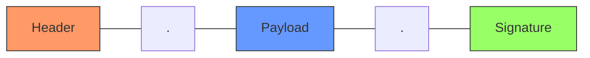

## 1. 本质与核心逻辑
JWT 是一种**自包含（Self-contained）**的、用于在多端通讯中安全传输信息的标准。

> [!ABSTRACT] 核心比喻：储物柜钥匙 vs 身份证
> - **Session (储物柜钥匙)**：服务器内存里存着一个大柜子（Session 对象），你拿钥匙（SessionID）。服务器压力大，且分布式环境下需配合 [[Redis]] 做同步。
> - **JWT (身份证)**：所有身份信息（用户 ID、角色）都在你手里。服务器不存数据，只负责验证“防伪标识”（签名）是否合法。

---

## 2. 结构拆分 (The Three Parts)
JWT 通过 `.` 分隔为三个部分：`Header.Payload.Signature`

| 组成部分 | 内容说明 | 编码/处理 | 安全提示 |
| :--- | :--- | :--- | :--- |
| **Header** | 声明类型 (JWT) 和签名算法 (如 HS256) | Base64URL 编码 | 仅供描述，不具安全性 |
| **Payload** | 存放 UserID、过期时间等 Claim（权限声明） | Base64URL 编码 | **严禁存放明文密码/手机号**（任何人都能解码） |
| **Signature** | `(Header+Payload+Secret)` 经过算法生成的密文 | 签名算法加密 | **Secret（盐）必须保存在后端，不可泄露** |

---

## 3. 实际使用与实战避坑

### 🚀 传输方式
通常放置在 HTTP 请求头中：
`Authorization: Bearer <token>`
> [!TIP] 移动端友好
> 这种方式摆脱了对 Cookie 的依赖，能完美解决移动端、小程序或跨域场景下的认证问题。

### 🔒 痛点：Token 失控问题
JWT 是无状态的，一旦签发，后端无法在过期前主动撤回。这导致“退出登录”在逻辑上难以实现。

> [!IMPORTANT] 解决方案：配合 [[Redis]] 实现“黑名单”
> 1. 用户退出登录时，将该 Token 的唯一标识（jti）存入 Redis。
> 2. 每次请求拦截时，先查 Redis 检查该 Token 是否在黑名单中。
> 3. *注：这虽然让后端变回了“有状态”，但是为了安全性必须做出的折中。*

---

## 4. 进阶架构：双 Token 机制 (AT & RT)

为了平衡 **安全性（过期快）** 与 **用户体验（免登录）**，引入双令牌模式：

### 🔄 运行流程
1. **Access Token (AT)**：
    - **寿命短**（如：30 分钟）。
    - 负责日常所有接口访问。
2. **Refresh Token (RT)**：
    - **寿命长**（如：7 天 / 14 天）。
    - 仅用于在 AT 过期后，换取新的 AT。

### 🏢 存储策略
- [ ] **Web 端**：
    - AT 存 `LocalStorage`。
    - RT 存 `HttpOnly Cookie`（防止 XSS 攻击抓取 RT，浏览器自动带上，安全性最高）。
- [ ] **移动端**：
    - AT 和 RT 均直接持久化存储（如 KeyChain 或 SharedPreferences）。

> [!SUCCESS] 为什么要双 Token？
> 如果 AT 被黑客截获，它很快就会失效。而 RT 存储更隐秘（HttpOnly），且不参与日常接口调用，被截获概率极低。这样既保证了安全，又避免了让用户每隔 30 分钟登录一次。
